# Project 01: Web Perimeter Security

## Purpose

This project builds a multi-layered perimeter security stack in front of a public-facing web server (karateke.online). The goal is to detect and block real-world HTTP-based attacks (XSS, SQL Injection, etc.) before they ever reach the application layer. Traffic first passes through Cloudflare, then is filtered on the server itself by an Nginx reverse proxy with a ModSecurity WAF layer. The OWASP Core Rule Set (CRS) 3.3.8 is used as the rule engine.

| Tool | Role |
|---|---|
| Cloudflare DNS + Tunnel | Hides the real server IP address, performs initial L3-L4/DDoS-level filtering, routes traffic to the server over a secure tunnel |
| Nginx | Acts as the reverse proxy handling all incoming HTTP(S) requests and forwarding them to the backend |
| ModSecurity | Open-source WAF engine integrated into Nginx as a module, analyzes requests against the rule set |
| OWASP CRS 3.3.8 | Pre-built attack signature and anomaly scoring rules for ModSecurity (XSS, SQLi, RCE, etc.) |

```
                        ┌─────────────────────┐
                        │       Client         │
                        │  (curl / browser)     │
                        └──────────┬───────────┘
                                   │ HTTPS
                                   ▼
                        ┌─────────────────────┐
                        │   Cloudflare DNS     │
                        │   + Tunnel            │
                        │ (IP masking, initial   │
                        │  filtering)            │
                        └──────────┬───────────┘
                                   │ Over tunnel
                                   ▼
                        ┌─────────────────────┐
                        │   Nginx Reverse       │
                        │      Proxy            │
                        │  ┌───────────────┐  │
                        │  │  ModSecurity   │  │
                        │  │  + OWASP CRS   │  │
                        │  │    3.3.8       │  │
                        │  └───────┬───────┘  │
                        └──────────┼───────────┘
                                   │
                     ┌─────────────┴─────────────┐
                     │ 403 Forbidden               │  200 OK
                     │ (rule matched)              │  (clean request)
                     ▼                             ▼
            ┌─────────────────┐         ┌─────────────────────┐
            │  audit.log        │         │  Backend Application │
            │  (SecAudit)        │         │  (website)            │
            └─────────────────┘         └─────────────────────┘
```

## Methodology

### 1. Service and Configuration Verification

The DNS record and Cloudflare Tunnel were configured for the domain (karateke.online) on Cloudflare — the server's real IP address was hidden from the outside world. Nginx was installed on the server with a virtual host defined for karateke.online. The ModSecurity package was installed and enabled as an Nginx module (`load_module modules/ngx_http_modsecurity_module.so`), and OWASP CRS 3.3.8 was downloaded and configured via `crs-setup.conf`. ModSecurity's `SecRuleEngine` was switched from `DetectionOnly` mode to `On` (blocking mode) to activate real enforcement, and the audit log format (`SecAuditLog`, `SecAuditLogParts`) was configured so every blocked request is logged in detail (rule ID, message, anomaly score).

Service/tunnel-level verification of the setup:

*Evidence: `11-cloudflared-tunnel-status.png`*

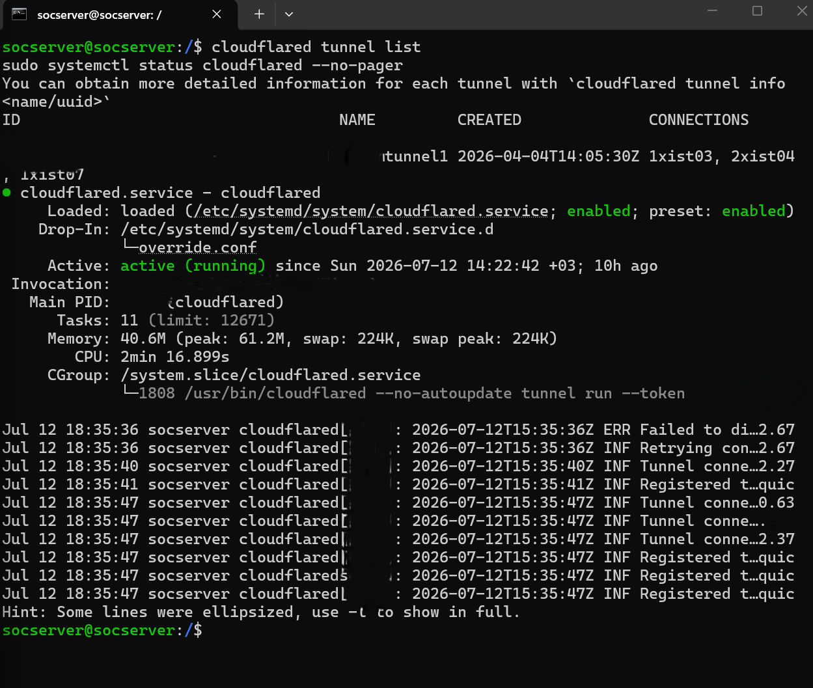

*Evidence: `12-nginx-service-status.png`*


*Evidence: `09-nginx-modsecurity-config-check.png`*


### 2. Attack Surface Analysis (Nmap + Nikto)

Before the actual WAF tests, the server's exposed surface and its behavior against automated scanning tools were verified.

**Nmap — open port scan:**
```bash
nmap -sV -sC --top-ports 1000 --stats-every 10s 192.168.1.149 -oN /root/nmap-quickscan.txt
```
Result: all 1000 scanned ports are in "ignored/filtered" state — the server is closed to network-level scanning.

*Evidence: `01-nmap-top-ports-scan.png`*

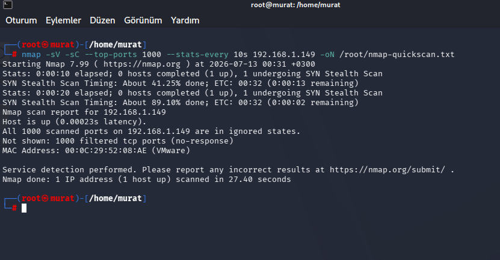

**Nikto — automated web vulnerability scan (against karateke.online, behind Cloudflare):**
```bash
nikto -h https://karateke.online -o /root/nikto-result.txt
```
In both separate runs, the scan hit Cloudflare's bot/rate-limit protection: the `cf-mitigated: challenge` header was triggered and the tool terminated early with "Error limit (20) reached for host". The same outcome repeating across two independent runs shows this blocking is a consistent, repeatable defense behavior rather than a coincidence.

*Evidence: `02-nikto-domain-scan-v1.png`, `03-nikto-domain-scan-v2.png`*

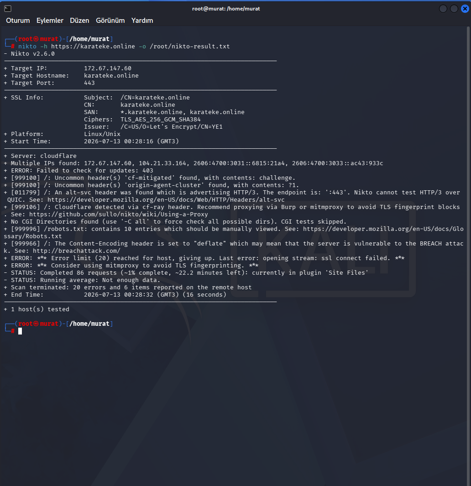
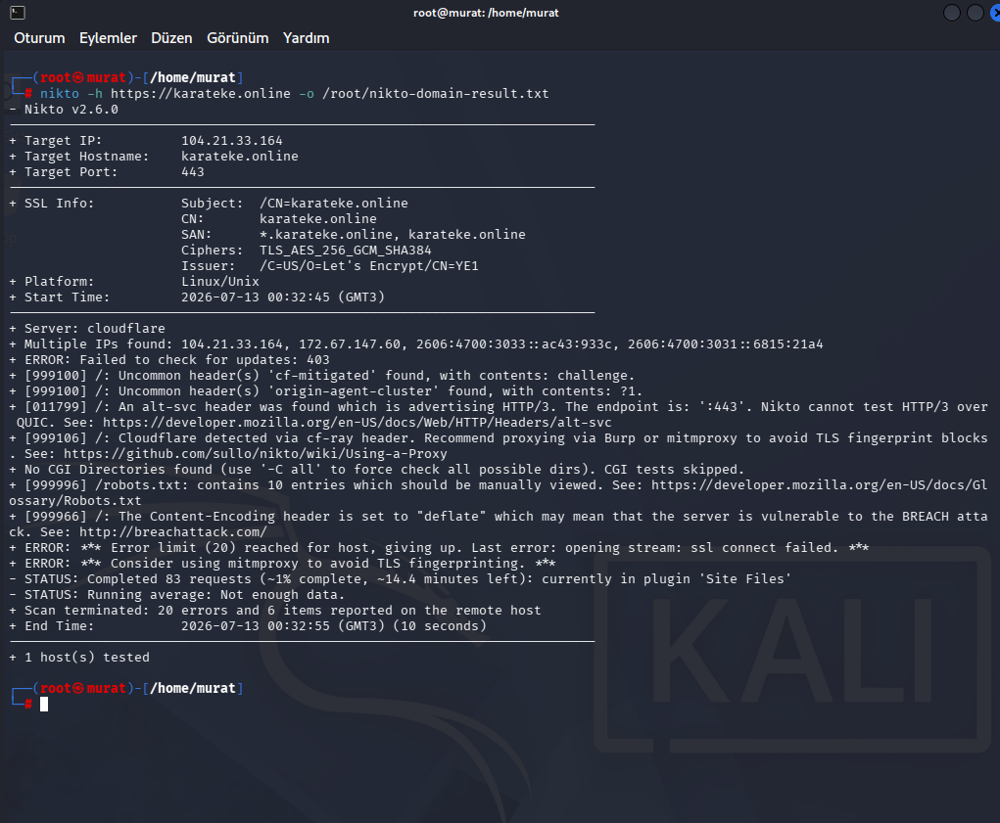

**Nikto — direct attempt against the server's real IP:**
```bash
nikto -h https://192.168.1.149 -o /root/nikto-origin-result.txt
```
Result: `[FAIL] Unable to connect to 192.168.1.149:443` — the origin server is unreachable directly on port 443 from outside the Cloudflare Tunnel.

*Evidence: `04-nikto-origin-scan-failed.png`*

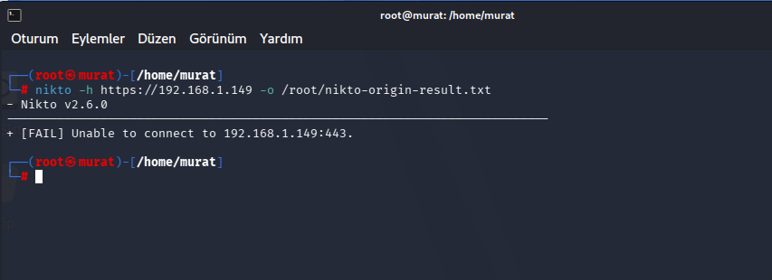

### 3. Origin Server Protection

**Direct connection attempt:**
```bash
curl -v --connect-timeout 5 https://192.168.1.149:443
```
Result: "Connection timed out" after 5 seconds — the origin server is closed to the outside.

*Evidence: `16-curl-origin-connection-timeout.png`*

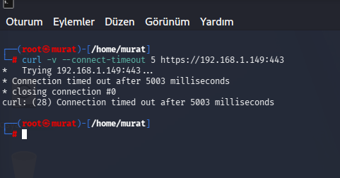

**Nmap — origin port 443 status:**
```bash
nmap -p 443 192.168.1.149
```
Result: `443/tcp filtered https` — the port is filtered, not open.

*Evidence: `17-nmap-origin-port-443-filtered.png`*

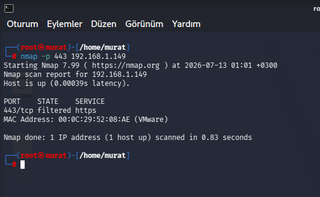

**Local firewall check:**
```bash
sudo ufw status verbose | grep 443
sudo iptables -L -n -v | grep 443
```
Both commands returned empty results — there is no dedicated ufw/iptables rule for port 443 on the server; access control is achieved by the origin never being exposed outside the Cloudflare Tunnel architecture in the first place, so no separate local firewall rule is needed.

*Evidence: `15-ufw-iptables-port-443-check.png`*

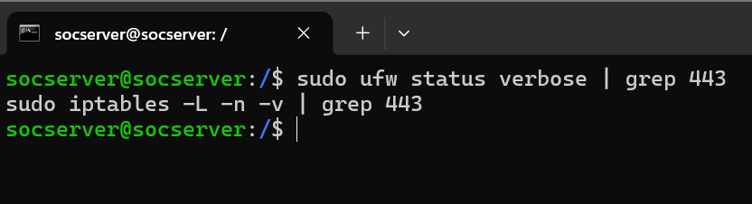

This confirms from multiple angles that the origin server is completely unreachable from the outside (nmap: filtered, nikto: connection failed, curl: timeout, ufw/iptables: no dedicated rule needed by design) — the single entry point is the Cloudflare Tunnel.

### 4. WAF Tests (Through Cloudflare — karateke.online)

**XSS test request:**
```bash
curl -i "https://karateke.online/?q=<script>alert(1)</script>"
```
Expected and actual output:
```
HTTP/2 403
```
Audit log entry (`/var/log/modsecurity/audit.log`):
```
[id "941100"] [msg "XSS Attack Detected via libinjection"]
[id "949110"] [msg "Inbound Anomaly Score Exceeded (Total Score: 15)"]
```

*Evidence: `06-curl-xss-test-403.png`*

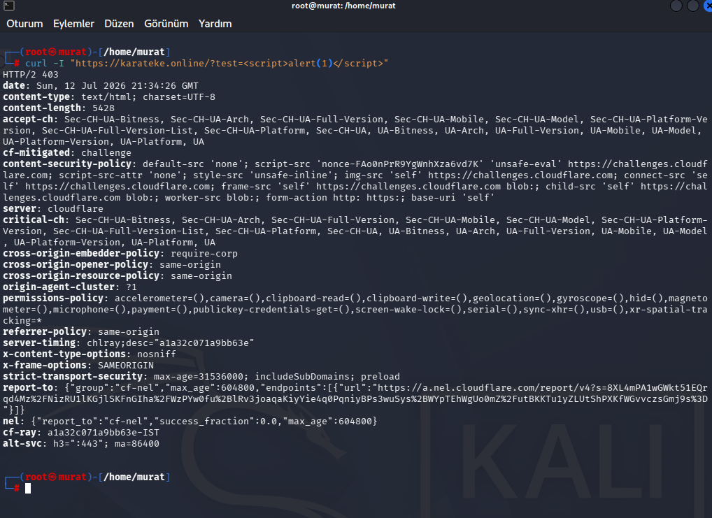

Live-verified with a split-screen showing the audit log updating in real time during the test:

*Evidence: `18-split-screen-live-audit-log-monitoring.png`*

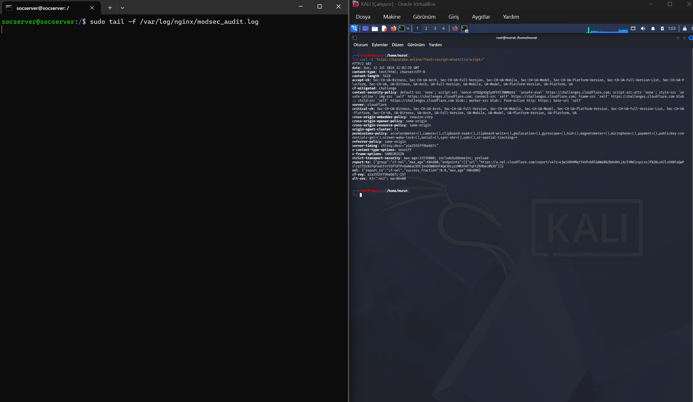

**SQL Injection test request:**
```bash
curl -i "https://karateke.online/?id=1' OR '1'='1"
```
Expected and actual output:
```
HTTP/2 403
```

*Evidence: `05-curl-sqli-test-403.png`*


Also confirmed with an automated sqlmap scan — the WAF returned 403 on 586 requests, causing sqlmap itself to conclude the parameter "does not seem to be injectable" (i.e., the WAF blocked sqlmap's entire test suite):

*Evidence: `07-sqlmap-scan-waf-blocked.png`*

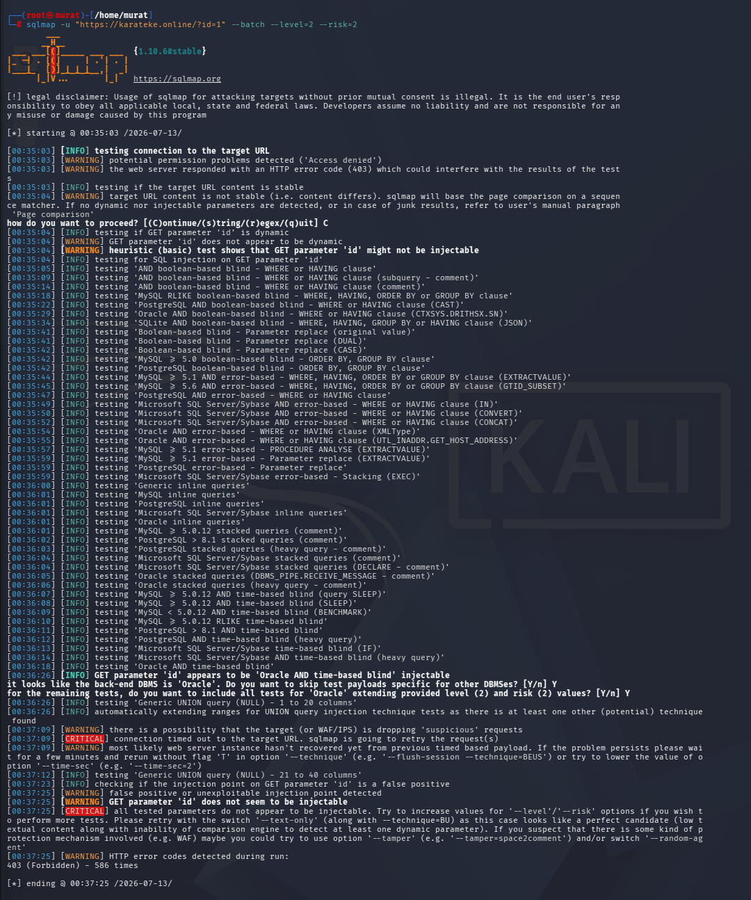

**Normal (clean) request — false positive check and the WAF's behavioral (rate-adaptive) nature:**
```bash
curl -i "https://karateke.online/"
```
An important nuance was observed in this test: the same clean request produced different results across separate runs. Some runs returned a plain `HTTP/2 200`, while others triggered Cloudflare's "managed challenge" mechanism, returning `HTTP/2 403` with `cf-mitigated: challenge`. This is evidence that the WAF/Cloudflare layer is not a static rule set but a **behavioral, rate-adaptive** protection mechanism that decides based on traffic history and other signals — the same type of request is not guaranteed the same response every time.

*Evidence (same request type, two separate runs — both triggered the challenge): `08-curl-normal-request-challenge.png`, `20-curl-normal-request-challenge-v2.png`*


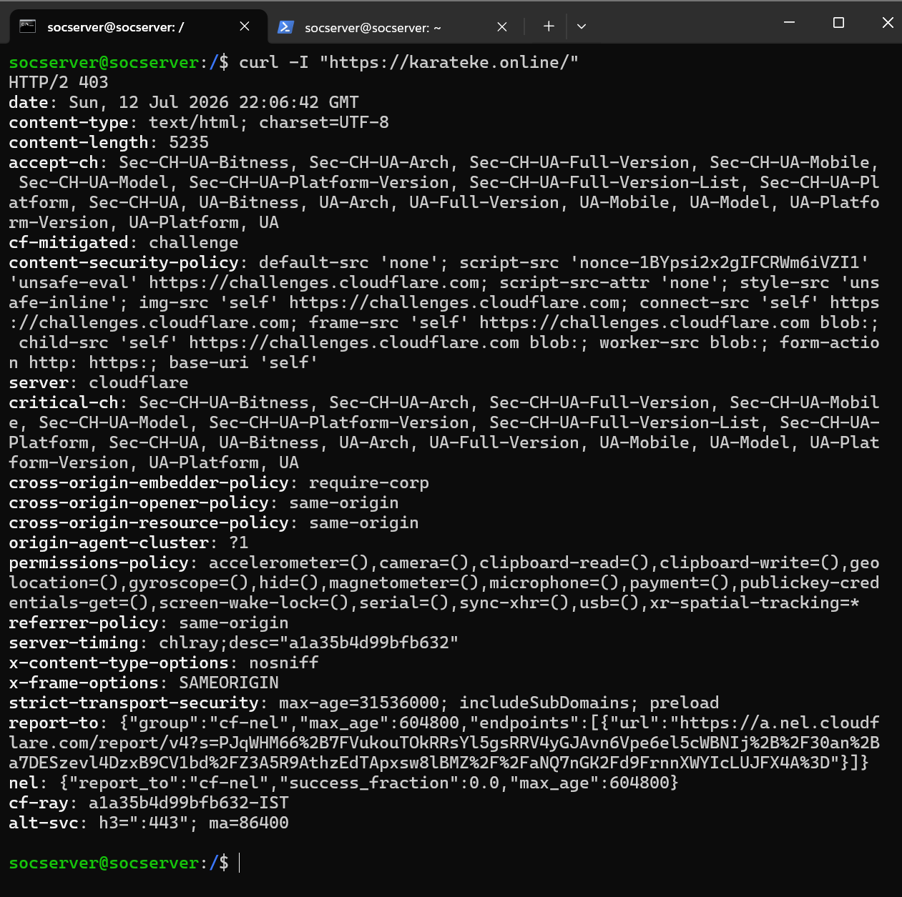

> **Note:** Both of these pieces of evidence show the challenge (403) outcome; the direct proof of the "clean request → 200 OK" result is `21-localhost-bypass-normal-request-200.png` in the Origin/Localhost Bypass Testing section below. The fact that the same clean request sometimes returns 200 and sometimes a challenge at the Cloudflare edge (public request) is itself part of the rate-adaptive behavior described above.

Taken together, the tests in this section show that the WAF layer was able to stop XSS and SQLi attacks at the HTTP level (403) without touching a single line of application code, while leaving legitimate traffic largely unaffected.

### 5. Origin/Localhost Bypass Testing (Bypassing Cloudflare, Direct to ModSecurity)

To test nginx/ModSecurity directly while bypassing the Cloudflare layer, `Host` header spoofing was used from the server itself:

```bash
curl -I -H "Host: karateke.online" "http://localhost/?test=<script>alert(1)</script>"
```
Result: `HTTP/1.1 403 Forbidden` (`Server: nginx`) — even with Cloudflare fully bypassed, ModSecurity blocks the XSS payload on its own.

*Evidence: `19-localhost-bypass-xss-test-403.png`*

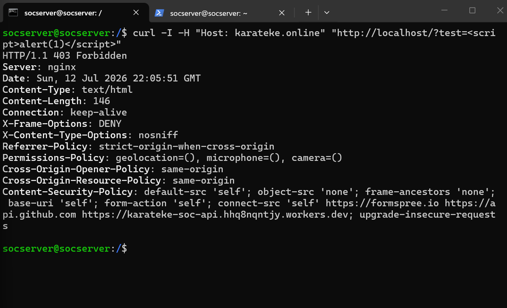

```bash
curl -I -H "Host: karateke.online" "http://localhost/"
```
Result: `HTTP/1.1 200 OK` (`Server: nginx`) — using the same bypass method, the clean request passes through without issue, no false positive.

*Evidence: `21-localhost-bypass-normal-request-200.png`*


### 6. Configuration and Cloudflare Dashboard Verification

The clean/baseline state before testing:

*Evidence: `10-modsecurity-audit-log-check.png` — audit log still empty prior to testing*


The Cloudflare Security dashboard confirmed the events triggered during testing along with overall traffic mitigation statistics: over the last 24 hours, 767 of 1.1k total requests were mitigated by Cloudflare; a large number of requests from a single source IP (`X.X.X.X`, Turkey) were processed as "Skip (Custom rules)".

*Evidence: `13-cloudflare-security-events.png`, `14-cloudflare-security-analytics-traffic.png`*


These checks confirmed that, with the audit log detail level (SecAuditLogParts) configured correctly, rule ID, message, and score information can be tracked in a single line for post-incident analysis.

## Root Cause Analysis / Findings

During setup, two independent configuration issues were identified and resolved before testing began:

### Root Cause A — Module Loading Conflict

The package installation automatically loaded the ModSecurity Nginx module, while a manual `load_module` line had also been added to `nginx.conf`. This conflict was resolved by removing the duplicate line.

### Root Cause B — sites-enabled/default Global Directive Issue

The `sites-enabled/default` file was found to contain ModSecurity directives (`modsecurity on;`, `modsecurity_rules_file ...`) outside the `server {}` block. This caused CRS rule ID 901001 (the CRS setup/init rule) to be loaded multiple times. The directives were removed from the file and moved exclusively inside the relevant `server {}` block.

These two findings showed that a "silent" conflict — the same directive defined both by the package and in manual configuration — can cause serious rule duplication (duplicate rule ID 901001) in a production environment; that default files like `sites-enabled/default` can cause unexpected behavior when they contain global directives; and that `server {}` block boundaries need to be made explicit in WAF/proxy configurations.

## Key Skills Demonstrated

- Setting up and integrating a multi-layered perimeter security architecture (Cloudflare + Nginx + ModSecurity + OWASP CRS)
- Testing and verifying the WAF with real attack scenarios (manual XSS/SQLi requests, automated sqlmap scan)
- Diagnosing and root-cause-fixing silent configuration conflicts (duplicate module loading, global directive leakage)
- Verifying that the anomaly scoring system (Total Score) enables decisions based on a cumulative risk score rather than a single signature match, producing fewer false positives than relying on a single signature match
- Proving from multiple angles (nmap, nikto, curl, ufw/iptables) that the origin server is completely unreachable from the outside

## Screenshot Inventory

| # | Filename | Content |
|---|---|---|
| 01 | 01-nmap-top-ports-scan.png | Nmap top-1000 port scan (all filtered) |
| 02 | 02-nikto-domain-scan-v1.png | Nikto scan - Cloudflare block (1st run) |
| 03 | 03-nikto-domain-scan-v2.png | Nikto scan - Cloudflare block (2nd run, proof of repeatability) |
| 04 | 04-nikto-origin-scan-failed.png | Nikto - direct connection to origin IP failed |
| 05 | 05-curl-sqli-test-403.png | SQLi test - HTTP 403 |
| 06 | 06-curl-xss-test-403.png | XSS test - HTTP 403 |
| 07 | 07-sqlmap-scan-waf-blocked.png | Automated sqlmap scan blocked by the WAF |
| 08 | 08-curl-normal-request-challenge.png | Normal request - Cloudflare managed challenge (1st attempt) |
| 09 | 09-nginx-modsecurity-config-check.png | ModSecurity module/configuration check |
| 10 | 10-modsecurity-audit-log-check.png | ModSecurity audit log - empty baseline before testing |
| 11 | 11-cloudflared-tunnel-status.png | Cloudflare Tunnel service status |
| 12 | 12-nginx-service-status.png | Nginx service status |
| 13 | 13-cloudflare-security-events.png | Cloudflare Security - Events |
| 14 | 14-cloudflare-security-analytics-traffic.png | Cloudflare Security - Traffic Analytics |
| 15 | 15-ufw-iptables-port-443-check.png | ufw/iptables port 443 check (empty result) |
| 16 | 16-curl-origin-connection-timeout.png | Direct connection to origin times out |
| 17 | 17-nmap-origin-port-443-filtered.png | Nmap - origin port 443 filtered |
| 18 | 18-split-screen-live-audit-log-monitoring.png | Live audit log monitoring + XSS test (split-screen) |
| 19 | 19-localhost-bypass-xss-test-403.png | Localhost/origin bypass - XSS test blocked |
| 20 | 20-curl-normal-request-challenge-v2.png | Normal request - Cloudflare managed challenge (2nd attempt) |
| 21 | 21-localhost-bypass-normal-request-200.png | Localhost/origin bypass - clean request 200 OK |

**Total: 21 verified screenshots.**
