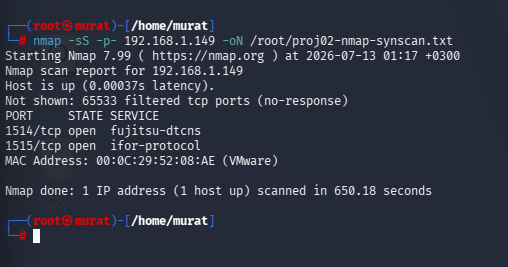
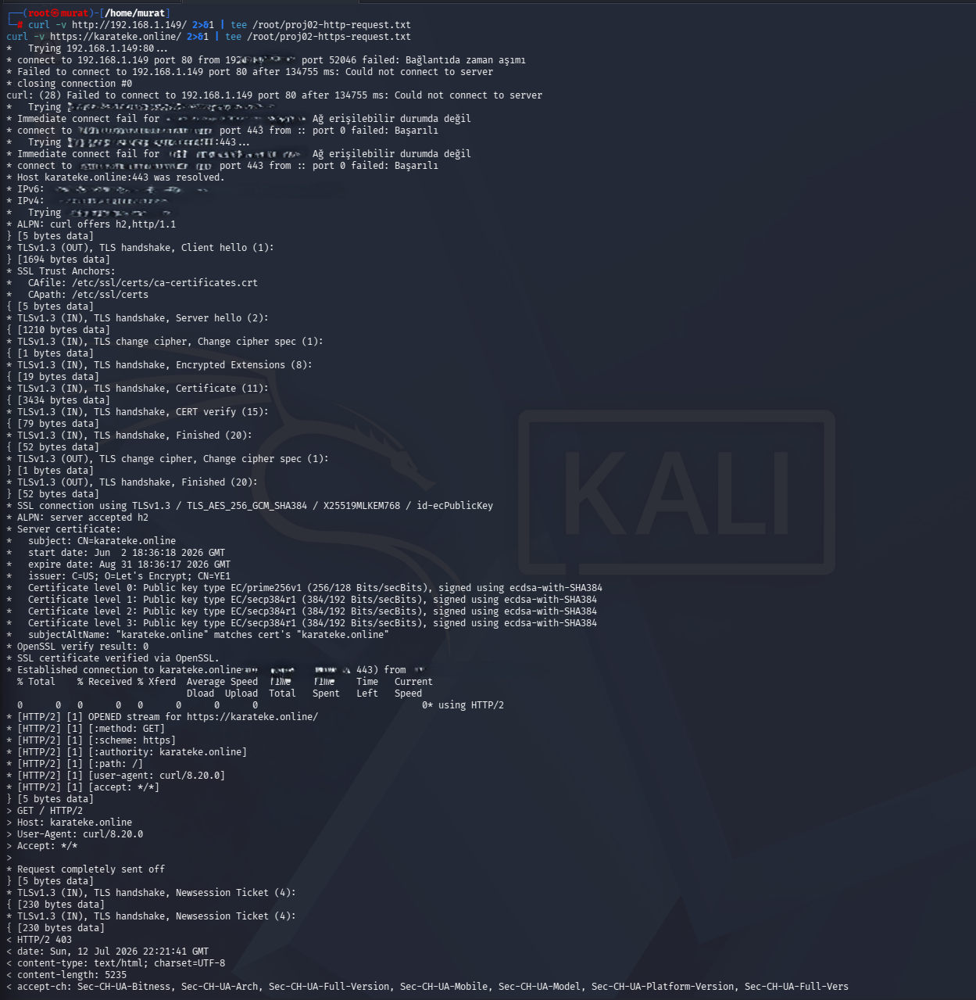
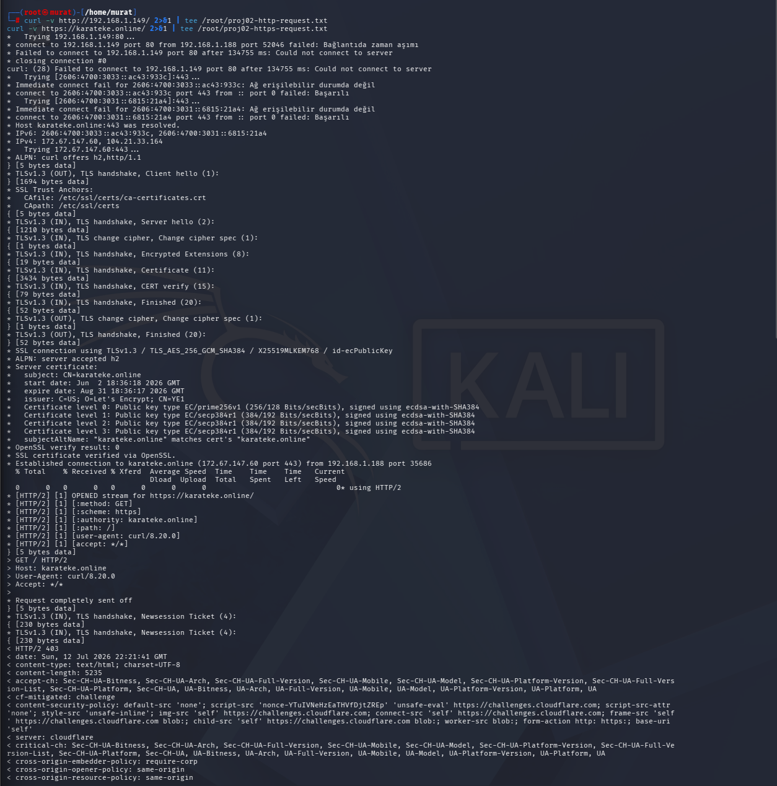
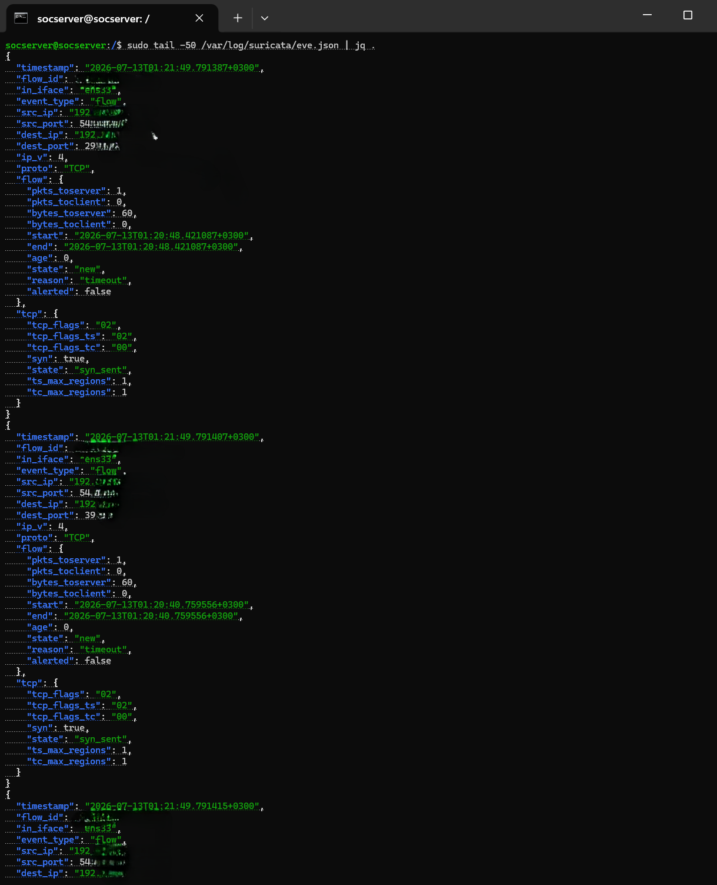
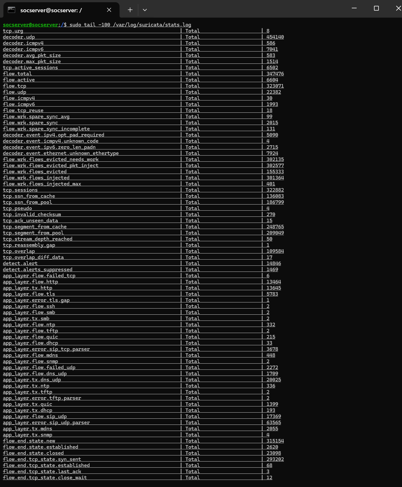
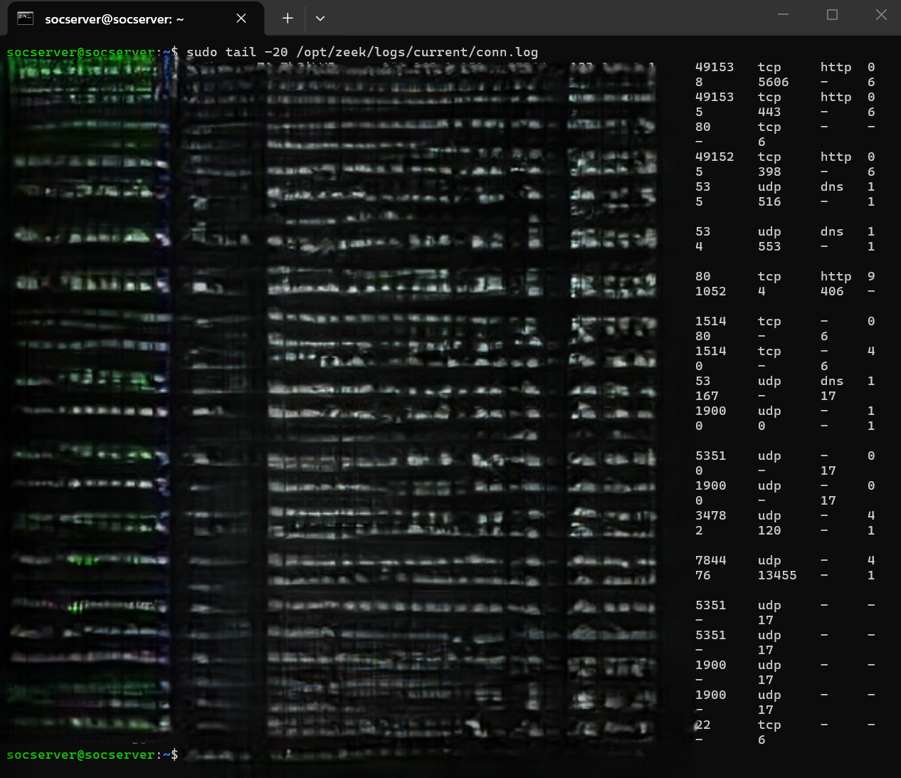
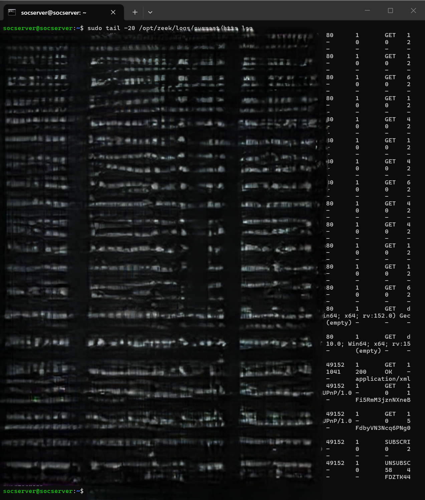
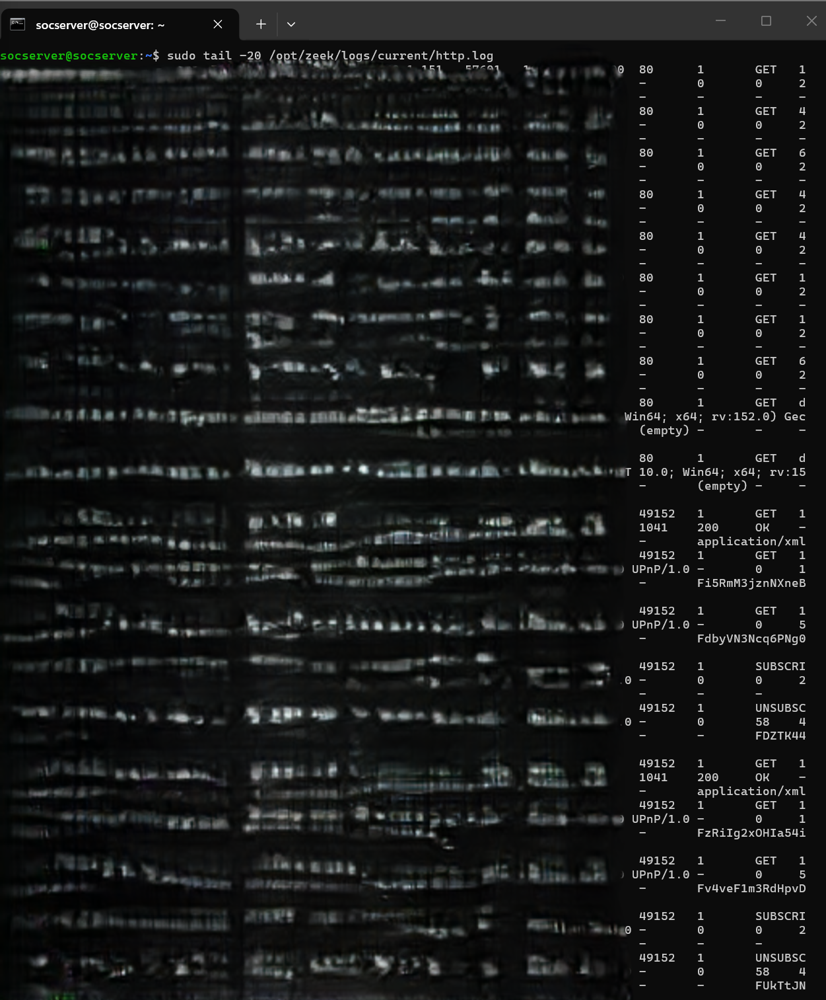
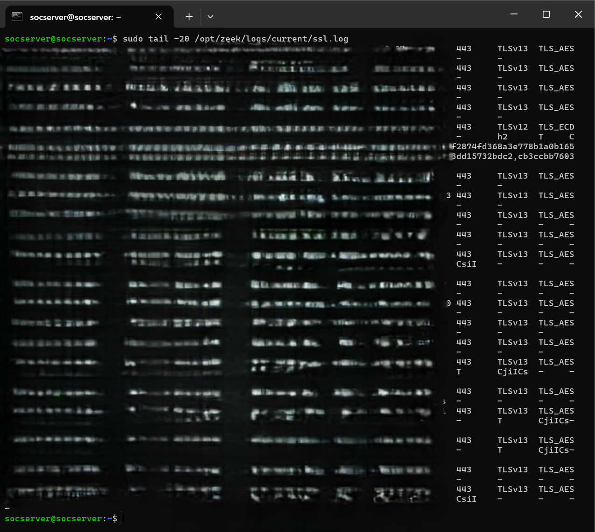
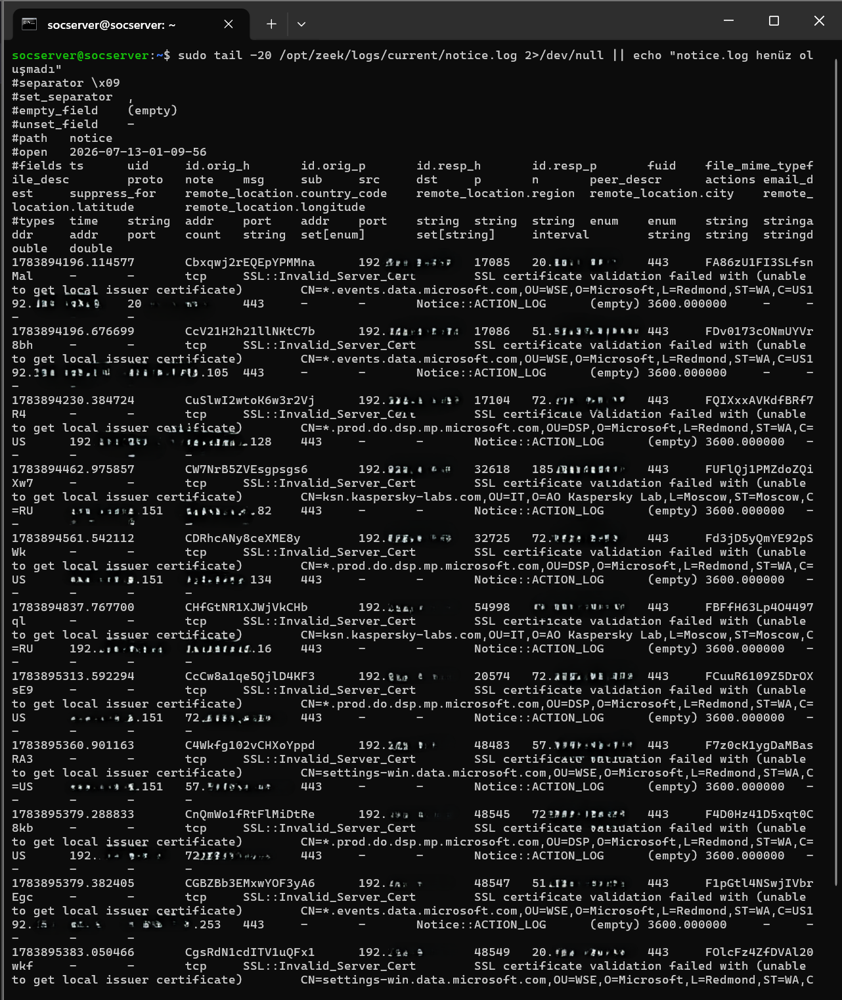

# Project 02: Network Traffic Detection Lab

## Purpose

This project combines a signature-based intrusion detection/prevention system (IDS/IPS) capable of monitoring and analyzing inbound/outbound server traffic at the packet level, with a network monitoring tool that provides deep protocol-level traffic visibility. Suricata generates real-time alerts based on known threat signatures (the Emerging Threats rule set), while Zeek converts every connection into structured log records (conn.log, ssl.log, etc.), providing rich data for post-incident analysis and correlation. The logs produced by this layer (eve.json, conn.log, and the other Zeek logs) form the raw data source for the correlation infrastructure in Project 04 (SIEM).

| Tool | Role |
|---|---|
| Suricata | IDS/IPS engine; detects known attack signatures using the Emerging Threats (ET) rule set, runs continuously as a systemd service |
| Zeek | Analyzes network traffic at the protocol level, produces structured logs (conn.log, ssl.log, http.log, etc.) for every connection |
| zeekctl | Control layer that deploys and manages Zeek in standalone mode |

```
                    ┌─────────────────────────────┐
                    │     Network Interface (NIC)   │
                    │   Raw traffic (all packets)    │
                    └───────────┬─────────────────┘
                                │
                 ┌──────────────┴──────────────┐
                 ▼                              ▼
        ┌─────────────────┐          ┌─────────────────────┐
        │    Suricata        │          │        Zeek            │
        │  (IDS/IPS engine)   │          │  (protocol analysis)    │
        │  ET Rule Set        │          │  zeekctl (standalone)   │
        └────────┬─────────┘          └──────────┬──────────┘
                 │                                │
                 ▼                                ▼
        ┌─────────────────┐          ┌─────────────────────┐
        │  eve.json /         │          │  conn.log, ssl.log,     │
        │  fast.log            │          │  http.log ...           │
        │  (alerts)            │          │  (connection records)  │
        └────────┬─────────┘          └──────────┬──────────┘
                 │                                │
                 └───────────────┬────────────────┘
                                 ▼
                      ┌─────────────────────┐
                      │   SIEM Correlation    │
                      │  (Wazuh — see project  │
                      │   04)                  │
                      └─────────────────────┘
```

## Methodology

### 1. Attack Surface Discovery (Nmap)

Before generating traffic for the IDS/NSM stack, the target server's exposed surface was verified with two different nmap techniques.

```bash
nmap -sV -sC -A 192.168.1.149 -oN /root/proj02-nmap-full.txt
```
Result: all 1000 scanned ports were "ignored/filtered"; OS fingerprinting also could not be resolved due to too many conflicting matches.

*Evidence: `01-nmap-full-service-scan.png`*


```bash
nmap -sS -p- 192.168.1.149 -oN /root/proj02-nmap-synscan.txt
```
Result: 65,533 ports filtered, only ports 1514/1515 (Wazuh agent/manager) open — the scan took 650 seconds.

*Evidence: `02-nmap-syn-scan-full-ports.png`*



### 2. Traffic Generation and Test Scenarios

Various HTTP(S) requests and connection attempts were generated to verify the IDS/NSM layer against real traffic.

```bash
curl -v http://192.168.1.149/ 2>&1 | tee /root/proj02-http-request.txt
curl -v https://karateke.online/ 2>&1 | tee /root/proj02-https-request.txt
```
The first command (port 80, direct to the origin IP) failed to connect ("Could not connect to server"); the second showed the full TLS 1.3 handshake (certificate chain, ALPN, cipher suite) and ended in `HTTP/2 403` (blocked by the WAF). Two separate screenshots capture the same test session: the connection/handshake process (v1), and the full response headers that follow, including `cf-mitigated: challenge` (v2):

*Evidence: `03-curl-http-https-request-v1.png`, `04-curl-http-https-request-v2.png`*




```bash
curl -A "() { :; }; echo VULNERABLE" http://192.168.1.149/
```
A request with a suspicious/malicious user-agent payload also failed to connect to the origin (port 80) — since the origin is closed to the outside, this payload was rejected before it could ever reach the IDS.

*Evidence: `05-curl-suspicious-user-agent-test.png`*


```bash
nc -zv 192.168.1.149 22
```
The connection attempt to the SSH port (22) resulted in "Connection timed out" — the network segmentation rule does not allow SSH access from this machine.

*Evidence: `06-nc-ssh-port-connection-attempt.png`*


### 3. Suricata Service and Alert Verification

The Suricata package was installed with its listening network interface defined in `suricata.yaml`, the Emerging Threats (ET) rule set was downloaded and kept current via `suricata-update`, and the service was enabled as a systemd service (`systemctl enable --now suricata`) to run continuously in the background.

**Suricata service status:**
```bash
systemctl status suricata
```
Expected output:
```
● suricata.service - Suricata IDS/IPS daemon
     Loaded: loaded (/lib/systemd/system/suricata.service; enabled)
     Active: active (running)
```

*Evidence: `07-suricata-service-status.png`*


**Live alert stream:**
```bash
tail -f /var/log/suricata/fast.log
```
Mostly low-priority (Priority 3) ET INFO alerts (routine traffic such as STUN/NAT traversal) were observed, along with a couple of protocol anomalies ("Ethertype unknown", "Applayer Detect protocol only one direction").

*Evidence: `08-suricata-fast-log-alerts.png`*


**Detailed JSON log:**
```bash
tail -50 /var/log/suricata/eve.json | jq .
```
Connections from the Kali machine (192.168.1.188) to the target (192.168.1.149) are visible in detail as "flow" type JSON events.

*Evidence: `09-suricata-eve-json-detailed-log.png`*



**Cumulative statistics (two different points in time):**
```bash
sudo tail -100 /var/log/suricata/stats.log
```
The same command captured at two different times shows Suricata's cumulative counters (flow.total, detect.alert, etc.) increasing over time — proof that the engine is running continuously, live.

*Evidence: `10-suricata-stats-log-v1.png` (flow.total ≈ 347K, detect.alert 14846), `11-suricata-stats-log-v2.png` (later point in time — flow.total ≈ 452K, detect.alert 15869)*




### 4. Zeek Service and Log Verification

When the Zeek package was installed, it turned out the installation only provides binaries and does not include a direct systemd service definition — it was determined that Zeek needs to be run through its own management layer, `zeekctl`. The interface for standalone mode was defined in `/opt/zeek/etc/node.cfg`, Zeek was deployed with `zeekctl deploy`, and a persistent systemd unit file (`ExecStart=/opt/zeek/bin/zeekctl deploy`) was written so it comes up automatically after a server reboot. Log rotation and file permissions for Suricata's `eve.json` output and Zeek's `conn.log` records were configured so they can later be collected by the SIEM (Wazuh).

**Zeek systemd unit status:**
```bash
systemctl status zeek
```
Expected output: `Active: active (running)` — the log shows it was started via `zeekctl`.

*Evidence: `12-zeek-service-status.png`*


**Connection records (conn.log):**
```bash
tail -n 20 /opt/zeek/logs/current/conn.log
```
Among various TCP/UDP connection records, an `S0` (half-open — no response received) connection attempt from the Kali machine (192.168.1.188) to the target's SSH port (22) is also visible — an independent confirmation that overlaps with the `06` `nc` test. Conn.log fields (duration, byte counts, connection state letters) can summarize a connection's entire lifecycle in a single line.

*Evidence: `13-zeek-conn-log.png`*



**DNS queries (dns.log):**
```bash
tail -n 20 /opt/zeek/logs/current/dns.log
```
Various outbound DNS queries (Cloudflare, Microsoft, Mozilla, claude.ai, etc.) recorded at the protocol level.

*Evidence: `14-zeek-dns-log.png`*


**HTTP requests (http.log, two different points in time):**
```bash
tail -n 20 /opt/zeek/logs/current/http.log
```
Mostly Go-http-client "generate_204" (captive portal check) requests, along with some Firefox and UPnP (SUBSCRIBE/UNSUBSCRIBE) traffic. The second snapshot shows the same log file slightly later, confirming new lines were appended over time.

*Evidence: `15-zeek-http-log-v1.png`, `16-zeek-http-log-v2.png`*




**TLS/SSL connections (ssl.log):**
```bash
tail -n 20 /opt/zeek/logs/current/ssl.log
```
Numerous outbound TLS 1.3 connections (ChatGPT, Bing, Office 365, Google API, etc.) recorded at the protocol level.

*Evidence: `17-zeek-ssl-log.png`*



**Protocol anomalies (weird.log):**
```bash
tail -n 20 /opt/zeek/logs/current/weird.log
```
Behaviors Zeek flags as non-standard were recorded, such as "unknown_HTTP_method" (UPnP SUBSCRIBE/UNSUBSCRIBE), "data_before_established", and "active_connection_reuse" — not attacks, but protocol deviations worth reviewing.

*Evidence: `18-zeek-weird-log.png`*


**Notices (notice.log) — SSL certificate warnings:**
```bash
tail -n 20 /opt/zeek/logs/current/notice.log
```
Numerous "SSL certificate validation failed... unable to get local issuer certificate" notices were observed (e.g., related to Microsoft and Kaspersky certificate chains) — this stems from a missing certificate/chain on the client side (Windows), correctly captured by Zeek.

*Evidence: `19-zeek-notice-log-ssl-cert-warnings.png`*



Zeek's different log types — http.log, ssl.log, dns.log, weird.log, and notice.log — together confirmed a multi-dimensional view of traffic that a single Suricata alert alone cannot offer; weird.log and notice.log in particular surface anomalies worth investigating (protocol deviations, certificate chain issues) even when no attack occurred. The SSH port scan from the Kali machine confirmed that the network segmentation rule rejects SSH traffic from that host, independently corroborated by two sources — the `nc` output and the corresponding `S0` entry in Zeek's conn.log.

## Key Skills Demonstrated

- Building a layered network traffic visibility architecture by combining Suricata (signature-based IDS/IPS) with Zeek (protocol-level NSM)
- Correctly integrating tool-specific control layers such as zeekctl and writing a dedicated systemd unit file for persistence
- Performing multi-dimensional traffic analysis via Suricata's eve.json/fast.log output and Zeek's various log types (conn/dns/http/ssl/weird/notice)
- Cross-verifying a network segmentation rule from two independent sources (nc output + Zeek conn.log S0 record)
- Proving a security engine is running continuously/live via cumulative counter comparison across two points in time

## Screenshot Inventory

| # | Filename | Content |
|---|---|---|
| 01 | 01-nmap-full-service-scan.png | Nmap full service scan (1000 ports filtered) |
| 02 | 02-nmap-syn-scan-full-ports.png | Nmap SYN scan - all ports (only 1514/1515 open) |
| 03 | 03-curl-http-https-request-v1.png | HTTP/HTTPS request test - connection and TLS handshake |
| 04 | 04-curl-http-https-request-v2.png | HTTP/HTTPS request test - full response headers (WAF 403) |
| 05 | 05-curl-suspicious-user-agent-test.png | Suspicious user-agent payload test (failed to connect) |
| 06 | 06-nc-ssh-port-connection-attempt.png | nc connection attempt to SSH port - timeout |
| 07 | 07-suricata-service-status.png | Suricata service status |
| 08 | 08-suricata-fast-log-alerts.png | Suricata fast.log live alert stream |
| 09 | 09-suricata-eve-json-detailed-log.png | Suricata eve.json detailed log |
| 10 | 10-suricata-stats-log-v1.png | Suricata stats.log - snapshot 1 |
| 11 | 11-suricata-stats-log-v2.png | Suricata stats.log - snapshot 2 (counters increased) |
| 12 | 12-zeek-service-status.png | Zeek service status |
| 13 | 13-zeek-conn-log.png | Zeek conn.log |
| 14 | 14-zeek-dns-log.png | Zeek dns.log |
| 15 | 15-zeek-http-log-v1.png | Zeek http.log - snapshot 1 |
| 16 | 16-zeek-http-log-v2.png | Zeek http.log - snapshot 2 (new lines appended) |
| 17 | 17-zeek-ssl-log.png | Zeek ssl.log |
| 18 | 18-zeek-weird-log.png | Zeek weird.log (protocol anomalies) |
| 19 | 19-zeek-notice-log-ssl-cert-warnings.png | Zeek notice.log - SSL certificate warnings |

**Total: 19 verified screenshots.**
