# Project 03: Host-Based Threat Detection (Falco + Auditd + CrowdSec + Fail2Ban)

## Objective

This project establishes a **host-based** threat detection and automated blocking layer on a Linux server running `karateke.online`, then validates that layer with real attack attempts. Building on network perimeter defense (Project 01) and network traffic detection (Project 02), this project focuses on **visibility into host-level behavior** and **automated response to suspicious activity**.

Components used:

| Tool | Role |
|---|---|
| **Falco** | Kernel-level runtime behavior detection (syscall monitoring) |
| **Auditd** | Linux audit subsystem — login/authentication event tracking |
| **CrowdSec** | Community-driven threat intelligence + automated IP blocking (bouncer) |
| **Fail2Ban** | Log-based behavioral blocking (brute-force, bot scanning, etc.) |

A separate **Kali Linux** machine (192.168.1.188) was used to run attack simulations against the target server at 192.168.1.149 (SSH access to this server is only possible via the Windows admin machine at 192.168.1.151).

---

## 1. Attack Surface Analysis (Nmap)

Before running attack attempts, the server's exposed surface was verified with a full port scan:

```
sudo nmap -T5 -p- 192.168.1.149 -oN /root/proj03-aggressive-scan.txt
```

**Result:** 65,533 ports filtered; only 2 ports appeared open (1514/1515 — Wazuh agent/manager communication ports, misclassified by nmap as fujitsu-dtcns/ifor-protocol). This is direct evidence that the server's attack surface has been minimized.

*Evidence: `17-nmap-aggressive-scan-attack-surface.png`*


---

## 2. Attack Attempts (Kali Side)

Attack simulations were run from a separate Kali Linux machine at 192.168.1.188 on the same network.

- An **SSH brute-force attempt via Hydra** failed due to a wordlist formatting error.
- An **HTTP form brute-force attempt via Hydra** failed with the same wordlist error.
- **10 consecutive manual SSH connection attempts** all resulted in `Connection timed out`. This is because network segmentation on the target (`192.168.1.149`) restricts SSH access to the admin machine at `192.168.1.151` only — since the Kali machine is `.188`, it was blocked at the network layer. **This is direct evidence of an active network-level defense control.**

*Evidence: `01-hydra-ssh-bruteforce-attempt-fail.png`, `02-hydra-http-bruteforce-attempt-fail.png`, `03-manual-ssh-connection-attempts-timeout.png`*

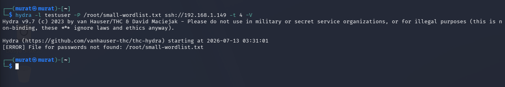
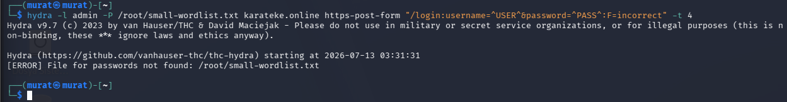


> **Note:** A dedicated screenshot of the Kali machine's IP configuration (e.g. `ip a` output) is not included in this set; the IP address is taken from session context notes. This can be added with a single follow-up screenshot if needed.

---

## 3. Service Health Verification

All detection/blocking services were confirmed running:

- Falco → `active (running)`
- Auditd → `active (running)`
- CrowdSec + firewall-bouncer → both `active (running)`
- Fail2Ban → `active (running)`

*Evidence: `04-falco-service-status-active.png`, `05-auditd-service-status-active.png`, `06-crowdsec-bouncer-service-status-active.png`, `07-fail2ban-service-status-active.png`*

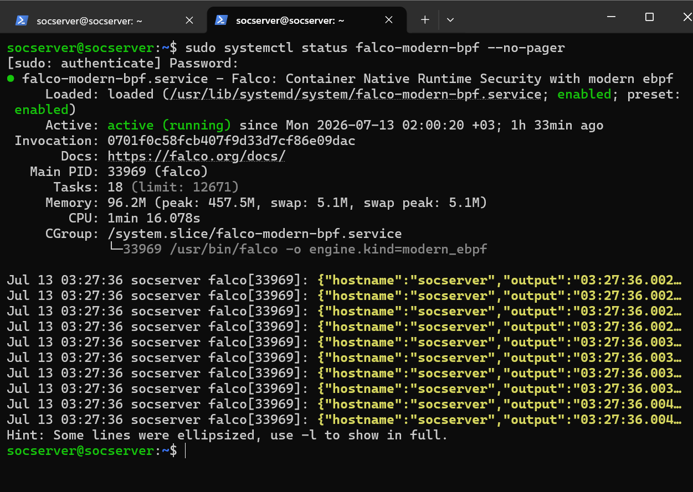
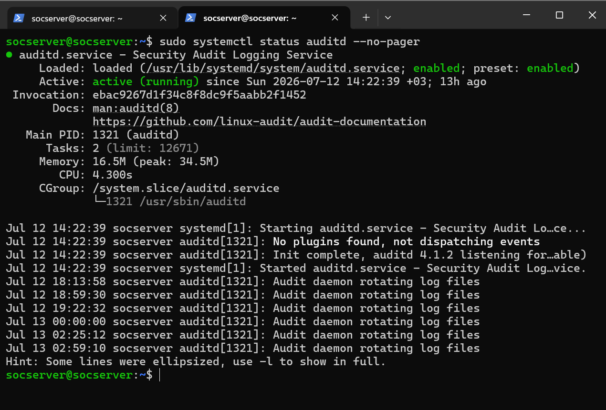
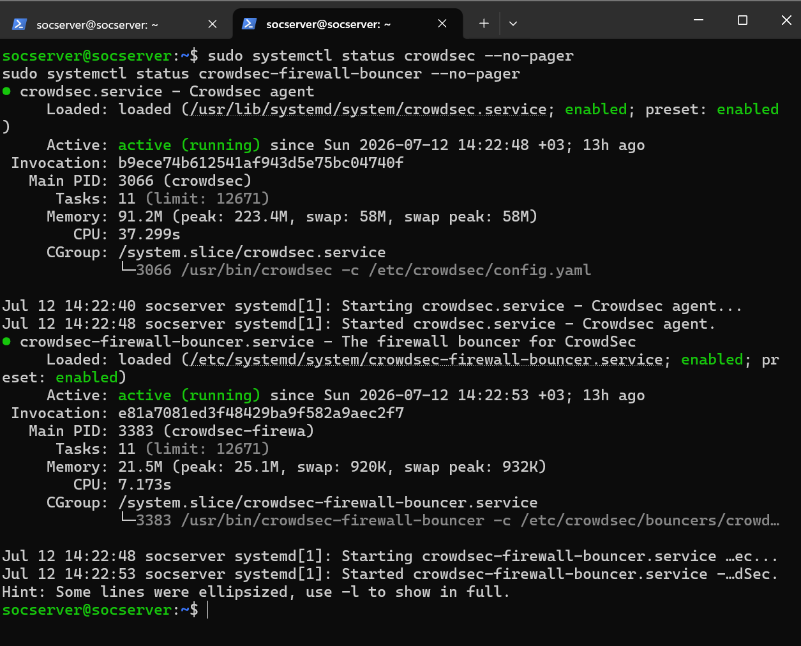


---

## 4. Real Detection Evidence

**Falco — Sensitive File Access Detection:**
Falco detected the `wazuh-syscheckd` process reading authentication-related sensitive files such as `/etc/pam.d/passwd`, `chfn`, `sudo`, and `chpasswd`, generating a `"Sensitive file opened for reading... Read sensitive file untrusted"` alert. This behavior maps to **MITRE ATT&CK T1555 (Credential Access)**.

*Evidence: `08-falco-alert-sensitive-file-read.png`*

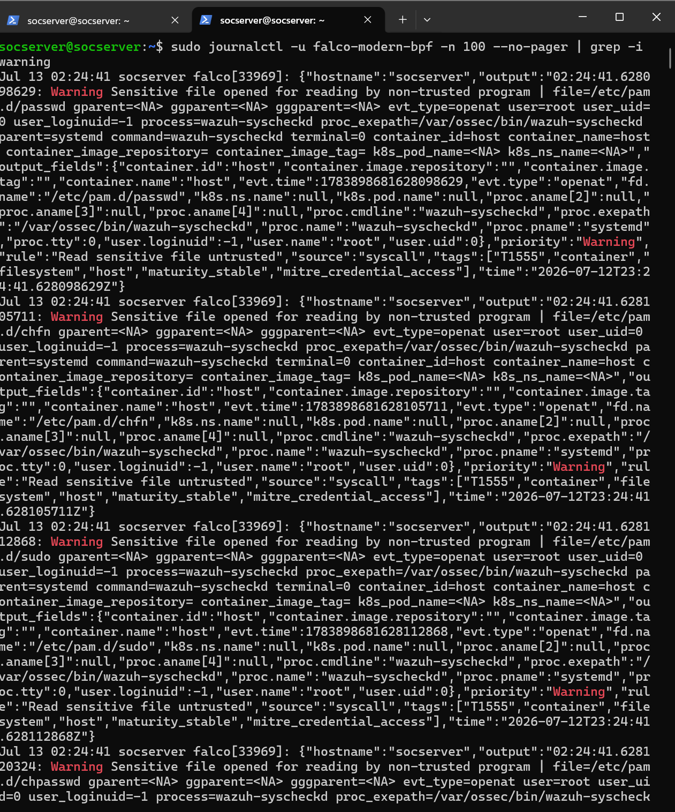

**Auditd — Login/Authentication Queries:**
Queries for `USER_LOGIN` and `USER_AUTH` events returned `<no matches>` at this stage — no real login attempt had been recorded yet. This confirms the audit subsystem was correctly configured and ready to log, establishing a clean baseline.

*Evidence: `09-auditd-user-login-query-no-matches.png`, `10-auditd-user-auth-query-no-matches.png`*


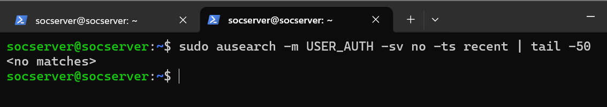

**CrowdSec — Community Threat Intelligence:**
`cscli decisions list` showed no active blocking decisions at this point. However, `cscli metrics` revealed a far more valuable finding: through the CrowdSec Community API (CAPI) blocklist, **5,030 IPs were already proactively blocked**, broken down as:

| Category | Blocked IP Count |
|---|---|
| http:bruteforce | 1,831 |
| http:exploit | 1,334 |
| ssh:bruteforce | 1,045 |
| ssh:exploit | 137 |

This demonstrates that the server benefits from a global threat intelligence network **even before any attack attempt occurs locally**.

*Evidence: `11-crowdsec-decisions-list-empty.png`, `12-crowdsec-metrics-community-blocklist.png`*

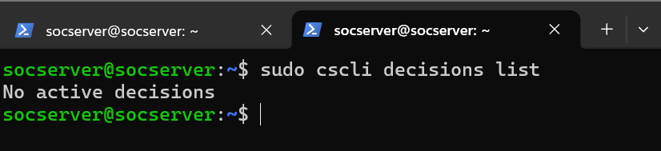


---

## 5. Fail2Ban Troubleshooting — The Most Valuable Part of This Project

During this project, it was discovered that Fail2Ban's `nginx-botsearch` jail was not banning real attack attempts. Root cause analysis uncovered three separate, independent issues:

### Root Cause A — Incorrect Backend Configuration
Fail2Ban jails were configured with `backend=systemd`, but nginx was writing logs directly to a file (`/var/www/karateke.online/logs/access.log`) rather than to journald. This mismatch meant Fail2Ban never saw the relevant log entries.

**Fix:** `jail.local` was corrected to use `backend=auto`, and all nginx jail `logpath` values were updated to point to the correct log file.

*Evidence: `13-fail2ban-jail-local-config-fixed.png`*


### Root Cause B — Nginx SPA Fallback Never Produced Real 404s
Since the application is a React SPA, nginx redirected all unknown paths to `index.html` and returned HTTP 200 — including for suspicious probe paths (`/pma/`, `/wp-admin/`, etc.). As a result, Fail2Ban's 404-based filters never triggered.

**Fix:** A dedicated nginx `location` block was added for suspicious/unknown paths, ensuring they actually return `404`.

*Evidence: `14-nginx-access-log-real-ip-404-probes.png` — shows `/pma/realiptest*` requests genuinely returning 404 after the fix*


### Root Cause C (Most Critical) — Cloudflare Tunnel Was Masking the Real IP
Because the server is exposed via Cloudflare Tunnel, every request reached nginx as `127.0.0.1`. Fail2Ban's `ignoreself` rule ignores its own loopback IP by default, meaning **no attacker IP could ever be banned** — the system perceived every request as originating from itself.

**Fix:** `/etc/nginx/conf.d/cloudflare-realip.conf` was created, defining all official Cloudflare IP ranges via `set_real_ip_from` directives, with `real_ip_header CF-Connecting-IP;` exposing the true client IP to nginx.

*Evidence: `18-nginx-cloudflare-realip-config.png`*

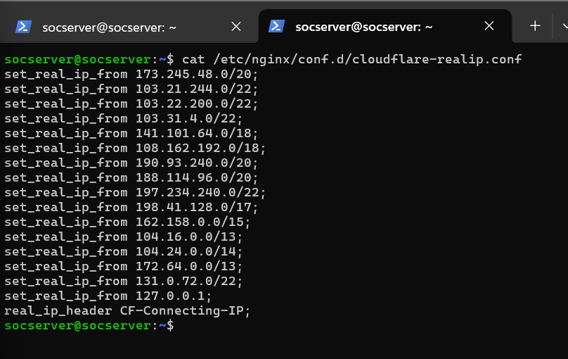

**Verification:** After the fix, access.log began showing the real client IP (`X.X.X.X`) instead of `127.0.0.1`.

*Evidence: `19-nginx-access-log-real-ip-dashboard-requests.png`*

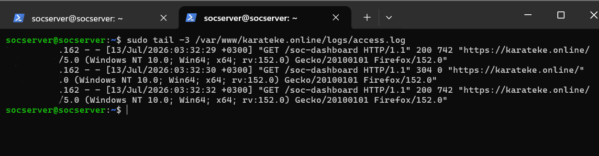

### Validation and Final Evidence

The `fail2ban-regex` tool was used to test the filter logic against access.log, finding **51 matches** — confirming the filter was working correctly.

*Evidence: `15-fail2ban-regex-filter-match-analysis.png`*

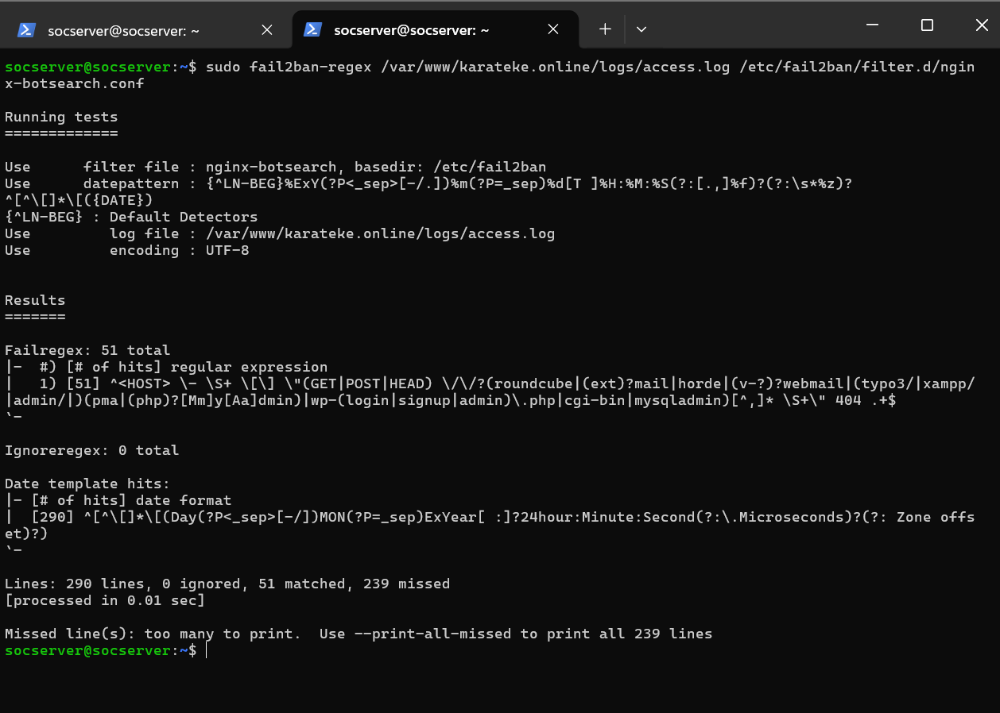

After all three root causes were fixed, the `nginx-botsearch` jail became fully operational, detecting and banning the attacker's IP in real time:

```
Currently failed: 0
Total failed:     24
Currently banned: 1
Total banned:     1
Banned IP list:   X.X.X.X
```

This is final proof that the attacker's IP was **genuinely detected and banned**.

*Evidence: `20-fail2ban-nginx-botsearch-status-final.png`*


(During the process, `fail2ban-server` was also run in foreground debug mode, producing a `"Server already running"` error since the service was already active — this is expected behavior, not a fault.)

*Evidence: `16-fail2ban-server-foreground-debug-error.png`*


---

## Key Skills Demonstrated

- Deployment and validation of a multi-layered host-based detection architecture (Falco, Auditd, CrowdSec, Fail2Ban)
- Real attack simulation and practical validation of network segmentation defenses
- **Root cause analysis of a complex, multi-component production issue**: correctly diagnosing and resolving the interaction between the reverse proxy (Cloudflare Tunnel), web server (nginx SPA routing), and IPS (Fail2Ban) layers
- Mapping logs/alerts to the MITRE ATT&CK framework (T1555 — Credential Access)
- Evaluating and interpreting CrowdSec community threat intelligence

---

## Screenshot Inventory

| # | Filename | Content |
|---|---|---|
| 01 | 01-hydra-ssh-bruteforce-attempt-fail.png | Hydra SSH brute-force (wordlist error) |
| 02 | 02-hydra-http-bruteforce-attempt-fail.png | Hydra HTTP brute-force (wordlist error) |
| 03 | 03-manual-ssh-connection-attempts-timeout.png | Manual SSH attempts, timeout |
| 04 | 04-falco-service-status-active.png | Falco service status |
| 05 | 05-auditd-service-status-active.png | Auditd service status |
| 06 | 06-crowdsec-bouncer-service-status-active.png | CrowdSec + bouncer service status |
| 07 | 07-fail2ban-service-status-active.png | Fail2Ban service status |
| 08 | 08-falco-alert-sensitive-file-read.png | Falco sensitive file access alert |
| 09 | 09-auditd-user-login-query-no-matches.png | Auditd USER_LOGIN query |
| 10 | 10-auditd-user-auth-query-no-matches.png | Auditd USER_AUTH query |
| 11 | 11-crowdsec-decisions-list-empty.png | CrowdSec active decisions list |
| 12 | 12-crowdsec-metrics-community-blocklist.png | CrowdSec CAPI metrics |
| 13 | 13-fail2ban-jail-local-config-fixed.png | jail.local corrected configuration |
| 14 | 14-nginx-access-log-real-ip-404-probes.png | Suspicious paths returning 404 |
| 15 | 15-fail2ban-regex-filter-match-analysis.png | fail2ban-regex analysis output |
| 16 | 16-fail2ban-server-foreground-debug-error.png | Foreground debug mode output |
| 17 | 17-nmap-aggressive-scan-attack-surface.png | Nmap full port scan |
| 18 | 18-nginx-cloudflare-realip-config.png | Cloudflare real-IP configuration |
| 19 | 19-nginx-access-log-real-ip-dashboard-requests.png | Access log with real IP |
| 20 | 20-fail2ban-nginx-botsearch-status-final.png | Fail2Ban final ban evidence |

**Total: 20 verified screenshots.** (A Kali IP configuration screenshot is not present in this set; it can be added with a single follow-up screenshot if desired.)
