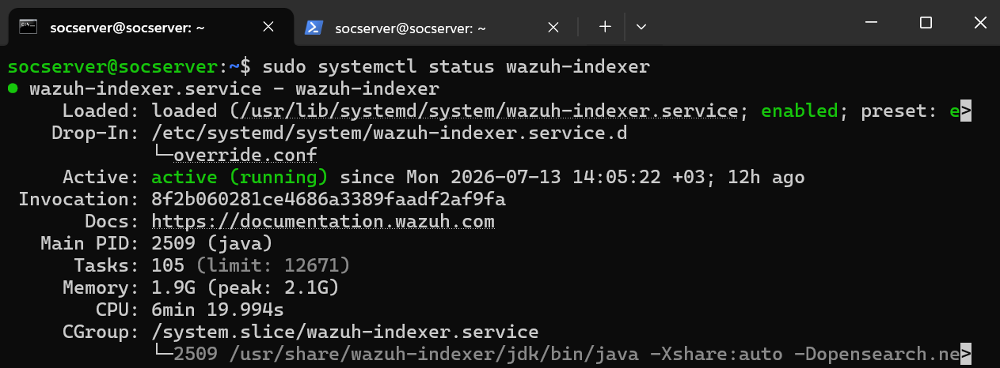
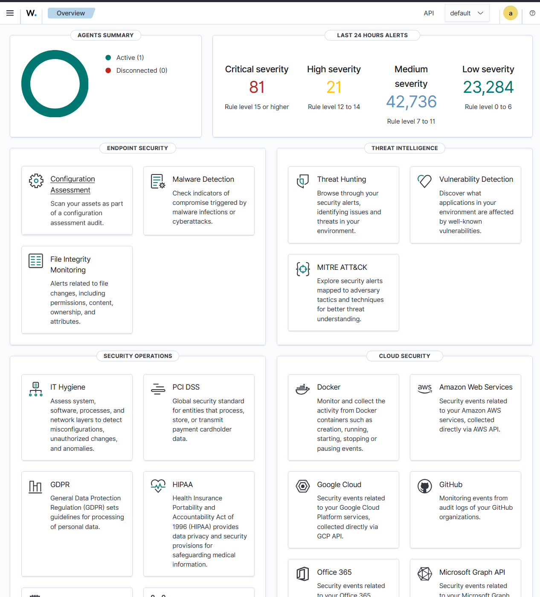
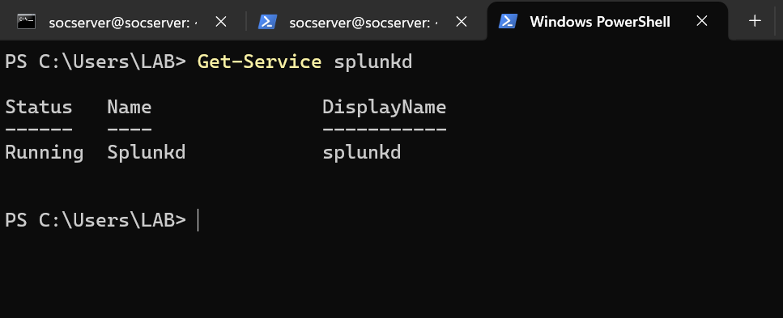
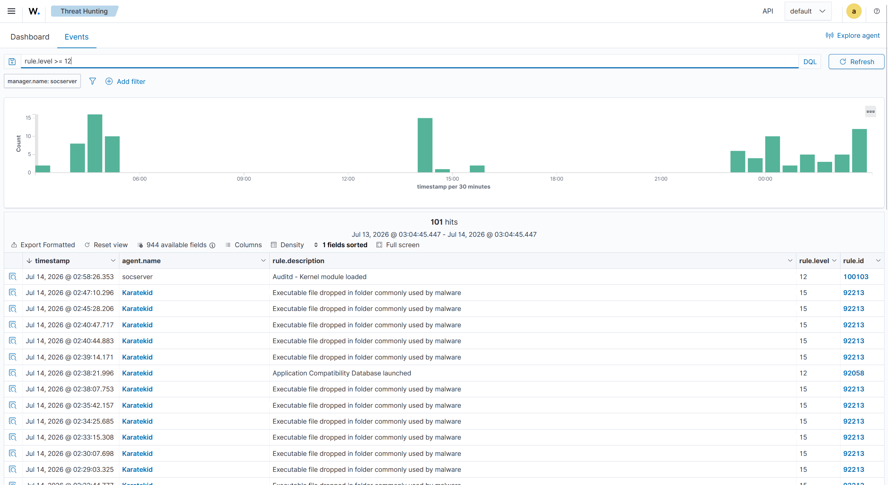
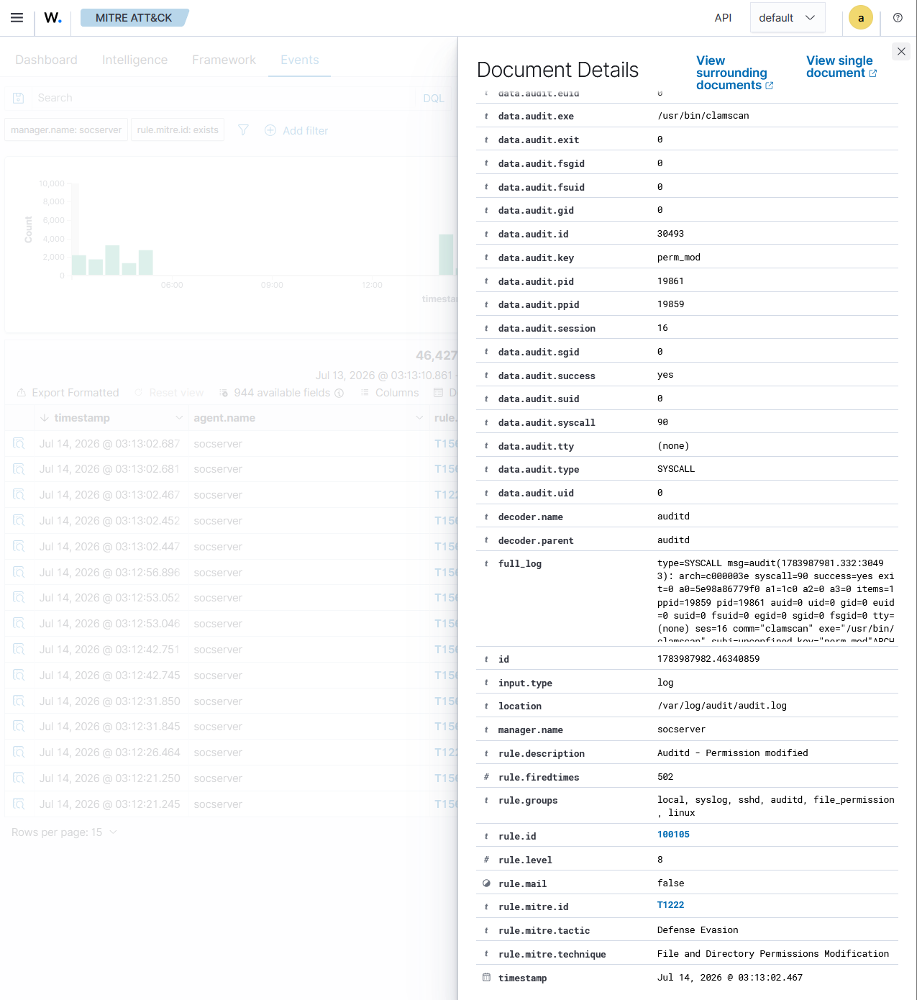
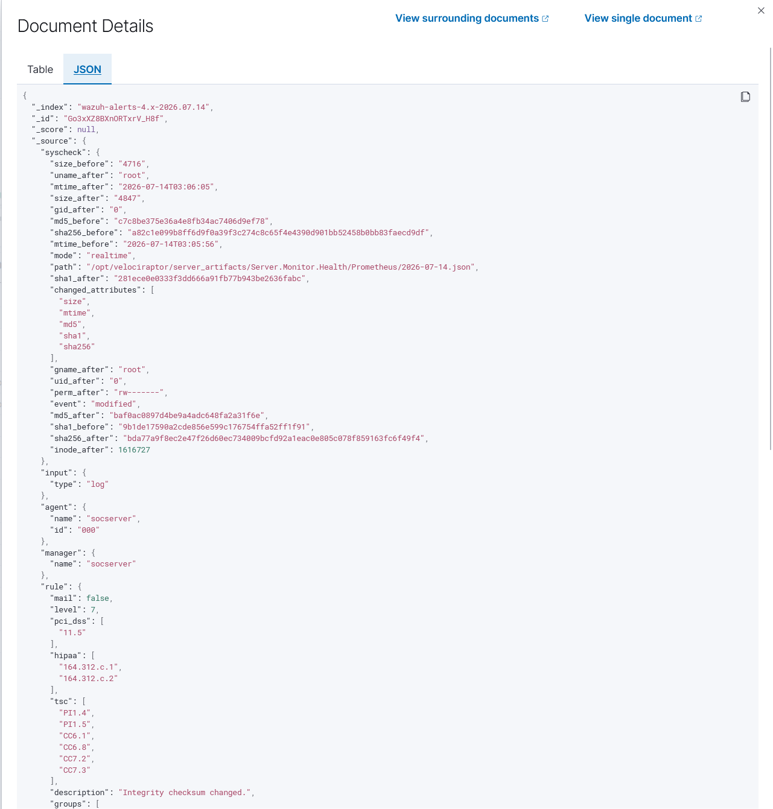
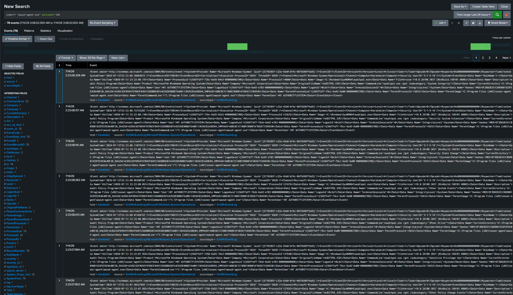

# Project 04: SIEM Log Correlation Platform (Wazuh + Splunk)

## Purpose

The scattered logs produced in Projects 01-03 (ModSecurity audit log, Suricata eve.json, Zeek conn.log, Falco/Auditd/CrowdSec/Fail2Ban records) are meaningful on their own, but the relationships between them are hard to see in isolation. This project brings all of these sources together in a central SIEM platform (Wazuh) to generate alerts based on correlation rules and severity levels, and adds a second, independent analysis/visibility layer via Splunk Enterprise running on a separate Windows 11 machine. (Full log correlation on the Splunk side has not actually been set up yet — this is an honest finding that surfaced during testing; see the Findings section.)

| Tool | Role |
|---|---|
| Wazuh Manager | Collects data from agents and log sources, correlates it with its rule engine, generates alerts |
| Wazuh Indexer | Indexes the produced events, enables search and storage |
| Wazuh Dashboard | The web interface where alerts and events are visualized |
| Splunk Enterprise | Independent secondary log analysis platform running on a separate Windows 11 machine |

## Methodology

### 1. Service Verification

Verified that the Wazuh components (Manager, Indexer, Dashboard) and Splunk are up and running. The dashboard overview showed **Critical: 81, High: 21, Medium: 42,736, Low: 23,284** alerts over the last 24 hours — proof that a dense, real alert stream fed by the Projects 01-03 security stack is already running on the system.

```bash
sudo systemctl status wazuh-manager
sudo systemctl status wazuh-indexer
sudo systemctl status wazuh-dashboard
```

*Evidence: `01-wazuh-manager-service-status.png`*


*Evidence: `02-wazuh-indexer-service-status.png`*



*Evidence: `03-wazuh-dashboard-overview.png`*



```powershell
Get-Service splunkd
```

*Evidence: `07-splunk-service-status.png`*



### 2. Selecting a Real High-Priority Alert

Password-based SSH authentication is deliberately **disabled** on the server (key-based auth only) — a security strength, so this project did not construct an artificial test that would weaken or bypass it. Instead, a high/critical-severity example was picked from the real alert data already flowing through the system: filtering Wazuh Threat Hunting > Events by `rule.level >= 12` returned **101 results**; among these, a **level 15** alert, `rule.id 92213` — *"Executable file dropped in folder commonly used by malware"* — was selected as the example event.

*Evidence: `04-wazuh-real-alert-selection.png`*



### 3. Wazuh Detection and MITRE Mapping

Reviewed the Document Details view of one of the selected alerts: `rule.mitre.id: T1222`, `rule.mitre.tactic: Defense Evasion`, `rule.mitre.technique: File and Directory Permissions Modification`, `rule.description: "Auditd - Permission modified"`, `rule.id: 100105`, `rule.level: 8`, `data.audit.key: perm_mod`. The source process (`data.audit.exe`) is **`/usr/bin/clamscan`** — i.e., Project 06's ClamAV component.

*Evidence: `05-wazuh-alert-detail-mitre-attck.png`*



Also reviewed, as an example of a different detection type, a rule-triggered log record originating from file integrity monitoring (syscheck) (`rule.description: "Integrity checksum changed."`, `rule.level: 7`).

*Evidence: `06-wazuh-rule-triggered-log.png`*



**Finding:** Wazuh is able to monitor even our own security tools' (ClamAV) routine operations at the audit level and tag them with a MITRE ATT&CK technique (T1222) — an interesting side finding showing that even a defensive tool's own behavior is observable and classifiable.

### 4. Independent Visibility in Splunk

Searched Splunk for `wazuh-agent.exe`; returned **78 events** over the last 24 hours.

*Evidence: `08-splunk-index-search-spl-query.png`*



Expanding the field list of one event, `ParentImage` and `ParentCommandLine` clearly show `C:\Program Files (x86)\ossec-agent\wazuh-agent.exe`.

*Evidence: `09-splunk-wazuh-agent-telemetry-detail.png`*


### 5. Wazuh-Splunk Side-by-Side Monitoring

A split-screen view monitored both platforms simultaneously: on the left, a Splunk search for `wazuh` (**79 events**); on the right, the Wazuh Threat Hunting dashboard (**68,009 Total, 101 Level 12+ alerts, 7 Authentication failure, 95 Authentication success**).

*Evidence: `10-wazuh-splunk-side-by-side-visibility.png`*


This image shows the two platforms can be monitored **simultaneously, side by side** — but as explained in the next section, this is an operational convenience for side-by-side monitoring, not data-level correlation/integration.

## Findings

### Finding A — Wazuh-Splunk Integration Is Not Yet Set Up

Running `| eventcount summarize=false index=*` in Splunk showed that only the `history`, `main`, and `summary` indexes exist — there is **no** dedicated `wazuh`/`wazuh-alerts` index. This shows Wazuh alerts are not being forwarded to Splunk; the two platforms currently operate independently at the data level. A shared index/forwarder integration (e.g., Wazuh's Splunk App or alert forwarding via HTTP Event Collector) for full log correlation is planned as a future improvement.

### Finding B — Complementary (But Independent) Visibility

Despite Finding A, Splunk's own independent Sysmon/Windows telemetry provided indirect but real confirmation: `wazuh-agent.exe` appearing clearly in the `ParentImage`/`ParentCommandLine` fields confirms, from Splunk's own independent vantage point, that the Wazuh agent is genuinely running on the endpoint. In other words, there is currently **no full correlation, but there is complementary visibility** — the two platforms don't share the same data, but they can indirectly confirm each other's presence.

## Key Competencies Demonstrated

- Filtering and triaging real-time, high-priority (`rule.level >= 12`) alerts
- Practically interpreting MITRE ATT&CK mapping (linking T1222/Defense Evasion to an audit-level event)
- Recognizing how security tools (ClamAV, Auditd) can observe and tag each other's behavior
- Identifying and honestly reporting SIEM integration gaps (no dedicated Wazuh index in Splunk)
- Demonstrating that different telemetry sources (Wazuh audit + Splunk Sysmon) can independently confirm each other

## Screenshot Inventory

| # | File Name | Content |
|---|---|---|
| 01 | 01-wazuh-manager-service-status.png | Wazuh Manager service status |
| 02 | 02-wazuh-indexer-service-status.png | Wazuh Indexer service status |
| 03 | 03-wazuh-dashboard-overview.png | Dashboard overview (Critical 81/High 21/Medium 42,736/Low 23,284) |
| 04 | 04-wazuh-real-alert-selection.png | rule.level >= 12 filter, 101 hits, level 15 malware alert |
| 05 | 05-wazuh-alert-detail-mitre-attck.png | T1222/Defense Evasion MITRE mapping (clamscan-sourced) |
| 06 | 06-wazuh-rule-triggered-log.png | Full JSON record of the triggered rule (syscheck detail) |
| 07 | 07-splunk-service-status.png | Splunk service status (Windows, splunkd Running) |
| 08 | 08-splunk-index-search-spl-query.png | Splunk search for "wazuh-agent.exe", 78 events |
| 09 | 09-splunk-wazuh-agent-telemetry-detail.png | Expanded event, ParentImage=wazuh-agent.exe |
| 10 | 10-wazuh-splunk-side-by-side-visibility.png | Split-screen: Splunk search + Wazuh dashboard side by side |

**Total: 10 verified screenshots.**
