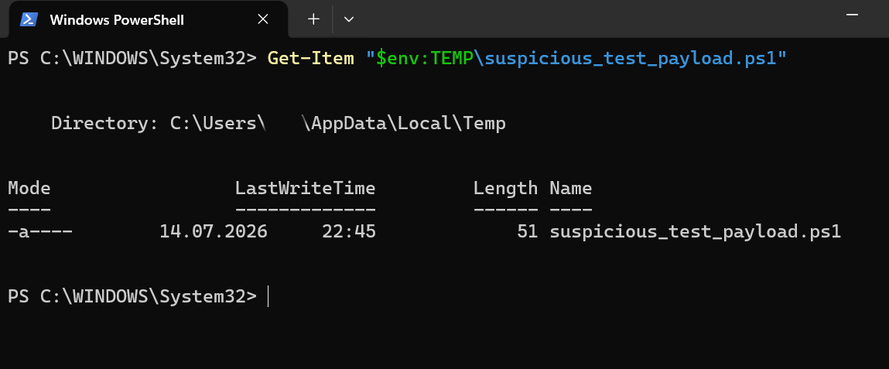
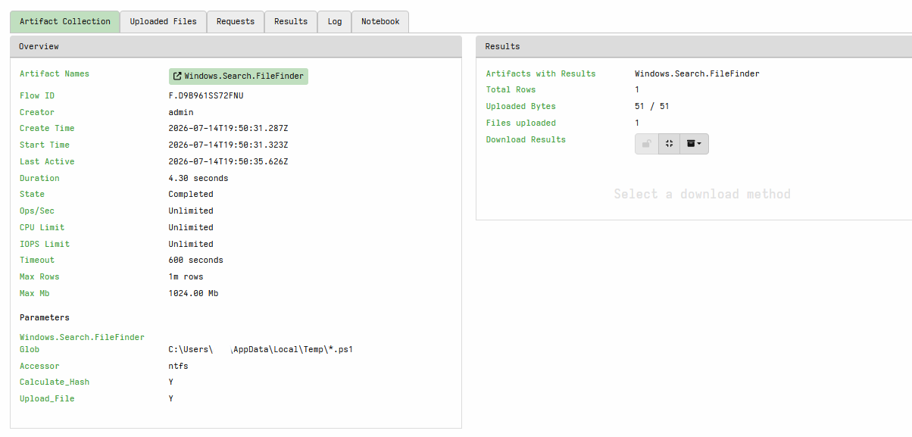
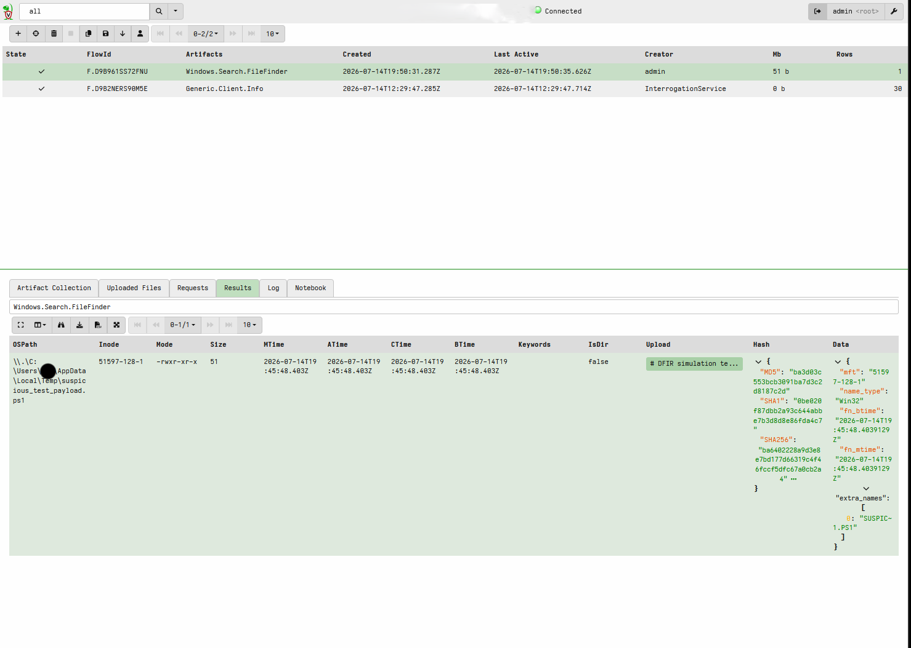
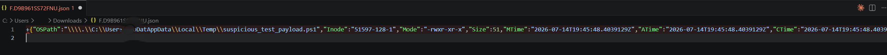
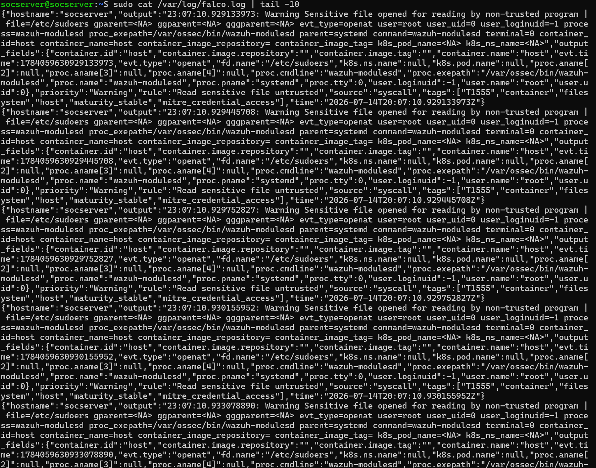

# Project 05: DFIR Digital Forensics Lab (Velociraptor)

## Purpose

This project aims to validate, end to end, a basic digital forensics and incident response workflow on an endpoint using the Velociraptor DFIR platform. Scope: verifying the server infrastructure, connecting a Windows client as an agent, collecting an artifact through a controlled test scenario, reviewing the results (timestamps and cryptographic hashes), and reporting.

## Methodology

### 1. Verifying Server Status
On the Ubuntu server (`socserver`, 192.168.1.149), the status of the Velociraptor service was checked:
```bash
sudo systemctl status velociraptor.service
```
The service was confirmed to be `active (running)`, with over 13 hours of continuous uptime.


### 2. Establishing the Client Connection
A client MSI package was generated via the Velociraptor GUI for the Windows 11 client (`Karatekid`) and installed. The initial install attempts hit an MSI error (error 1603, failing at the `ProcessComponents` step); the root cause was a Windows Installer issue tied to the unsigned/downloaded file. As a fix, the service was installed directly using Velociraptor's own exe + client config method:
```powershell
.\velociraptor.exe --config client.config.yaml service install
Start-Service -Name "Velociraptor"
```
The client connected successfully to the server and moved into "Connected" status.


### 3. Controlled Test Scenario
The Falco logs (`/var/log/falco.log`) were reviewed beforehand; all the "Read sensitive file untrusted" alerts observed were found to originate from the `wazuh-modulesd` process reading `/etc/sudoers` and `/etc/shadow` during its routine FIM (File Integrity Monitoring) scan — this is not an actual threat but expected, legitimate behavior (see Findings). For this reason, a controlled, benign test scenario was chosen instead of a real incident. A harmless marker file was created on the client:
```powershell
whoami
New-Item -Path "$env:TEMP\suspicious_test_payload.ps1" -ItemType File -Value "# DFIR simulation test payload - benign marker file"
Get-Item "$env:TEMP\suspicious_test_payload.ps1"
```



### 4. Artifact Collection Request
The target file was searched for via the Velociraptor GUI using the `Windows.Search.FileFinder` artifact. The first attempt with the default `auto` accessor returned 0 results (see Findings, root cause analysis); switching to the `ntfs` accessor resolved the issue:

### 5. Reviewing the Results
The collection completed successfully with 1 result row and 51/51 bytes uploaded. The results table presents the file path, all four MFT timestamps (MTime, ATime, CTime, BTime — all 2026-07-14T19:45:48.403Z), and three hash algorithms (MD5, SHA1, SHA256) in a single row. This table simultaneously covers both timeline analysis and hash extraction.



### 6. Reporting and Export
The collection result was exported in JSON format and verified (`F.D9B961SS72FNU.json`), with the content reviewed in VS Code.



## Findings / Root Cause Analysis

**Finding A — Falco alerts are false positives:** Falco's "Read sensitive file untrusted" rule was being triggered by the `wazuh-modulesd` process reading `/etc/sudoers` and `/etc/shadow`. Investigation confirmed this to be Wazuh's own legitimate FIM/rootcheck activity, not an actual threat. This represents a configuration improvement opportunity — Wazuh is not yet added to Falco's "trusted process" list — and is the rationale for choosing a controlled test scenario over simulating a real incident.



**Finding B — SYSTEM account access restriction:** The Velociraptor Windows client runs under the `LocalSystem` account. With the default `auto` accessor, an attempt to access the user-specific `AppData\Local\Temp` folder returned 0 results (a permissions restriction). Switching to the `ntfs` accessor (low-level, raw disk read) bypassed this restriction and the file was found successfully. This is a practical justification for DFIR tools preferring raw disk access over relying on the live filesystem API.

## Highlighted Skills

- End-to-end installation and configuration of the Velociraptor DFIR platform
- Windows Installer (MSI) troubleshooting and alternative service installation methods
- VQL-based artifact collection (Windows.Search.FileFinder)
- Practical application of filesystem accessor concepts (auto vs ntfs) and bypassing permission restrictions
- Falco log analysis and distinguishing false positives from real threats
- MFT-based timestamp analysis (MTime/ATime/CTime/BTime) and cryptographic hash verification
- Exporting a forensic report in JSON format

## Screenshot Inventory

| # | File | Description |
|---|---|---|
| 1 | 01-velociraptor-server-status.png | Server service status (active/running) |
| 2 | 02-velociraptor-client-connected.png | Client connection status (Connected) |
| 3 | 03-simulated-incident-command.png | Controlled test file creation command |
| 4 | 04-velociraptor-artifact-collection-request.png | Artifact collection request and parameters |
| 5 | 05-velociraptor-collection-results.png | Collection results (timestamps + hashes) |
| 6 | 06-velociraptor-report-export.png | JSON report export |
| 7 | 07-falco-log-review.png | Falco log review (false-positive identification) |

## Next Steps

This project validated, end to end, the setup of the Velociraptor infrastructure, the connection of an endpoint, and a basic artifact collection/analysis flow. As a more advanced DFIR scenario, a controlled attack simulation from Kali Linux (`192.168.1.188`) against the Windows client (remote command execution over WMI/SMB via Impacket, MITRE T1047/T1021.002) was planned but could not be completed in this session because Windows Firewall was filtering the SMB ports (139/445). This scenario will be completed in a future iteration with:

1. Opening the SMB rules in Windows Firewall,
2. Running a remote command from Kali with `wmiexec.py`,
3. Detecting this access using Velociraptor's `Windows.EventLogs.EvtxHunter` or `Windows.Network.Netstat` artifacts,
4. MITRE ATT&CK mapping and incident timeline reconstruction
