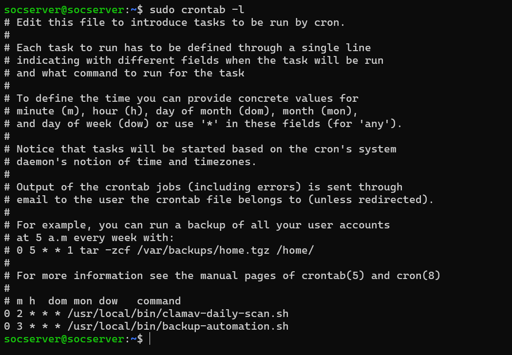
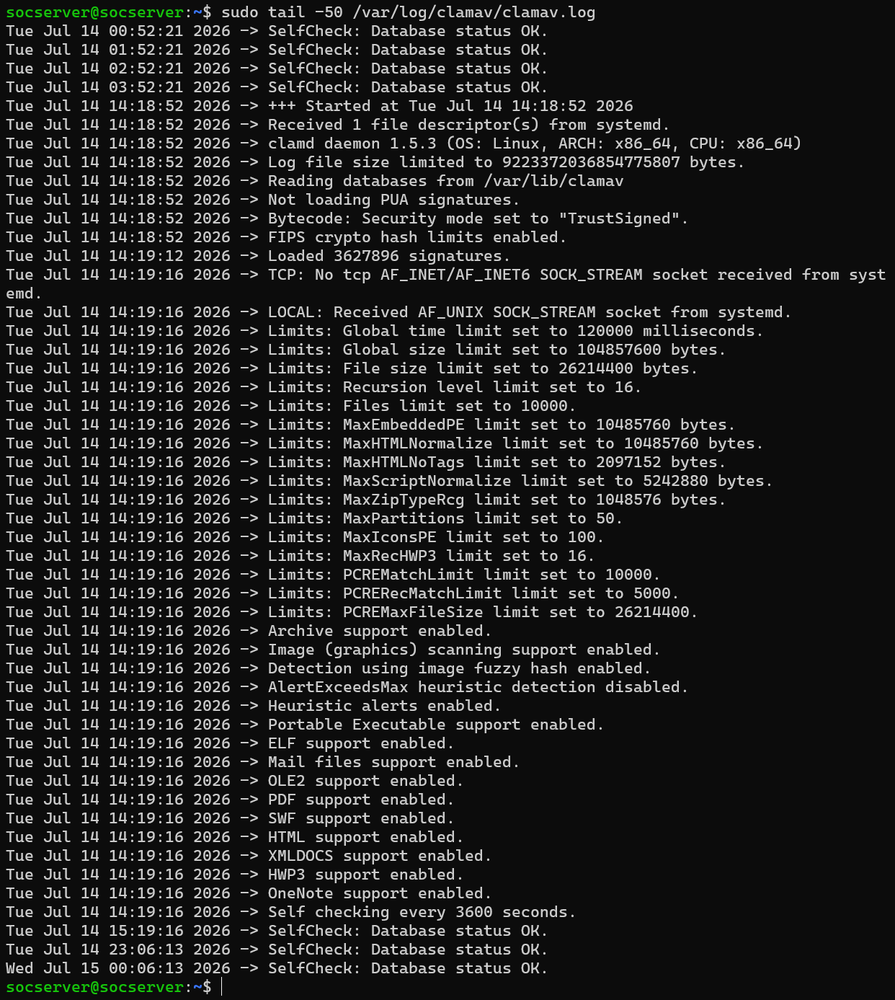
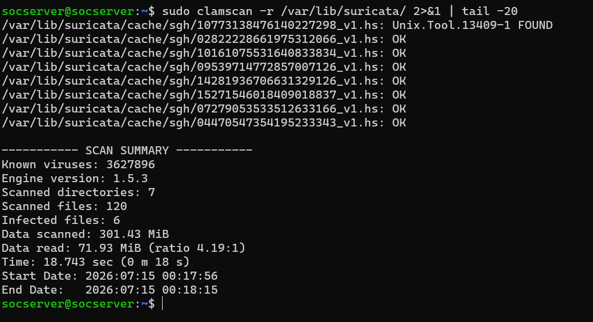

# Project 06: Malware Detection Automation (ClamAV + cron)

## Purpose

This project sets up an antivirus infrastructure that scans the server's filesystem regularly and automatically for malware. ClamAV runs as a signature-based antivirus engine, while a cron-scheduled script automates a daily full-system scan.

| Tool | Role |
|---|---|
| ClamAV (clamav-daemon) | Signature-based antivirus engine that scans the filesystem |
| cron | Automatically triggers the daily scan script at a scheduled time |

## Methodology

### 1. Service Status Verification

The status of the ClamAV daemon was checked:
```bash
sudo systemctl status clamav-daemon
```
The service was `active (running)`, with continuous uptime since 2026-07-14 14:18:52 +03 (Main PID 2544, Memory 957.5M).


### 2. Verifying the Scheduling Mechanism

The original plan expected the schedule to be defined as a system file under `/etc/cron.d/`; in reality, the job was found to be defined in root's personal crontab:
```bash
sudo crontab -l
```
Two lines were found in the output:
```
0 2 * * * /usr/local/bin/clamav-daily-scan.sh
0 3 * * * /usr/local/bin/backup-automation.sh
```
The first line is this project's schedule (ClamAV daily scan, 02:00), and the second is Project 07's schedule (Automated Backup Recovery System, 03:00) — the same screenshot serves as valid evidence for both projects.



### 3. Detection Test with the EICAR Test File

The standard, harmless EICAR test file was downloaded and its contents verified:
```bash
curl -o /tmp/eicar.txt https://secure.eicar.org/eicar.com.txt
cat /tmp/eicar.txt
```
The `EICAR-STANDARD-ANTIVIRUS-TEST-FILE` signature string was confirmed in the file contents.


### 4. Detection Verification via Manual Scan

```bash
sudo clamscan /tmp/eicar.txt
```
Result: `Eicar-Test-Signature FOUND`. Scan Summary: Known viruses: 3,627,896, Engine version: 1.5.3, Scanned files: 1, Infected files: 1, Data scanned: 68 B, Time: 6.084 sec.


### 5. Full-System Scan Log and Continuous Health Check

```bash
sudo tail -50 /var/log/clamav/clamav.log
```
The log confirms the service starting up, the database (3,627,896 signatures) loading, and hourly repeating `SelfCheck: Database status OK` entries — evidence that the service runs continuously and in a healthy state.



### 6. Verifying Automated Scan History via Syslog

```bash
sudo grep -a clamav /var/log/syslog | tail -20
```
The syslog record confirms `clamav-daemon` service start events and the `freshclam` database update history (`daily.cld`, version 28060, 355,490 signatures).


## Findings / Root Cause Analysis

**Finding A — The schedule is defined in root's personal crontab:** The audit plan expected the schedule to be found as a system file under `/etc/cron.d/`; in reality, the job is defined in root's personal crontab (`sudo crontab -l`). This is a practical finding showing that automation audits need to check user crontabs as well, not just `/etc/cron.d/`.

**Finding B — ClamAV produces a false positive on Suricata's rule files (Unix.Tool.13409-1):**
```bash
sudo clamscan -r /var/lib/suricata/
```
This scan produced a `Unix.Tool.13409-1 FOUND` detection on a rule cache file under `/var/lib/suricata/cache/sgh/` (Scanned files: 120, Infected files: 6). Root cause: Suricata's rule sets (e.g., ET/Emerging Threats) contain known attack/exploit signatures and malicious code snippets in raw form, precisely in order to DETECT them. ClamAV mistakes this signature content for an actual threat and flags it incorrectly. This is a real, instructive example of how security tools can misinterpret each other's data — not a misconfiguration, but a SOC practice that requires careful log analysis and source verification.



## Key Competencies Demonstrated

- Setting up automated, scheduled malware scanning infrastructure with ClamAV + cron
- Verifying an antivirus engine's real-time detection capability with the standard EICAR test file
- Discovering and verifying the actual location of the scheduling mechanism (root crontab, not `/etc/cron.d/`)
- Analyzing false-positive scenarios between security tools and root-causing them (Suricata rule files → ClamAV misdetection)
- Proving automation continuity and health through log-based verification (service status, scan log, syslog history)

## Screenshot Inventory

| # | File Name | Content |
|---|---|---|
| 01 | 01-clamav-service-status.png | ClamAV service status (active/running) |
| 02 | 02-cron-daily-scan-job-definition.png | Root crontab, daily scan schedule (Project 06 + 07) |
| 03 | 03-eicar-test-file-creation.png | EICAR test file download and verification |
| 04 | 04-clamav-manual-scan-eicar-detection.png | Manual scan - EICAR detection |
| 05 | 05-clamav-scan-log-full-system.png | Full-system scan log, SelfCheck OK |
| 06 | 06-false-positive-analysis-suricata-cache.png | False positive analysis (Suricata rule file, Unix.Tool.13409-1) |
| 07 | 07-clamav-cron-log-history.png | Past ClamAV/freshclam records in syslog |

**Completed with 7 verified screenshots.**
