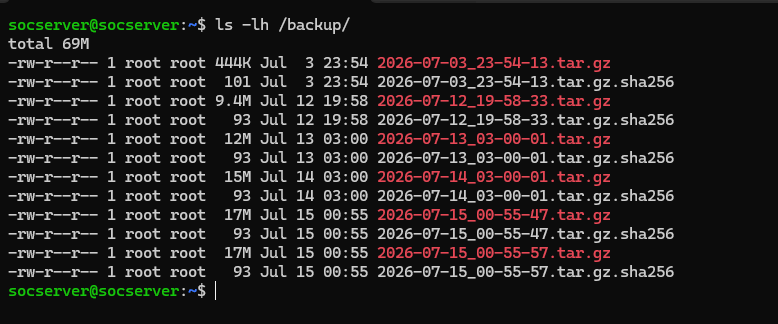
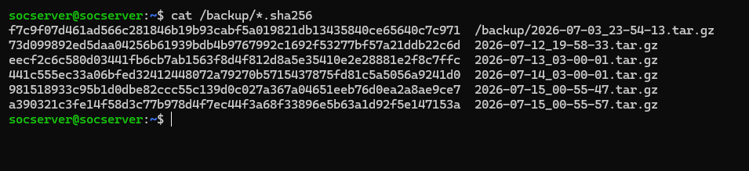
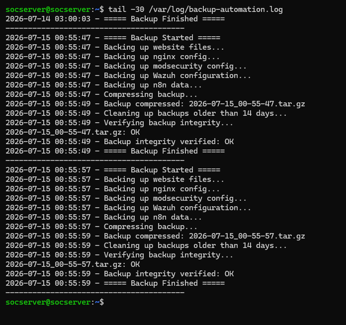
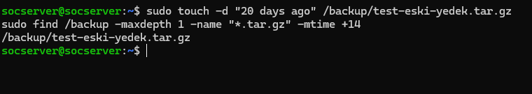

# Project 07: Automated Backup & Recovery System

## Purpose

The configurations and data belonging to the security and infrastructure components set up in previous projects must be recoverable in a disaster scenario (disk failure, ransomware, misconfiguration). This project builds a backup system with integrity verification (SHA256) and automated retention policy management.

| Tool | Role |
|---|---|
| Bash scripting | The main automation script that drives the entire backup logic |
| cron | Automatically triggers the backup script every night |
| tar | Bundles the backed-up files into a single compressed archive |
| sha256sum | Generates/checks a checksum to verify the integrity of the backup archive |

## Methodology

### 1. Reviewing the Backup Script Content

```bash
cat /usr/local/bin/backup-automation.sh
```
The script copies, in order, the website (`rsync`, `/var/www/karateke.online/`), nginx config, ModSecurity config, Wazuh config (only `/var/ossec/etc/` — `logs`/`queue` excluded due to size), and n8n Docker volume data into a timestamped directory; compresses the directory into a `tar.gz`; generates a SHA256 hash file; deletes the raw (uncompressed) directory after compression (leaving only the `.tar.gz`); automatically cleans up backups older than `RETENTION_DAYS=14`; and, as a final step, verifies the integrity of its own resulting archive with `sha256sum -c` and logs the result.


### 2. Verifying the Schedule (Cron)

```bash
sudo crontab -l
```
Root's crontab has the line `0 3 * * * /usr/local/bin/backup-automation.sh` defined — in the same crontab file as, but at a different hour from, Project 06's daily ClamAV scan (`0 2 * * *`). **This screenshot was also used as evidence in Project 06** (the same `sudo crontab -l` output is valid evidence for both projects).


### 3. Manual Run

```bash
tail -30 /var/log/backup-automation.log
```
The log shows a full run cycle: `===== Backup Started =====` → website/nginx/modsecurity/Wazuh/n8n backed up in order → `Compressing backup...` → `Cleaning up backups older than 14 days...` → `Verifying backup integrity...` → `OK` → `Backup integrity verified: OK` → `===== Backup Finished =====`.


### 4. Verifying the Resulting Backup Files

```bash
ls -lh /backup/
```
`/backup/` contains timestamped `.tar.gz` + `.tar.gz.sha256` file pairs (6 backups, 69M total) — the oldest from 2026-07-03, the newest two being back-to-back manual test backups taken the same day (2026-07-15).



### 5. Reviewing the SHA256 Checksum Values

```bash
cat /backup/*.sha256
```
The generated SHA256 hash value and corresponding file path were listed for each archive, one per line.



### 6. Integrity Verification

The same log entry also contains the script's own integrity verification: `Verifying backup integrity...` followed by `<file>.tar.gz: OK` and `Backup integrity verified: OK`. **This is the same source screenshot as step 3** — since the script's single log output contains both the run and the verification information together, the same piece of evidence is used under both subsections.



### 7. Retention Policy Test

```bash
sudo touch -d "20 days ago" /backup/test-eski-yedek.tar.gz
sudo find /backup -maxdepth 1 -name "*.tar.gz" -mtime +14
```
Rather than waiting a real 14 days, this was simulated by creating a fake file with its modification time set 20 days in the past. `find ... -mtime +14` correctly identified this file — proof that the script's retention logic (`find "$BACKUP_ROOT" -maxdepth 1 -name "*.tar.gz" -mtime +$RETENTION_DAYS -exec rm -f {} \;`) will work as intended.



### 8. Recovery Restore Test

```bash
ls -t /backup/*.tar.gz | head -1 | xargs tar -tzvf | head -20
```
The most recent archive was inspected by listing its contents without extracting it. The output showed real configuration and rootcheck files under `wazuh/etc/` (`ossec.conf`, `client.keys`, `local_decoder.xml`, CIS/rootkit check lists, etc.) — confirming that the backup doesn't just "exist" but contains real, recoverable data.


## Key Competencies Demonstrated

- Comprehensively and consistently backing up critical infrastructure components (website, nginx, ModSecurity, Wazuh, n8n) with a single script
- Designing the script to be self-verifying, checking and logging its own backup's integrity
- Honestly verifying the retention policy with a simulated test (`touch -d` + `find -mtime`) rather than requiring a real waiting period
- Proving the distinction between "a backup exists" and "the backup is actually restorable" via a restore test
- Verifying the actual location of the cron-based schedule (root crontab, shared with Project 06)
- Building an end-to-end SHA256-based integrity verification chain

## Screenshot Inventory

| # | File Name | Content |
|---|---|---|
| 01 | 01-backup-script-content.png | Backup script content |
| 02 | 02-cron-schedule-definition.png | Cron schedule definition (evidence shared with Project 06) |
| 03 | 03-manual-backup-run-output.png | Manual backup run output |
| 04 | 04-backup-tar-file-created.png | Created tar files (6 backups, 69M) |
| 05 | 05-sha256-checksum-generation.png | SHA256 checksum generation |
| 06 | 06-sha256-integrity-verification.png | SHA256 integrity verification (same source screenshot as #03) |
| 07 | 07-retention-policy-14-day-cleanup.png | 14-day retention/cleanup evidence (simulated test) |
| 08 | 08-recovery-restore-test.png | Recovery restore test |

**Completed with 8 verified screenshots** (03 and 06 share the same source log screenshot).
