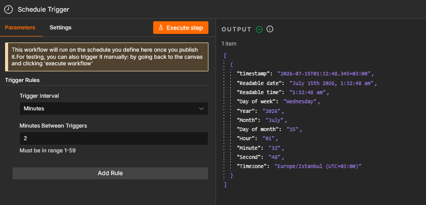
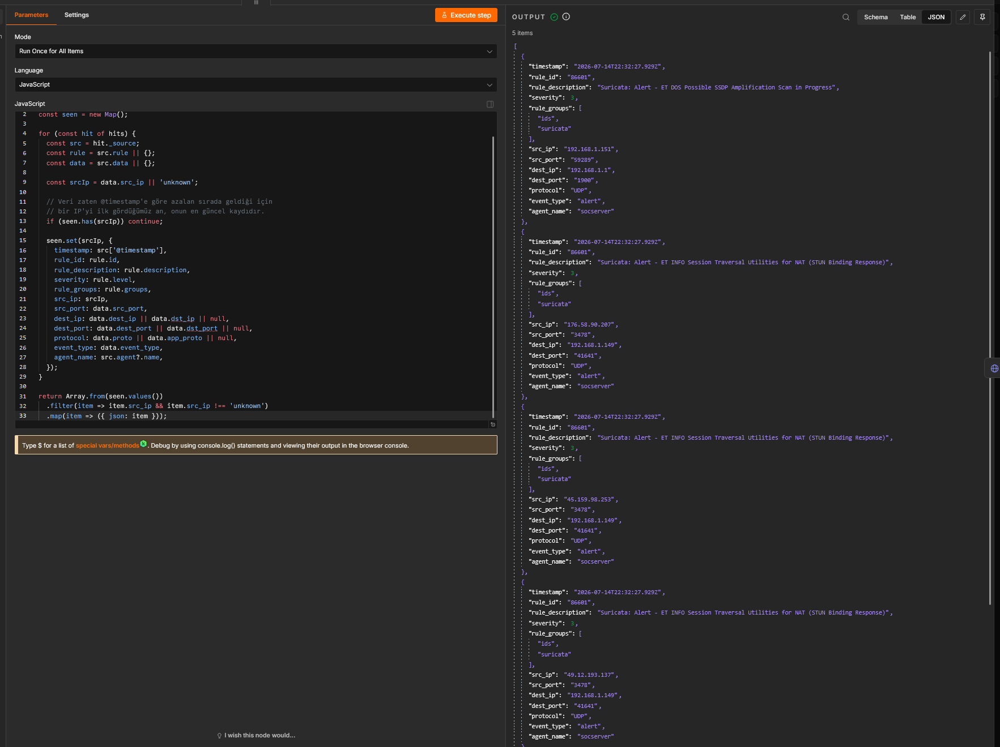
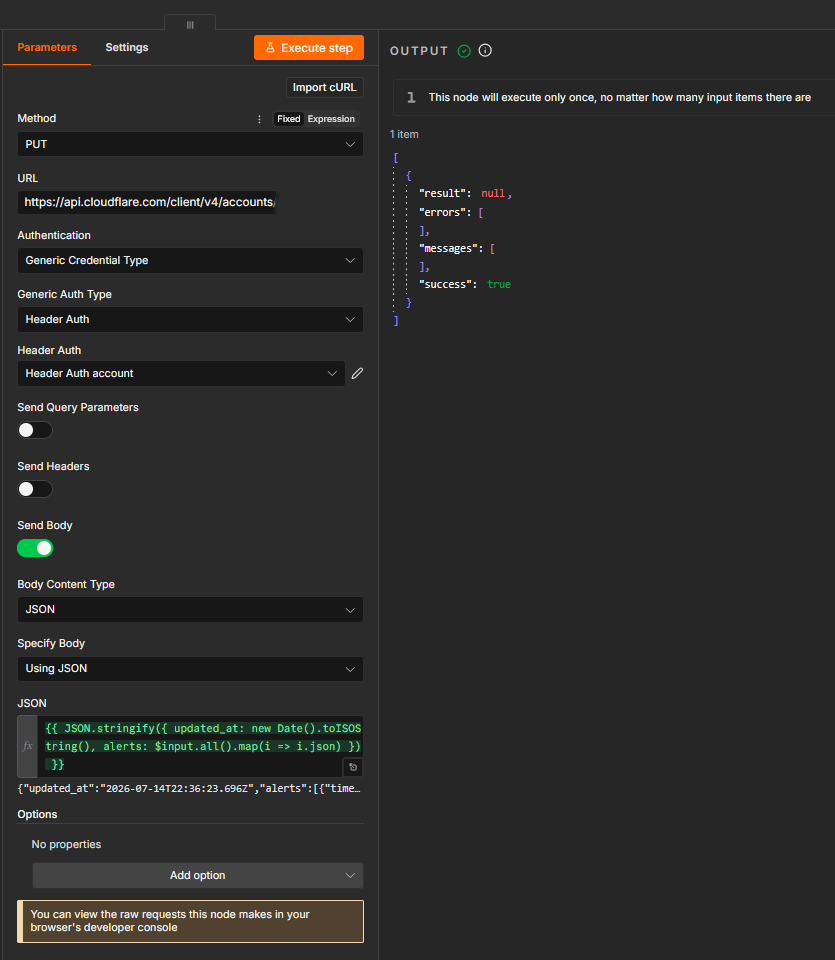
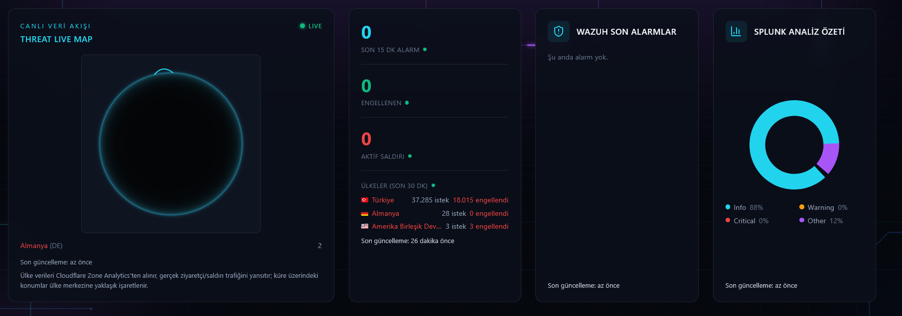

# Project 08: SOC Automation with n8n

## Purpose

The SIEM data (Wazuh, Splunk) collected in previous projects generates alerts on its own, but responding to those alerts usually requires manual analyst intervention. This project uses the n8n workflow automation tool to build a SOAR (Security Orchestration, Automation & Response) pipeline: data is pulled from the Wazuh Indexer and Splunk REST API, processed with JavaScript, and written automatically to Cloudflare KV storage. **This workflow is the backend engine that consumes the Wazuh/Splunk data examined in Project 04 (SIEM Log Correlation) and feeds the live panels (Threat Live Map, Wazuh Son Alarmlar, Splunk Analiz Özeti) of the `karateke.online/soc-dashboard` page** — in other words, Project 04's "data generation" and this project's "data distribution/automation" are two parts of the same chain.

| Tool | Role |
|---|---|
| n8n (Docker container) | Workflow automation engine; pulls SIEM data, processes it, writes it to Cloudflare KV |
| Wazuh Indexer (OpenSearch, port 9200) | Alert data source, queried directly by n8n with a raw `_search` query |
| Splunk REST API (port 8089) | Secondary analysis platform, queried by n8n with an SPL query |
| Cloudflare KV (Workers KV) | Key-value store n8n writes processed data to, read by soc-dashboard |

## Methodology

### 1. n8n Docker Service Status

```bash
docker ps | grep n8n
```
The n8n container is running (`Up 11 hours`), bound only to `127.0.0.1:5678` — closed to the outside, a secure configuration.


### 2. Workflow Architecture Overview

The n8n canvas was reviewed end to end: a single `Schedule Trigger` branches into 3 parallel paths — a WAZUH branch, a SPLUNK branch, and a direct Cloudflare/HTTP Request branch — each ending in its own `Code in JavaScript` and `HTTP Request` (Cloudflare `PUT`) node pair.


### 3. Schedule Configuration (Schedule Trigger)

The workflow does not run on a webhook but on a **scheduled** (`Schedule Trigger`) basis: `Trigger Interval: Minutes`, `Minutes Between Triggers: 2` — i.e., the system fires automatically every 2 minutes.



### 4. WAZUH Branch — Raw _search Query

The `HTTP Request` node in the WAZUH branch sends a raw `_search` query directly to the Wazuh Indexer (OpenSearch, `192.168.1.149:9200`): `POST /wazuh-alerts-*/_search`, `size: 50`, sorted descending by `@timestamp`, and filtered by `rule.groups` to select only the categories that matter (`ids`, `suricata`, `attack`, `web`, `sqlinjection`, `rootkit`, `authentication_failed`).


### 5. Data Transformation with JavaScript (Deduplication)

The `Code in JavaScript` node in the WAZUH branch deduplicates incoming alerts by `src_ip` (`const seen = new Map()`) — since the data already arrives sorted descending by `@timestamp`, the first record seen for each IP is kept as that IP's most recent record. The output showed real example IPs: `X.X.X.X`, `X.X.X.X`, `X.X.X.X`.



### 6. Cloudflare KV Update

The processed data is written to Cloudflare KV via `PUT https://api.cloudflare.com/client/v4/accounts/.../storage/kv/...`. This node's body in the WAZUH branch has the shape `{ updated_at: ..., alerts: $input.all().map(...) }` — i.e., an `{updated_at, alerts}` payload (likely the KV key feeding the "Wazuh Son Alarmlar" panel on the dashboard).



### 7. SPLUNK Branch — SPL Query (REST API)

The `HTTP Request` node in the SPLUNK branch sends a search job to the Splunk REST API (`192.168.1.151:8089`, Basic Auth): `POST /services/search/jobs/export`, with a body containing an SPL query of the form `search index=main earliest=-15m | rex field=_raw ...` — summarizing the last 15 minutes of data by category (Info/Warning/Critical/Other).


### 8. Production Execution History

In n8n's "Executions" screen, the workflow was confirmed to run continuously and in real time in production: consecutive "Succeeded" records at 2-minute intervals (01:38:22, 01:36:22, 01:34:22, ...).


### 9. End-to-End Proof: SOC Dashboard Live Result

The `karateke.online/soc-dashboard` page displays the data produced by this workflow live: the "CANLI VERİ AKIŞI / THREAT LIVE MAP", "WAZUH SON ALARMLAR", and "SPLUNK ANALİZ ÖZETİ" panels — visual proof that the full chain (Wazuh/Splunk → n8n → Cloudflare KV → dashboard) works end to end.



### 10. End-to-End Timing

The detail view of the same Executions screen (same source screenshot as step 8) shows a single execution's duration: `Succeeded in 2.196s`, `ID#1343` — the total time from trigger to Cloudflare KV write is roughly in the 2–3.7 second range.


## Findings

**Finding — The workflow updates at least 2 different Cloudflare KV keys in parallel, not just one:** The 3 parallel branches on the canvas don't write a single shared dataset to Cloudflare KV — they write at least two different payload shapes. The `HTTP Request1` node in the WAZUH branch sends a `{updated_at, alerts}`-shaped payload (likely the key feeding the "Wazuh Son Alarmlar" panel on the dashboard), while another branch examined sends a completely different `{windowStart, windowEnd, ...}`-shaped payload (likely a separate, time-windowed counter key feeding the country-level data on the "Threat Live Map" panel). The 5 separate `HTTP Request` + `PUT` node pairs visible on the canvas (`HTTP Request1/2/3/5` and one unnamed `HTTP Request`) are evidence of this parallel, multi-key update architecture — the workflow doesn't produce a single "alert list," it simultaneously generates several independent datasets that feed different panels of the dashboard.

## Key Competencies Demonstrated

- Combining multiple data sources (Wazuh Indexer, Splunk REST API, Cloudflare KV) into a single scheduled (not webhook-based, `Schedule Trigger`) workflow
- Writing raw, OpenSearch/Elasticsearch-style `_search` queries (filter, sort, size) directly via an HTTP Request node
- Writing custom data transformation and deduplication logic in JavaScript (`Map`-based most-recent-record deduplication)
- Identifying that multiple independent datasets (alert list, time-windowed counters) are written in parallel to different KV keys
- Proving automation reliability through a continuous, scheduled production execution history
- Verifying the SOAR chain (SIEM → n8n → Cloudflare KV → live dashboard) end to end, with a visual, real-world result

## Screenshot Inventory

| # | File Name | Content |
|---|---|---|
| 01 | 01-n8n-docker-service-status.png | n8n Docker service status |
| 02 | 02-n8n-workflow-canvas-overview.png | Full workflow diagram |
| 03 | 03-schedule-trigger-configuration.png | 2-minute schedule (Schedule Trigger) |
| 04 | 04-wazuh-http-request-config.png | Raw _search query to Wazuh Indexer |
| 05 | 05-javascript-data-transform.png | src_ip deduplication code |
| 06 | 06-cloudflare-kv-put-config.png | Cloudflare KV update ({updated_at, alerts}) |
| 07 | 07-splunk-http-request-config.png | Splunk SPL query (REST API) |
| 08 | 08-n8n-execution-log-success.png | Production execution history (every 2 min) |
| 09 | 09-soc-dashboard-live-data-result.png | Live dashboard result (end-to-end proof) |
| 10 | 10-end-to-end-workflow-timing.png | Execution timing (2.196s, same source screenshot as #08) |

**Completed with 10 verified screenshots** (08 and 10 share the same source screenshot).
