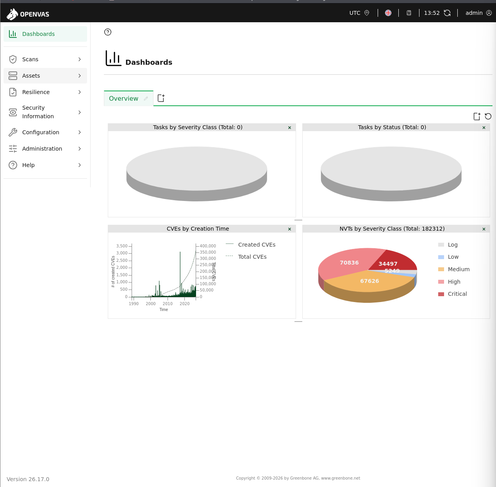
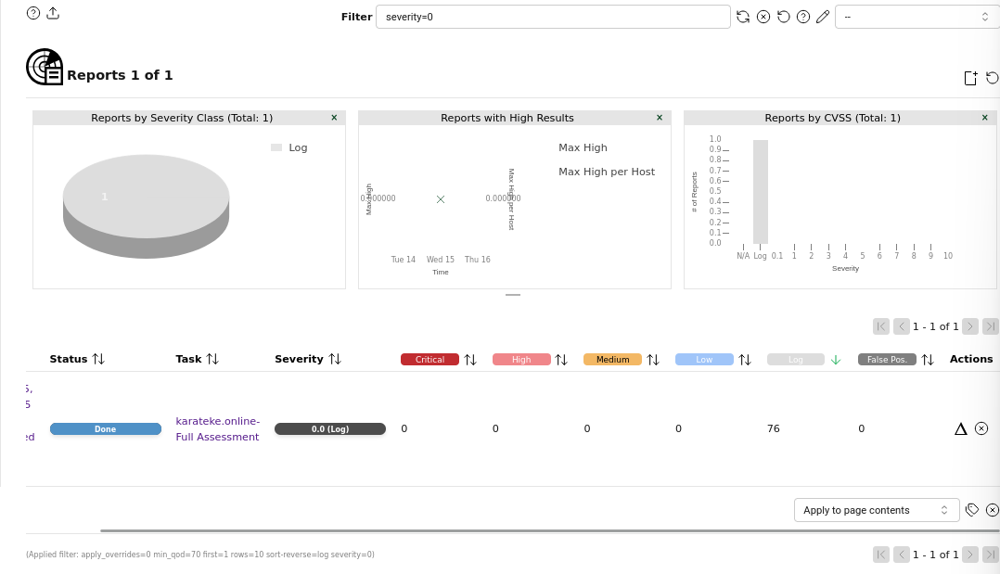
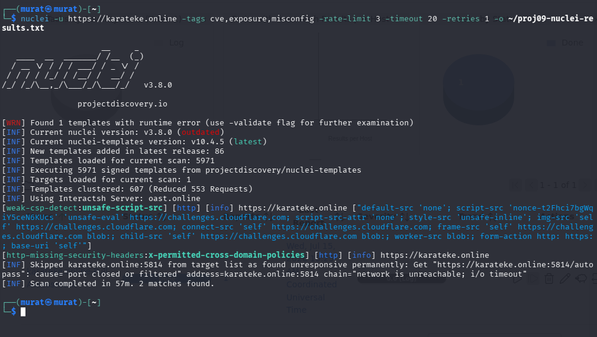
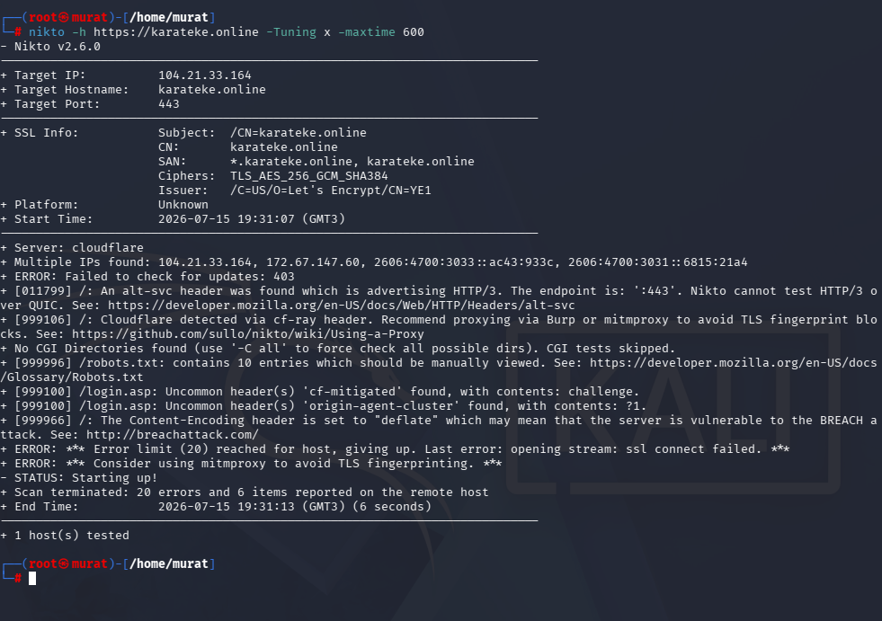
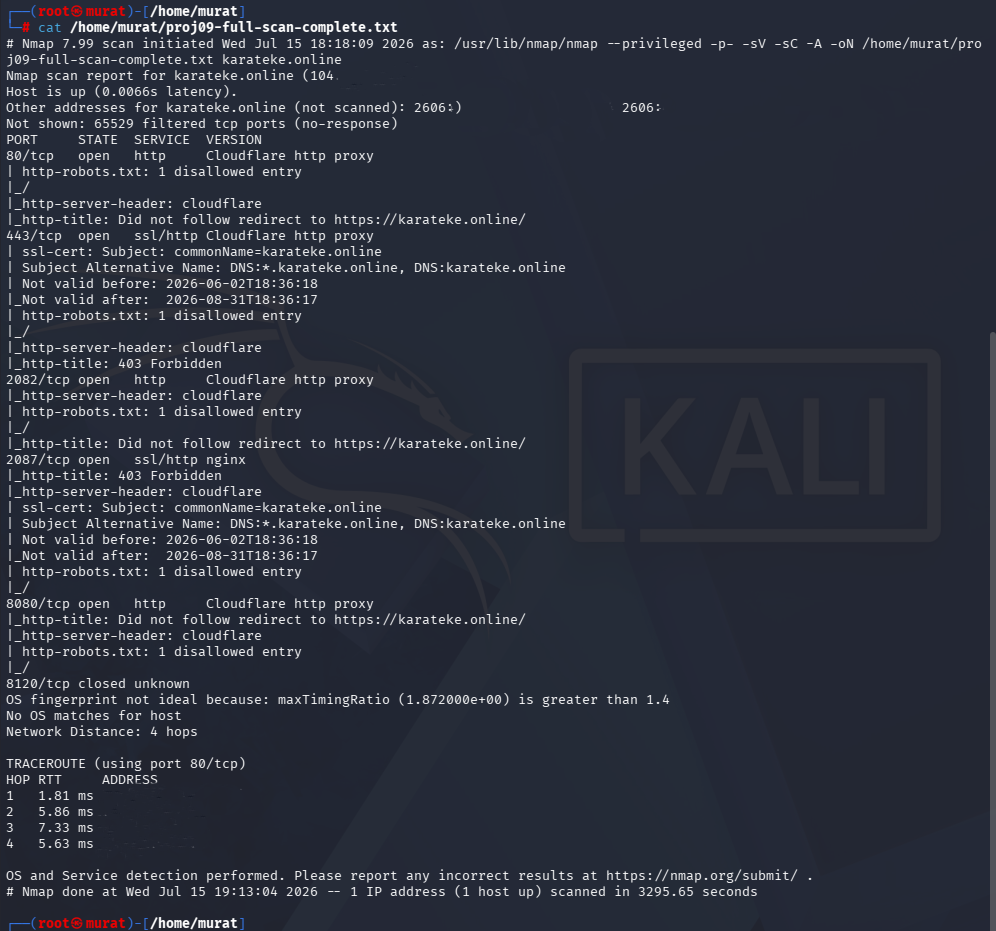

# Project 09: Vulnerability Assessment Lab (GVM/OpenVAS + Nuclei + Nikto + Nmap)

## Purpose

While previous projects (01-08) are mostly focused on defense and detection, this project is a vulnerability assessment carried out against `karateke.online` itself — i.e., against the WAF/Cloudflare defense layer set up in Project 01 — from the perspective of a real external attacker, using full-capability professional tools. **An isolated test target (DVWA/Metasploitable2) was deliberately not used** — the goal was to see, directly against production, whether Project 01's defenses would hold up under real conditions.

| Tool | Role |
|---|---|
| Kali Linux | The scanner machine where vulnerability scanning and penetration testing tools run |
| OpenVAS / Greenbone (GVM) | Automated vulnerability scanning based on a comprehensive vulnerability database, at network and service level |
| Nuclei | Fast, community-template-based (CVE/exposure/misconfig) vulnerability scanner |
| Nikto | Web-server-specific scanning for known vulnerabilities and misconfigurations |
| Nmap | Port scanning, service/version detection, and full port coverage |

*(Acunetix was not used in this project — no license was available.)*

## Methodology

### 1. Service Verification (GVM/OpenVAS)

Verified that the GVM/OpenVAS services were running on Kali. The dashboard overview showed **182,312 NVTs** loaded, with a Critical/High/Medium/Low distribution.

```bash
sudo systemctl status gvmd
sudo systemctl status ospd-openvas
```

*Evidence: `01-gvm-openvas-service-status.png`*



### 2. Target Configuration

The target was defined in the GVM web interface: `karateke.online` (domain, not an IP), Port List: **All IANA assigned TCP**. No credentials were supplied — this is an unauthenticated, external-test scenario equivalent to what a real external attacker would have access to.

*Evidence: `02-gvm-scan-target-configuration.png`*


### 3. Scan Task Creation and Launch

The scan task was created and launched using **"Full and fast"**, the most comprehensive Scan Config profile available in this GVM installation.

*Evidence: `03b-gvm-new-task-config.png` (task creation), `03-gvm-scan-in-progress.png` (task running)*


### 4. GVM Scan Results

The scan took **57 minutes**. Filtering by `severity=0`: **0 Critical, 0 High, 0 Medium, 0 Low** — only **76 "Log"**-level entries (no risk, informational only) were found. This is strong evidence that Project 01's defense layer held up against a real external scanning tool.

*Evidence: `04-gvm-scan-results-cve-list.png`*



### 5. Nuclei Scan

A Nuclei scan was run using 5,971 community templates (tagged cve, exposure, misconfig). **2 low-severity findings** were produced:

- **`weak-csp-detect:unsafe-script-src`** — investigated. The finding turned out to originate not from the site's own CSP, but from the CSP of Cloudflare's "Just a moment..." challenge page served to bot traffic (the real nginx config on the server has no `unsafe-eval`; verified via `curl` that the response carried `cf-mitigated: challenge`). No code change was made — this was proven not to be a real issue.
- **`http-missing-security-headers:x-permitted-cross-domain-policies`** — a real finding, and it was **fixed**: the header was added both to the repo (`deploy/nginx.conf.example`) and to the live nginx configuration on the server, deployed, and verified live via DevTools (`x-permitted-cross-domain-policies: none` is now returned).

```bash
nuclei -u https://karateke.online -tags cve,exposure,misconfig -rate-limit 3 -timeout 20 -retries 1
```

*Evidence: `05-nuclei-scan-results.png`*



### 6. Nikto Scan

The Nikto scan detected Cloudflare (`cf-mitigated: challenge` header). The tool itself also offered an interesting observation: *"Cloudflare detected via cf-ray header, consider proxying via Burp or mitmproxy to avoid TLS fingerprint blocks"* — i.e., the tool itself noticed that automated scans were being consistently blocked based on TLS/HTTP fingerprinting. It also raised a theoretical **BREACH** warning due to the use of `Content-Encoding: deflate`; this was investigated and determined to carry no real exploitation risk, since the site is a static SPA, generates no server-side secrets/tokens, and the compressed content contains no sensitive data — this was documented as an accepted risk and left unfixed.

```bash
nikto -h https://karateke.online -Tuning x -maxtime 600
```

*Evidence: `06-nikto-scan-command-output.png`*



### 7. Nmap Scan

A quick verification scan (`--top-ports 1000`) was run first: it completed in 41 seconds, with 997 ports filtered and only 80/443/8080 open (all Cloudflare) — no separate screenshot was taken for this scan.

A **full port scan** (`-p-`, all 65,535 ports) was then run and took **3,295 seconds (~55 minutes)**. This unusually long duration is indirect evidence that the Cloudflare/WAF layer was deliberately throttling scan traffic. Result: 65,529 ports filtered, with only Cloudflare-owned ports (80, 443, 2082, 2087, 8080) open, OS fingerprinting **failed** (`No OS matches for host`), and the traceroute reached only the Cloudflare edge IP (`104.21.33.164`) in 4 hops — the real origin server was never seen or reached.

```bash
nmap --privileged -p- -sV -sC -A -oN proj09-full-scan-complete.txt karateke.online
```

*Evidence: `07-nmap-full-port-scan-results.png`*



### 8. Report Export

The GVM scan results were exported as XML and scanned for sensitive data (internal IPs, file paths, usernames) — the output was **clean** and added to the repo as raw evidence.

*Evidence: `08-vulnerability-report-export.xml` (a file, not an image — included in the repo as raw evidence)*

## Findings

### Finding A — Origin Server Fully Hidden

Even Nmap's OS fingerprinting failed; all the scan could see was the Cloudflare edge. The real origin server's IP (`192.168.1.149`) was never exposed by any scan.

### Finding B — Automated Tools Are Fingerprinted and Blocked

Automated CLI tools (curl, Nuclei, Nikto) are consistently detected based on TLS/HTTP fingerprinting — directly confirmed by Nikto's own suggestion (`consider proxying via Burp or mitmproxy`).

### Finding C — Unusually Long Full Port Scan Duration

The full port scan taking 55 minutes (versus 41 seconds for the top-1000 scan) is indirect evidence of the WAF deliberately throttling (tarpitting) scan traffic.

### Finding D — One Real Finding, One False Positive

Of the 2 low-severity findings Nuclei reported, one (the missing `x-permitted-cross-domain-policies` header) was real and was fixed on production the same day; the other (the `unsafe-eval` CSP warning) was proven, upon investigation, to be a false positive originating from Cloudflare's challenge page. This demonstrates the importance of verifying every finding rather than blindly trusting raw scanner output.

## Key Competencies Demonstrated

- Performing a comprehensive external vulnerability scan against a real production environment using industry-standard tools (GVM/OpenVAS, Nuclei, Nikto, Nmap)
- Verifying findings rather than blindly accepting raw scanner output (proving the unsafe-eval finding was a false positive)
- Fixing and verifying a real finding on production the same day it was discovered
- Analyzing how a WAF/CDN layer behaves against automated tools (fingerprint detection, tarpitting)
- Independently and objectively testing one's own defense architecture and honestly reporting the result (zero findings = success, no fabricated findings)

## Screenshot Inventory

| # | File Name | Content |
|---|---|---|
| 01 | 01-gvm-openvas-service-status.png | GVM Dashboard overview (182,312 NVTs) |
| 02 | 02-gvm-scan-target-configuration.png | GVM target configuration - karateke.online |
| 03 | 03-gvm-scan-in-progress.png | GVM task running |
| 03b | 03b-gvm-new-task-config.png | GVM new task creation - Full and fast profile |
| 04 | 04-gvm-scan-results-cve-list.png | GVM results - 0 Critical/High/Medium/Low, 76 Log |
| 05 | 05-nuclei-scan-results.png | Nuclei scan results - 2 findings (investigated and addressed) |
| 06 | 06-nikto-scan-command-output.png | Nikto output - Cloudflare detection, BREACH warning |
| 07 | 07-nmap-full-port-scan-results.png | Nmap full port scan - origin server hidden |
| 08 | 08-vulnerability-report-export.xml | Raw GVM report (XML, clean - no sensitive data) |

**Total: 8 screenshots + 1 raw XML report (9 verified evidence files).**
