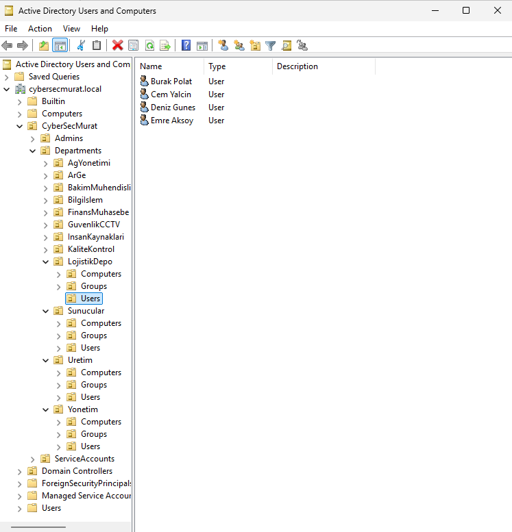
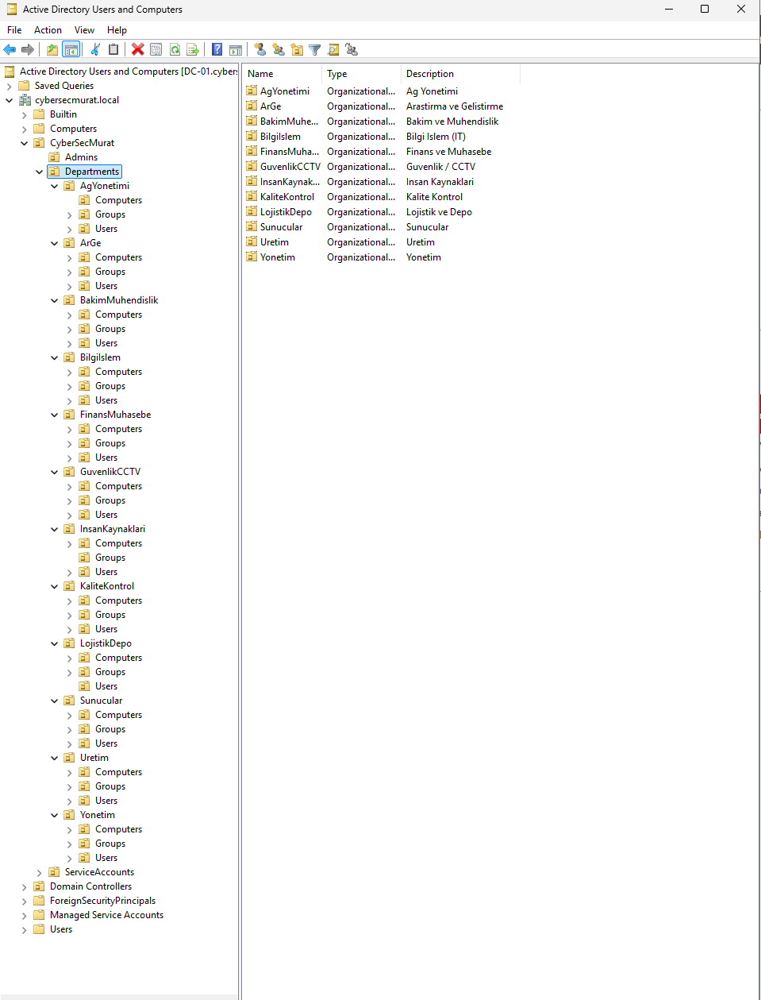
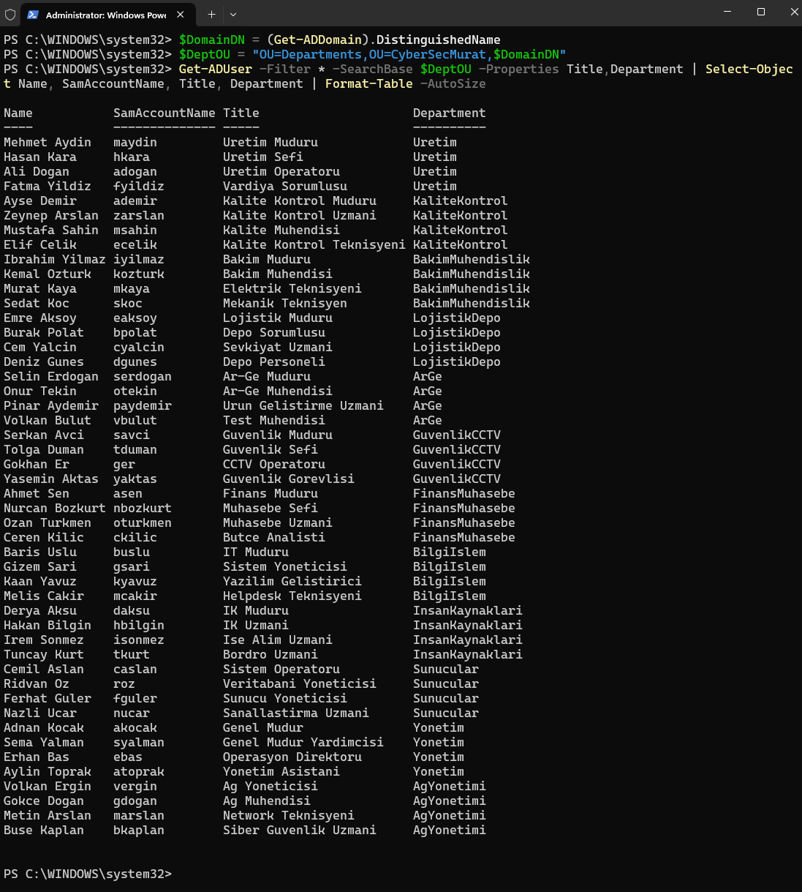
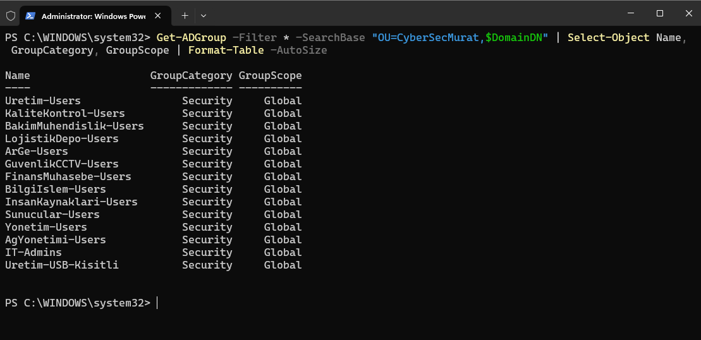
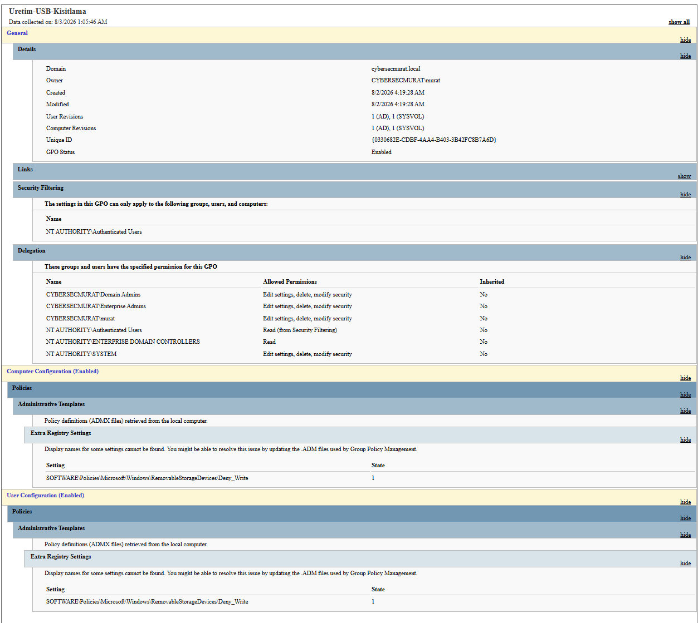
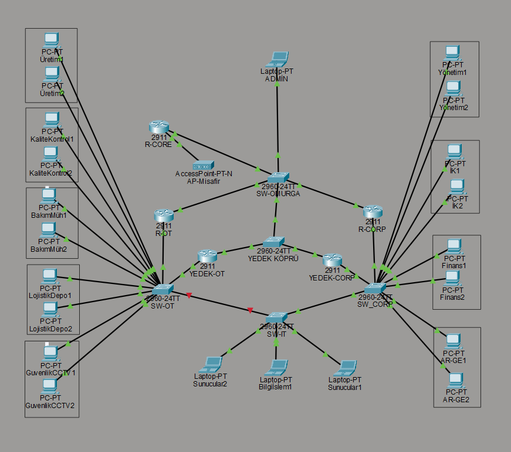
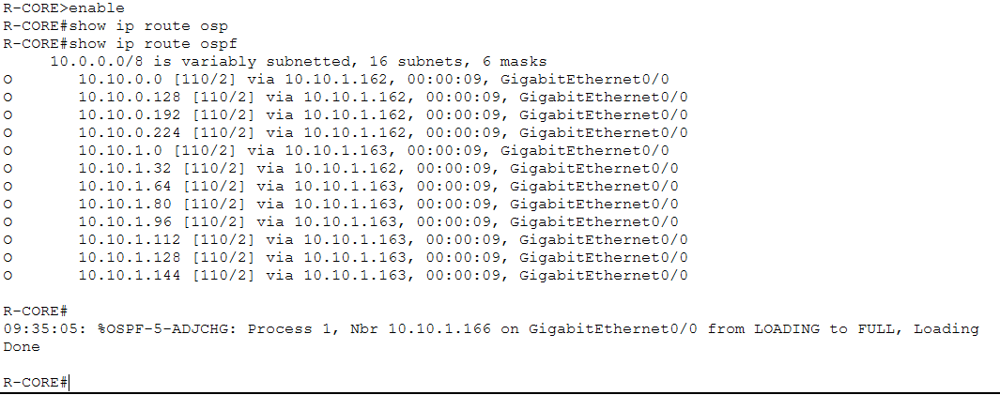
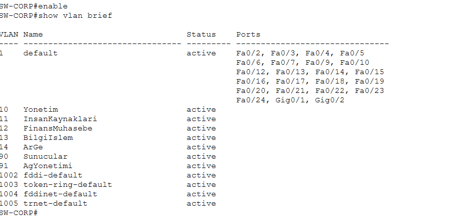
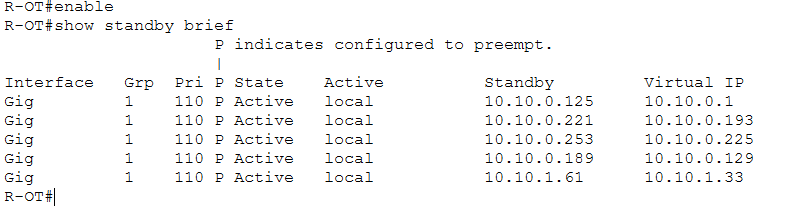
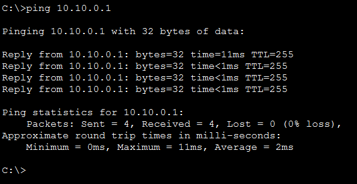

# Project 10: Active Directory Lab and Network Architecture (CyberSecMurat Inc.)

## Purpose

This project brings together an end-to-end identity management (Active Directory) infrastructure and a Purdue-Model-based network architecture for a fictional manufacturing company, **CyberSecMurat Inc.** The AD DS environment, built on Windows Server 2025, models 12 departments, 48 users, and department-based security/access rules, while the network topology designed in Packet Tracer provides a physically separated OT/Manufacturing and Corporate side, self-learning via OSPF, on a redundant backbone secured with HSRP. The goal is to show not a single tool, but how identity management, network architecture, and security engineering come together as different layers of one system.

## Methodology

### 1. Birth of the Domain

The `Get-ADDomain` output confirms that the `cybersecmurat.local` domain came up healthy: NetBIOS name **CYBERSECMURAT**, domain mode **Windows2025Domain**, single domain controller **DC-01.cybersecmurat.local**.

```powershell
Get-ADDomain
```


### 2. Organizational Chart

In the Active Directory Users and Computers console, under the `Departments` OU, each of the 12 departments (AgYonetimi, ArGe, BakimMuhendislik, BilgiIslem, FinansMuhasebe, GuvenlikCCTV, InsanKaynaklari, KaliteKontrol, LojistikDepo, Sunucular, Uretim, Yonetim) has its own `Computers` / `Groups` / `Users` sub-OU structure. There is also a separate **Admins** (Tier 0) and **ServiceAccounts** container — a reflection of the Tiered Administration model.

Counting the fully expanded tree: `CyberSecMurat` (1) + `Admins` (1) + `Departments` (1) + 12 department OUs + 12 × 3 sub-OUs (Computers/Groups/Users) + `ServiceAccounts` (1) = **52 OUs**.




### 3. The Company's Employees

**48 realistic users** (12 departments × 4 users) were bulk-created via PowerShell — each with a Turkish name and title matching its department (e.g., "Mehmet Aydın - Production Manager", "Gizem Sarı - System Administrator"). The `Get-ADUser` query lists all users with department and title information.

```powershell
$DomainDN = (Get-ADDomain).DistinguishedName
$DeptOU = "OU=Departments,OU=CyberSecMurat,$DomainDN"
Get-ADUser -Filter * -SearchBase $DeptOU -Properties Title,Department |
  Select-Object Name, SamAccountName, Title, Department | Format-Table -AutoSize
```



### 4. Who Works Together

Users were grouped into department-based security groups: one `-Users` group per department, plus two special groups — **IT-Admins** and **Uretim-USB-Kisitli**. A total of **14 groups**.

```powershell
Get-ADGroup -Filter * -SearchBase "OU=CyberSecMurat,$DomainDN" |
  Select-Object Name, GroupCategory, GroupScope | Format-Table -AutoSize
```



### 5. Setting the Rules

The `Get-ADDefaultDomainPasswordPolicy` output shows the domain-wide password rules: a minimum of **12 characters**, a password history of **12**, a **90-day** maximum age, and a **30-minute** account lockout after **5** failed attempts.

```powershell
Get-ADDefaultDomainPasswordPolicy
```


### 6. The Signature of OT Security

A GPO specific to the Production department (`Uretim-USB-Kisitlama`) was created: **Removable Storage Devices → Deny Write**. A realistic defense against Stuxnet-style attacks. The GPO report shows the `SOFTWARE\Policies\Microsoft\Windows\RemovableStorageDevices\Deny_Write` setting active with `State: 1` under both **Computer Configuration** and **User Configuration**, with the GPO status set to **Enabled**.



### 7. Where Two Worlds Meet

In the Active Directory Sites and Services console, **all 14 subnets** designed in Packet Tracer (12 departments + backbone + Guest WiFi) were defined under a single Site (**CyberSecMurat-Merkez-Fabrika**) — the junction point between the AD topology and the physical network topology.


### 8. The Big Picture

The full network topology: **3 main routers** (R-CORE, R-OT, R-CORP), **2 backup routers** (YEDEK-OT, YEDEK-CORP), **5 switches**, **22 end devices**, and a Guest WiFi access point. Following Purdue Model logic, OT/Manufacturing (R-OT) and Corporate (R-CORP) sit on physically separate routers, with traffic between them passing through the core router (R-CORE).



### 9. The Network Teaching Itself

Using OSPF (Open Shortest Path First), R-CORE automatically learns all department networks (routes marked `O` in the `show ip route ospf` output). The `%OSPF-5-ADJCHG` log line shows a backup router joining the network as a new neighbor (LOADING → FULL).

```
R-CORE#show ip route ospf
```



### 10. Virtual Walls Between Departments

On the corporate-side switch (SW-CORP), **7 VLANs** were defined: Management (10), Human Resources (11), Finance/Accounting (12), IT (13), R&D (14), Servers (90), Network Management (91).

```
SW-CORP#show vlan brief
```



### 11. Insurance Against a Single Point of Failure

With HSRP (Hot Standby Router Protocol), each department VLAN's gateway is configured so that if R-OT (Active) goes down, YEDEK-OT (Standby) automatically takes over. The `show standby brief` output shows R-OT correctly holding the Active role across all **5 VLANs**.

```
R-OT#show standby brief
```



### 12. Final Proof: The System Actually Works

A ping from a computer in the Production department to its gateway (**10.10.0.1**) returns **4/4 successful, 0% packet loss** — concrete proof that the identity management, VLAN, OSPF, and HSRP layers all work together end to end.

```
C:\>ping 10.10.0.1
```



---

This project set out to demonstrate not a single technology, but a system of systems: identity management (AD), network architecture (VLAN/OSPF/HSRP), and security engineering (Purdue Model separation, the USB-restriction GPO) were brought together as different layers of the same fictional company. The connection between the two layers is not real system integration but a deliberate design-consistency decision — and stating that boundary explicitly reflects genuine engineering discipline, without overstating the project's claims.

## Key Competencies Demonstrated

- Bulk-creating users/groups via PowerShell and managing Active Directory in a scriptable way
- Designing an OU hierarchy around Tiered Administration logic (Tier 0 Admin and Service Accounts separation)
- Enforcing a domain-wide password policy and GPO-based device restriction (USB Deny Write)
- Aligning the logical directory structure with the physical network topology via AD Sites and Services
- Designing and implementing OT/Corporate network separation following Purdue Model logic
- Setting up dynamic routing with OSPF, department segmentation with VLANs, and gateway redundancy with HSRP
- Verifying end-to-end connectivity (ping test) to prove the design doesn't stay on paper
- Honestly stating the boundaries of the relationship between the two layers (AD and network architecture)

## Screenshot Inventory

| # | File Name | Content |
|---|---|---|
| 01 | 01-ad-domain-overview.png | Get-ADDomain output - cybersecmurat.local domain summary |
| 02 | 02-ou-structure.png | OU structure - 12 departments under Departments |
| 02b | 02b-ou-structure-full.png | OU structure - all departments expanded, 52 OU verification |
| 03 | 03-users-list.png | Get-ADUser output - 48 users, with department and title info |
| 04 | 04-security-groups.png | Get-ADGroup output - 14 security groups |
| 05 | 05-password-policy.png | Get-ADDefaultDomainPasswordPolicy output - password policy |
| 06 | 06-gpo-usb-restriction.png | GPO report - Uretim-USB-Kisitlama, Deny_Write active |
| 07 | 07-ad-sites-services.png | AD Sites and Services - 14 subnets under a single Site |
| 08 | 08-network-topology-overview.png | Network topology overview - Purdue Model separation |
| 09 | 09-ospf-routing-table.png | OSPF routing table - automatically learned department networks |
| 10 | 10-vlan-configuration.png | VLAN configuration - 7 department VLANs |
| 11 | 11-hsrp-active-standby.png | HSRP status - 5 VLANs, Active/Standby roles |
| 12 | 12-ping-test-success.png | Ping test - 4/4 successful to the 10.10.0.1 gateway |

**Total: 13 screenshots (13 verified evidence files).**
