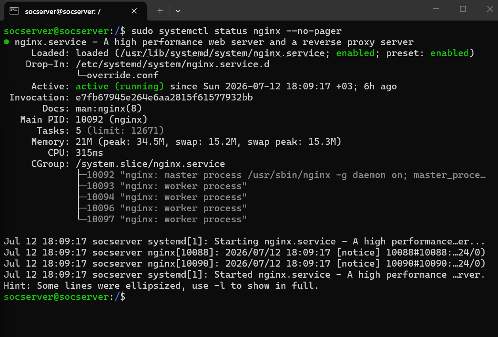
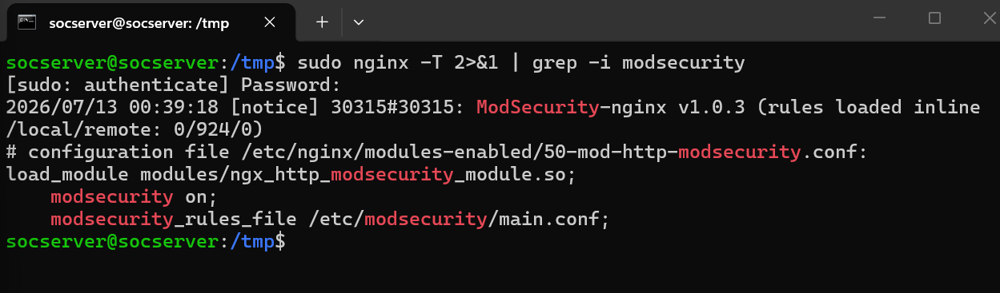
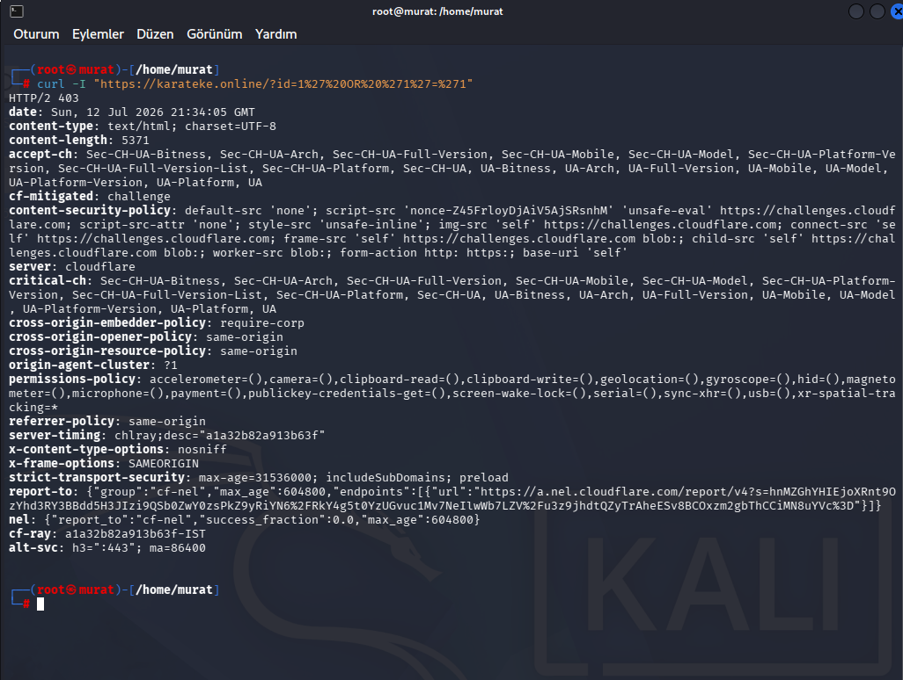
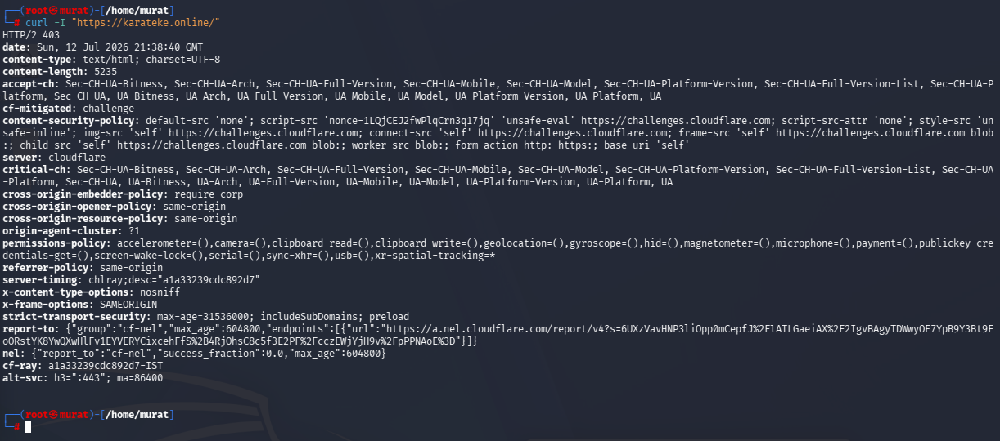
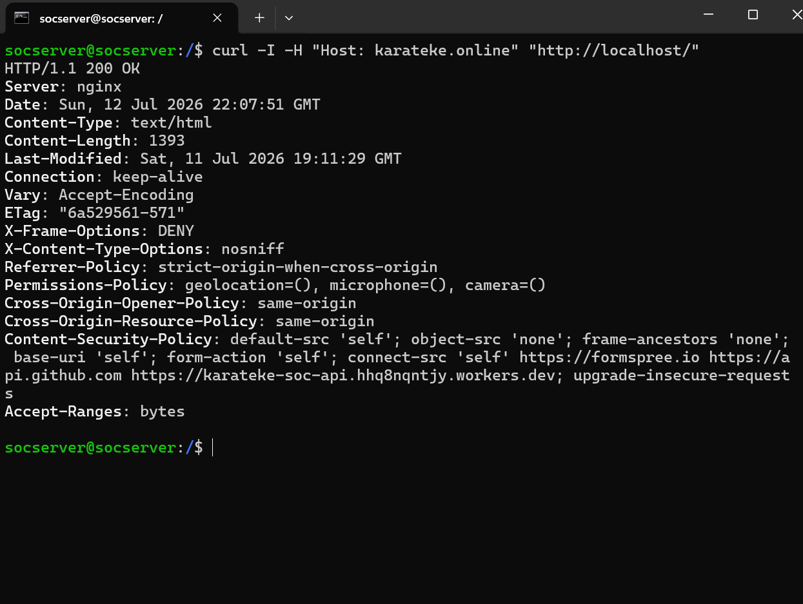
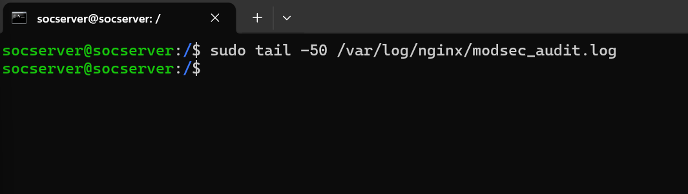
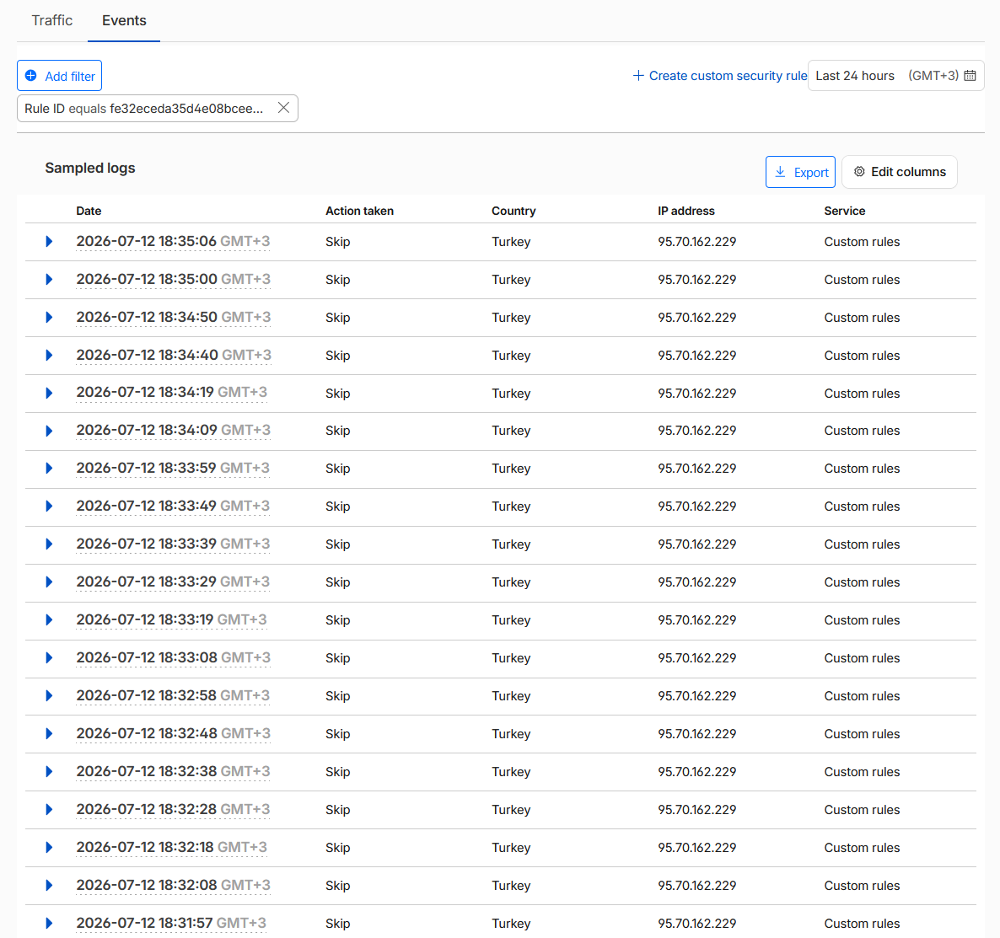
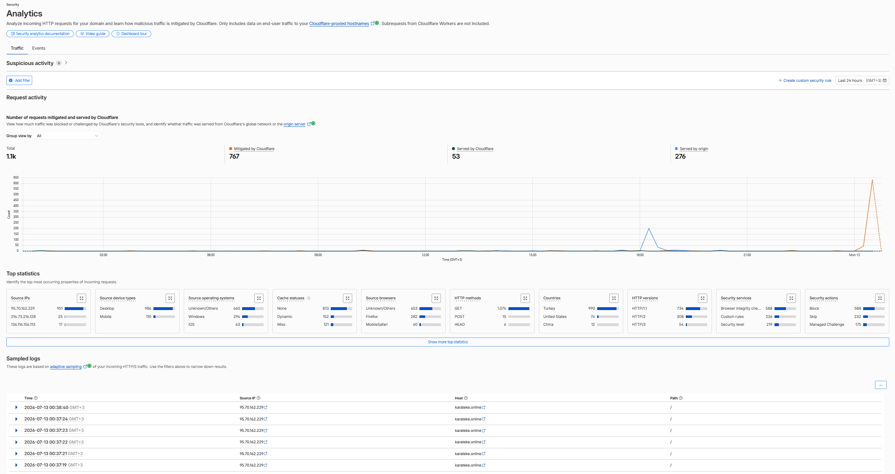

# Proje 01: Web Çevre Güvenliği (Web Perimeter Security)

## Amaç

Bu proje, internete açık bir web sunucusunun (karateke.online) önüne çok katmanlı bir çevre güvenliği (perimeter security) hattı kurmayı amaçlar. Amaç, gerçek dünyadaki HTTP tabanlı saldırıları (XSS, SQL Injection vb.) uygulama katmanına ulaşmadan önce tespit edip engellemektir. Trafik önce Cloudflare üzerinden geçer, ardından sunucu üzerinde Nginx reverse proxy ve ModSecurity WAF katmanından süzülür. Kural motoru olarak OWASP Core Rule Set (CRS) 3.3.8 kullanılmıştır.

| Araç | Görevi |
|---|---|
| Cloudflare DNS + Tunnel | Gerçek sunucu IP adresini gizler, DDoS/L3-L4 seviyesinde ilk filtreleme yapar, sunucuya güvenli tünel üzerinden trafik yönlendirir |
| Nginx | Reverse proxy olarak gelen tüm HTTP(S) isteklerini karşılar ve backend'e yönlendirir |
| ModSecurity | Nginx'e modül olarak entegre edilen açık kaynaklı WAF motoru, istekleri kural setine göre analiz eder |
| OWASP CRS 3.3.8 | ModSecurity için hazır saldırı imza ve anomali skorlama kuralları (XSS, SQLi, RCE vb.) |

```
                        ┌─────────────────────┐
                        │      İstemci         │
                        │  (curl / tarayıcı)   │
                        └──────────┬───────────┘
                                   │ HTTPS
                                   ▼
                        ┌─────────────────────┐
                        │   Cloudflare DNS     │
                        │   + Tunnel           │
                        │ (IP gizleme, ilk     │
                        │  filtreleme)         │
                        └──────────┬───────────┘
                                   │ Tünel üzerinden
                                   ▼
                        ┌─────────────────────┐
                        │   Nginx Reverse      │
                        │      Proxy           │
                        │  ┌───────────────┐  │
                        │  │  ModSecurity   │  │
                        │  │  + OWASP CRS   │  │
                        │  │    3.3.8       │  │
                        │  └───────┬───────┘  │
                        └──────────┼───────────┘
                                   │
                     ┌─────────────┴─────────────┐
                     │ 403 Forbidden              │  200 OK
                     │ (kural eşleşti)             │  (temiz istek)
                     ▼                             ▼
            ┌─────────────────┐         ┌─────────────────────┐
            │  audit.log       │         │  Backend Uygulama    │
            │  (SecAudit)      │         │  (web sitesi)        │
            └─────────────────┘         └─────────────────────┘
```

## Metodoloji

### 1. Servis ve Yapılandırma Doğrulaması

Cloudflare üzerinde domain (karateke.online) için DNS kaydı ve Cloudflare Tunnel yapılandırıldı — sunucunun gerçek IP adresi dışarıya kapatıldı. Sunucuya Nginx kuruldu ve karateke.online için sanal host tanımlandı. ModSecurity paketi kurulup Nginx modülü olarak (`load_module modules/ngx_http_modsecurity_module.so`) etkinleştirildi, OWASP CRS 3.3.8 indirilip `crs-setup.conf` yapılandırıldı. `SecRuleEngine` değeri `DetectionOnly` modundan `On` (blocking) moduna alınarak gerçek engelleme aktif edildi ve audit log formatı (`SecAuditLog`, `SecAuditLogParts`) her engellenen isteğin detaylı kaydını (kural ID, mesaj, anomali skoru) tutacak şekilde yapılandırıldı.

Kurulumun servis/tünel seviyesinde doğrulanması:

*Kanıt: `11-cloudflared-tunnel-status.png`*


*Kanıt: `12-nginx-service-status.png`*



*Kanıt: `09-nginx-modsecurity-config-check.png`*



### 2. Saldırı Yüzeyi Analizi (Nmap + Nikto)

Asıl WAF testlerinden önce, sunucunun dışa açık yüzeyi ve otomatik tarama araçlarına karşı davranışı doğrulandı.

**Nmap — açık port taraması:**
```bash
nmap -sV -sC --top-ports 1000 --stats-every 10s 192.168.1.149 -oN /root/nmap-quickscan.txt
```
Sonuç: taranan 1000 portun tamamı "ignored/filtered" durumda — sunucu ağ seviyesinde taranmaya kapalı.

*Kanıt: `01-nmap-top-ports-scan.png`*


**Nikto — otomatik web zafiyet taraması (karateke.online üzerinden, Cloudflare arkasında):**
```bash
nikto -h https://karateke.online -o /root/nikto-result.txt
```
İki ayrı çalıştırmada da tarama, Cloudflare'in bot/rate-limit korumasına takıldı: `cf-mitigated: challenge` başlığı tetiklendi ve "Error limit (20) reached for host" ile araç erken sonlandı. Aynı sonucun iki bağımsız çalıştırmada da tekrarlanması, bu engellemenin tesadüf değil tutarlı/tekrarlanabilir bir savunma davranışı olduğunu gösterir.

*Kanıtlar: `02-nikto-domain-scan-v1.png`, `03-nikto-domain-scan-v2.png`*


**Nikto — sunucunun gerçek IP'sine doğrudan deneme:**
```bash
nikto -h https://192.168.1.149 -o /root/nikto-origin-result.txt
```
Sonuç: `[FAIL] Unable to connect to 192.168.1.149:443` — origin sunucu, Cloudflare Tunnel dışından doğrudan 443 üzerinden erişilemez durumda.

*Kanıt: `04-nikto-origin-scan-failed.png`*


### 3. Origin Sunucu Koruması

**Doğrudan bağlantı denemesi:**
```bash
curl -v --connect-timeout 5 https://192.168.1.149:443
```
Sonuç: 5 saniye sonra "Connection timed out" — origin sunucu dışarıya kapalı.

*Kanıt: `16-curl-origin-connection-timeout.png`*


**Nmap — origin port 443 durumu:**
```bash
nmap -p 443 192.168.1.149
```
Sonuç: `443/tcp filtered https` — port filtrelenmiş, açık değil.

*Kanıt: `17-nmap-origin-port-443-filtered.png`*


**Yerel güvenlik duvarı kontrolü:**
```bash
sudo ufw status verbose | grep 443
sudo iptables -L -n -v | grep 443
```
Her iki komut da boş sonuç döndürdü — sunucu üzerinde port 443 için özel bir ufw/iptables kuralı yok; erişim kontrolü, origin'in Cloudflare Tunnel dışına hiç açılmaması mimarisiyle sağlanıyor, ayrı bir yerel firewall kuralına ihtiyaç duyulmuyor.

*Kanıt: `15-ufw-iptables-port-443-check.png`*


Origin sunucunun dışarıdan tamamen erişilemez olduğu böylece çok yönlü olarak (nmap: filtered, nikto: bağlantı başarısız, curl: timeout, ufw/iptables: özel kural gerektirmeyen mimari) doğrulanmış oldu; tek giriş noktası Cloudflare Tunnel'dır.

### 4. WAF Testleri (Cloudflare Üzerinden — karateke.online)

**XSS test isteği:**
```bash
curl -i "https://karateke.online/?q=<script>alert(1)</script>"
```
Beklenen ve alınan çıktı:
```
HTTP/2 403
```
Audit log kaydı (`/var/log/modsecurity/audit.log`):
```
[id "941100"] [msg "XSS Attack Detected via libinjection"]
[id "949110"] [msg "Inbound Anomaly Score Exceeded (Total Score: 15)"]
```

*Kanıt: `06-curl-xss-test-403.png`*


Test sırasında audit log'un aynı anda güncellendiği split-screen ile canlı doğrulandı:

*Kanıt: `18-split-screen-live-audit-log-monitoring.png`*


**SQL Injection test isteği:**
```bash
curl -i "https://karateke.online/?id=1' OR '1'='1"
```
Beklenen ve alınan çıktı:
```
HTTP/2 403
```

*Kanıt: `05-curl-sqli-test-403.png`*



Otomatik sqlmap taraması ile de doğrulandı — WAF, 586 istekte 403 döndürerek sqlmap'in kendi sonucunda "does not seem to be injectable" (yani WAF, sqlmap'in tüm test paketini bloke etti) demesine yol açtı:

*Kanıt: `07-sqlmap-scan-waf-blocked.png`*


**Normal (temiz) istek — false positive kontrolü ve WAF'ın davranışsal (rate-adaptive) doğası:**
```bash
curl -i "https://karateke.online/"
```
Bu testte önemli bir nüans gözlemlendi: aynı temiz isteğin farklı çalıştırmalarında farklı sonuçlar alındı. Bazı denemelerde doğrudan `HTTP/2 200` alınırken, bazılarında Cloudflare'in "managed challenge" mekanizması devreye girip `HTTP/2 403` + `cf-mitigated: challenge` döndürdü. Bu, WAF/Cloudflare katmanının statik bir kural seti değil, trafik geçmişi ve diğer sinyallere göre karar veren **davranışsal, oran-adaptif (rate-adaptive)** bir koruma mekanizması olarak çalıştığının kanıtıdır — aynı istek türüne her zaman aynı yanıt garanti edilmez.

*Kanıtlar (aynı istek türü, iki ayrı çalıştırma — ikisinde de challenge tetiklendi): `08-curl-normal-request-challenge.png`, `20-curl-normal-request-challenge-v2.png`*




> **Not:** Bu iki kanıt da challenge (403) sonucunu gösteriyor; "temiz istek → 200 OK" sonucunun doğrudan kanıtı, aşağıdaki Origin/Localhost Bypass Testleri bölümündeki `21-localhost-bypass-normal-request-200.png` dosyasıdır. Cloudflare edge seviyesinde (public istek) aynı temiz isteğin bazen 200, bazen challenge döndürmesi — az önce açıklanan rate-adaptive davranışın parçasıdır.

Bu bölümdeki testler bütün olarak, WAF katmanının uygulama koduna hiç dokunmadan XSS ve SQLi saldırılarını HTTP seviyesinde durdurabildiğini (403), meşru trafiği genel olarak etkilemediğini gösterir.

### 5. Origin/Localhost Bypass Testleri (Cloudflare Atlanarak, Doğrudan ModSecurity)

Cloudflare katmanını atlayıp doğrudan nginx/ModSecurity'yi test etmek için sunucu üzerinden `Host` header spoofing kullanıldı:

```bash
curl -I -H "Host: karateke.online" "http://localhost/?test=<script>alert(1)</script>"
```
Sonuç: `HTTP/1.1 403 Forbidden` (`Server: nginx`) — Cloudflare tamamen devre dışı bırakılsa bile ModSecurity, XSS payload'ını kendi başına engelliyor.

*Kanıt: `19-localhost-bypass-xss-test-403.png`*


```bash
curl -I -H "Host: karateke.online" "http://localhost/"
```
Sonuç: `HTTP/1.1 200 OK` (`Server: nginx`) — aynı bypass yöntemiyle temiz istek sorunsuz geçiyor, false positive yok.

*Kanıt: `21-localhost-bypass-normal-request-200.png`*



### 6. Yapılandırma ve Cloudflare Dashboard Doğrulaması

Testlerden önceki temiz/başlangıç durumu:

*Kanıt: `10-modsecurity-audit-log-check.png` — test öncesi audit log henüz boş*



Cloudflare Security dashboard'u, testler sırasında tetiklenen olayları ve genel trafik mitigasyon istatistiklerini doğruladı: son 24 saatte toplam 1.1k istekten 767'si Cloudflare tarafından mitigate edildi; tek bir kaynak IP'den (`X.X.X.X`, Türkiye) gelen çok sayıda istek "Skip (Custom rules)" olarak işlendi.

*Kanıtlar: `13-cloudflare-security-events.png`, `14-cloudflare-security-analytics-traffic.png`*




Audit log detay seviyesi (SecAuditLogParts) doğru ayarlandığında, olay sonrası analiz için kural ID, mesaj ve skor bilgisinin tek satırda izlenebildiği bu doğrulamalarla teyit edilmiş oldu.

## Kök Neden Analizi / Bulgular

Kurulum sırasında, testlere geçmeden önce çözülmesi gereken iki bağımsız yapılandırma sorunu tespit edildi:

### Kök Neden A — Modül Yükleme Çakışması

Paket kurulumu ModSecurity Nginx modülünü otomatik olarak yüklerken, `nginx.conf` içine manuel olarak da `load_module` satırı eklenmişti. Bu çakışma, tekrarlayan satır kaldırılarak giderildi.

### Kök Neden B — sites-enabled/default Global Direktif Sorunu

`sites-enabled/default` dosyasının, `server {}` bloğunun dışında ModSecurity direktifleri (`modsecurity on;`, `modsecurity_rules_file ...`) içerdiği görüldü. Bu durum, CRS kural ID 901001'in (CRS setup/init kuralı) birden fazla kez yüklenmesine yol açıyordu. Direktifler dosyadan temizlenip yalnızca ilgili `server {}` bloğu içine taşındı.

Bu iki bulgu, aynı direktifin hem paket hem manuel konfigürasyonda tanımlı olması gibi "sessiz" çakışmaların üretim ortamında ciddi kural tekrarına (duplicate rule ID 901001) yol açabileceğini; `sites-enabled/default` gibi varsayılan dosyaların global direktifler içerdiğinde beklenmedik davranışlara sebep olabileceğini ve WAF/proxy yapılandırmalarında `server {}` blok sınırlarının netleştirilmesi gerektiğini gösterdi.

## Öne Çıkan Yetkinlikler

- Çok katmanlı bir çevre güvenliği mimarisinin (Cloudflare + Nginx + ModSecurity + OWASP CRS) kurulumu ve entegrasyonu
- WAF'ın gerçek saldırı senaryolarıyla (manuel XSS/SQLi istekleri, otomatik sqlmap taraması) test edilip doğrulanması
- Sessiz yapılandırma çakışmalarının (modül çift yükleme, global direktif sızıntısı) teşhisi ve kök nedene dayalı düzeltilmesi
- Anomali skorlama sistemi (Total Score) sayesinde tekil imza eşleşmesi yerine kümülatif risk skoruna göre karar verilebildiğinin ve bunun tekil imza eşleşmesine göre daha az false-positive ürettiğinin doğrulanması
- Origin sunucunun çok yönlü (nmap, nikto, curl, ufw/iptables) doğrulama ile dışarıdan tamamen erişilemez olduğunun kanıtlanması

## Ekran Görüntüsü Envanteri

| # | Dosya Adı | İçerik |
|---|---|---|
| 01 | 01-nmap-top-ports-scan.png | Nmap top-1000 port taraması (tümü filtrelenmiş) |
| 02 | 02-nikto-domain-scan-v1.png | Nikto taraması - Cloudflare engeli (1. çalıştırma) |
| 03 | 03-nikto-domain-scan-v2.png | Nikto taraması - Cloudflare engeli (2. çalıştırma, tekrarlanabilirlik kanıtı) |
| 04 | 04-nikto-origin-scan-failed.png | Nikto - origin IP'ye doğrudan bağlantı başarısız |
| 05 | 05-curl-sqli-test-403.png | SQLi testi - HTTP 403 |
| 06 | 06-curl-xss-test-403.png | XSS testi - HTTP 403 |
| 07 | 07-sqlmap-scan-waf-blocked.png | sqlmap otomatik taraması WAF tarafından bloke edildi |
| 08 | 08-curl-normal-request-challenge.png | Normal istek - Cloudflare managed challenge (1. deneme) |
| 09 | 09-nginx-modsecurity-config-check.png | ModSecurity modül/yapılandırma kontrolü |
| 10 | 10-modsecurity-audit-log-check.png | ModSecurity audit log - test öncesi boş durum |
| 11 | 11-cloudflared-tunnel-status.png | Cloudflare Tunnel servis durumu |
| 12 | 12-nginx-service-status.png | Nginx servis durumu |
| 13 | 13-cloudflare-security-events.png | Cloudflare Security - Events |
| 14 | 14-cloudflare-security-analytics-traffic.png | Cloudflare Security - Traffic Analytics |
| 15 | 15-ufw-iptables-port-443-check.png | ufw/iptables port 443 kontrolü (boş sonuç) |
| 16 | 16-curl-origin-connection-timeout.png | Origin'e doğrudan bağlantı timeout |
| 17 | 17-nmap-origin-port-443-filtered.png | Nmap - origin port 443 filtrelenmiş |
| 18 | 18-split-screen-live-audit-log-monitoring.png | Canlı audit log izleme + XSS testi (split-screen) |
| 19 | 19-localhost-bypass-xss-test-403.png | Localhost/origin bypass - XSS testi engellendi |
| 20 | 20-curl-normal-request-challenge-v2.png | Normal istek - Cloudflare managed challenge (2. deneme) |
| 21 | 21-localhost-bypass-normal-request-200.png | Localhost/origin bypass - temiz istek 200 OK |

**Toplam: 21 doğrulanmış ekran görüntüsü.**
