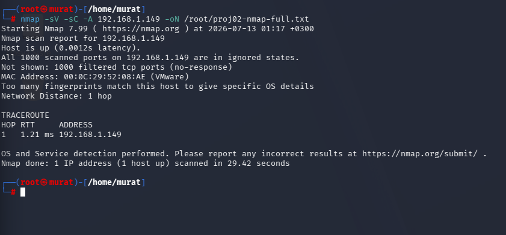
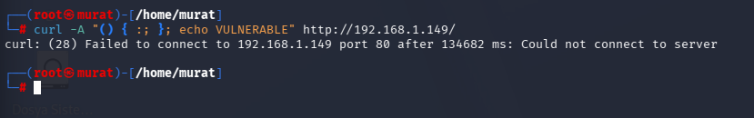
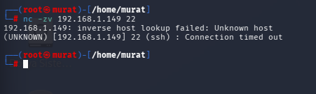
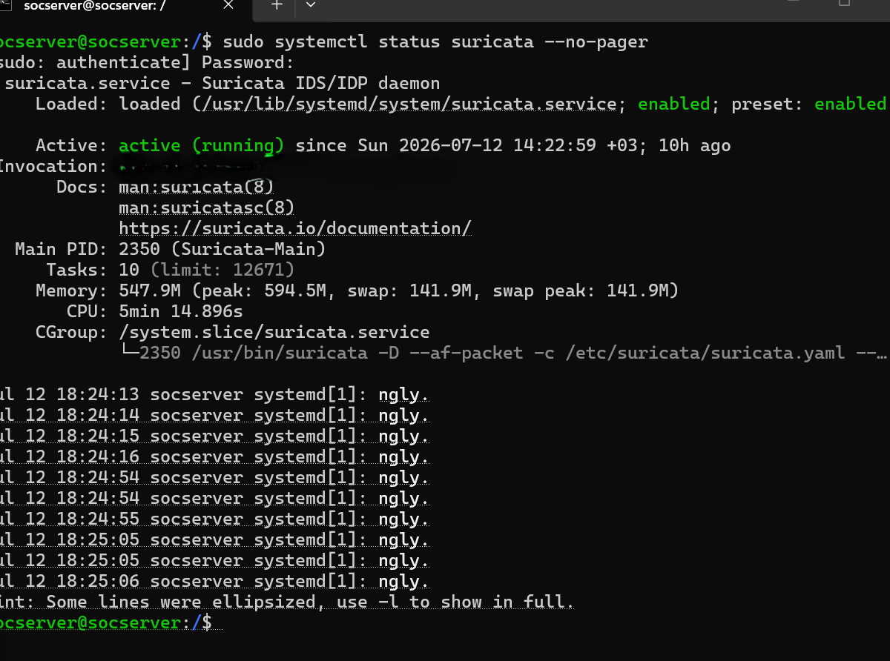
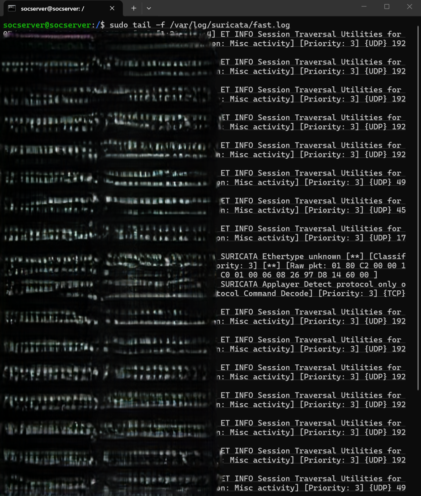
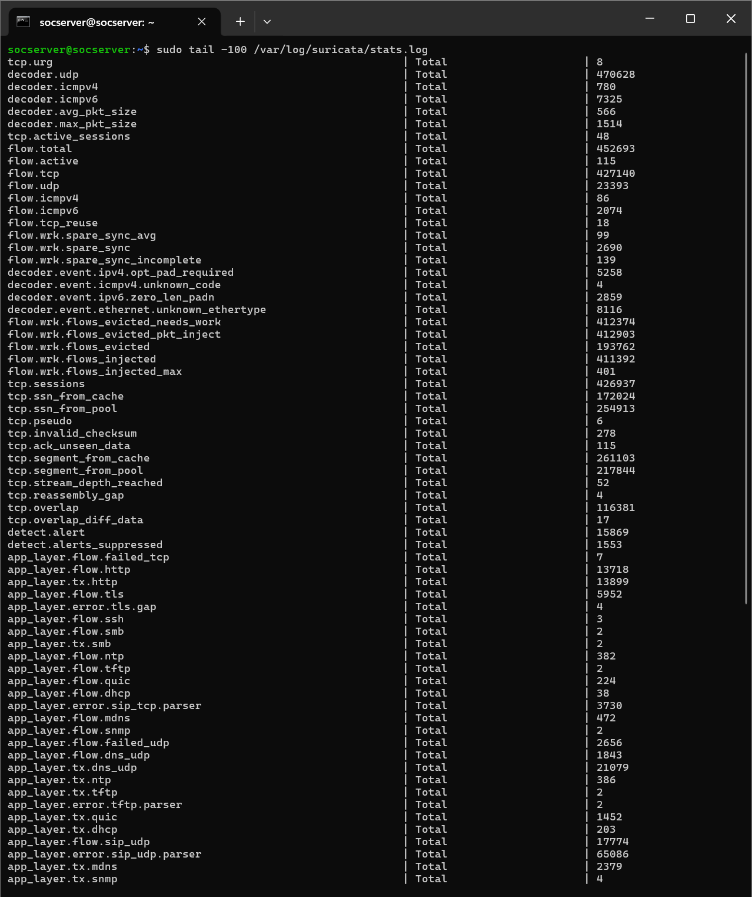
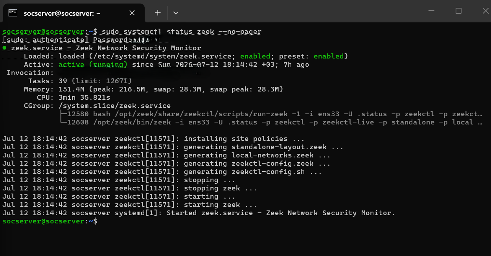
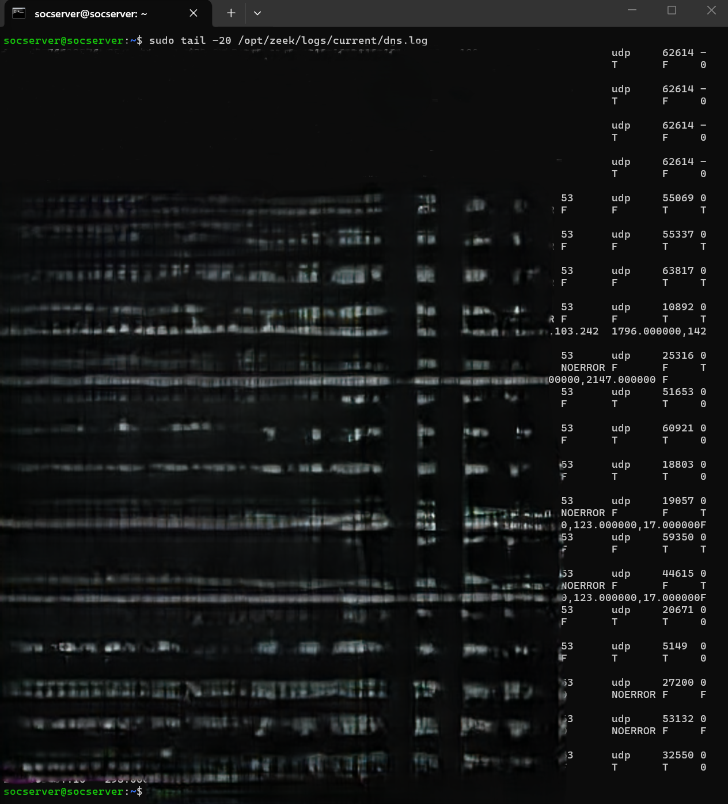
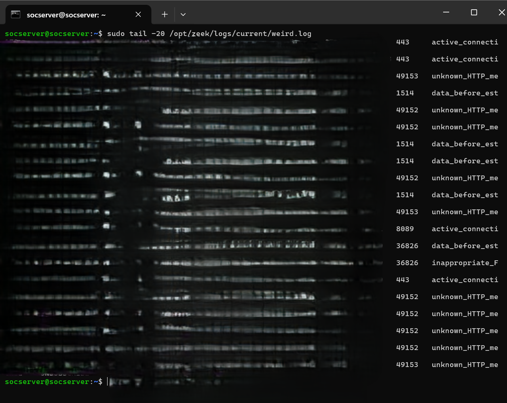

# Proje 02: Ağ Trafiği Tespit Laboratuvarı (Network Traffic Detection Lab)

## Amaç

Bu proje, sunucuya gelen/giden ağ trafiğini paket seviyesinde izleyip analiz edebilen imza tabanlı bir saldırı tespit/önleme sistemi (IDS/IPS) ve protokol seviyesinde derin trafik görünürlüğü sağlayan bir ağ izleme aracını bir araya getirir. Suricata, bilinen tehdit imzalarına (Emerging Threats kural seti) göre gerçek zamanlı alarm üretirken; Zeek, her bağlantıyı yapılandırılmış log kayıtlarına (conn.log, ssl.log vb.) dönüştürerek olay sonrası analiz ve korelasyon için zengin veri sağlar. Bu katmanın ürettiği loglar (eve.json, conn.log ve diğer Zeek logları), Proje 04'teki SIEM korelasyon altyapısının ham veri kaynağını oluşturur.

| Araç | Görevi |
|---|---|
| Suricata | IDS/IPS motoru; Emerging Threats (ET) kural setiyle bilinen saldırı imzalarını tespit eder, systemd servisi olarak sürekli çalışır |
| Zeek | Ağ trafiğini protokol seviyesinde analiz eder, her bağlantı için yapılandırılmış log (conn.log, ssl.log, http.log vb.) üretir |
| zeekctl | Zeek'in standalone modda devreye alınmasını ve yönetimini sağlayan kontrol katmanı |

```
                    ┌─────────────────────────────┐
                    │     Ağ Arayüzü (NIC)          │
                    │   Ham trafik (tüm paketler)   │
                    └───────────┬─────────────────┘
                                │
                 ┌──────────────┴──────────────┐
                 ▼                              ▼
        ┌─────────────────┐          ┌─────────────────────┐
        │    Suricata       │          │        Zeek           │
        │  (IDS/IPS motoru)  │          │  (protokol analizi)    │
        │  ET Kural Seti     │          │  zeekctl (standalone)  │
        └────────┬─────────┘          └──────────┬──────────┘
                 │                                │
                 ▼                                ▼
        ┌─────────────────┐          ┌─────────────────────┐
        │  eve.json /        │          │  conn.log, ssl.log,    │
        │  fast.log           │          │  http.log ...          │
        │  (alarm/uyarı)      │          │  (bağlantı kayıtları)  │
        └────────┬─────────┘          └──────────┬──────────┘
                 │                                │
                 └───────────────┬────────────────┘
                                 ▼
                      ┌─────────────────────┐
                      │   SIEM Korelasyonu   │
                      │  (Wazuh — bkz. proje  │
                      │   04)                 │
                      └─────────────────────┘
```

## Metodoloji

### 1. Saldırı Yüzeyi Keşfi (Nmap)

Trafik testlerinden önce, hedef sunucunun dışa açık yüzeyi iki farklı nmap tekniğiyle doğrulandı.

```bash
nmap -sV -sC -A 192.168.1.149 -oN /root/proj02-nmap-full.txt
```
Sonuç: taranan 1000 port "ignored/filtered" durumda; işletim sistemi parmak izi tespiti de çok sayıda eşleşme nedeniyle kesinleştirilemedi.

*Kanıt: `01-nmap-full-service-scan.png`*



```bash
nmap -sS -p- 192.168.1.149 -oN /root/proj02-nmap-synscan.txt
```
Sonuç: 65.533 port filtrelenmiş, yalnızca 1514/1515 (Wazuh agent/manager) portları açık — tarama 650 saniye sürdü.

*Kanıt: `02-nmap-syn-scan-full-ports.png`*


### 2. Trafik Üretimi ve Test Senaryoları

IDS/NSM katmanının gerçek trafik üzerinde çalıştığını doğrulamak için çeşitli HTTP(S) istekleri ve bağlantı denemeleri üretildi.

```bash
curl -v http://192.168.1.149/ 2>&1 | tee /root/proj02-http-request.txt
curl -v https://karateke.online/ 2>&1 | tee /root/proj02-https-request.txt
```
İlk komut (port 80, doğrudan origin IP) bağlanamadı ("Could not connect to server"); ikinci komut ise TLS 1.3 el sıkışmasının tamamını (sertifika zinciri, ALPN, cipher suite) gösterip sonunda `HTTP/2 403` (WAF tarafından engellendi) ile sonuçlandı. İki ayrı ekran görüntüsü, aynı test oturumunun bağlantı/el sıkışma sürecini (v1) ve devamında dönen tam yanıt başlıklarını (`cf-mitigated: challenge` dahil, v2) gösteriyor:

*Kanıtlar: `03-curl-http-https-request-v1.png`, `04-curl-http-https-request-v2.png`*


```bash
curl -A "() { :; }; echo VULNERABLE" http://192.168.1.149/
```
Şüpheli/zararlı user-agent payload'lı istek de origin'e (port 80) bağlanamadı — origin dışarıya kapalı olduğu için bu payload IDS'e ulaşmadan reddedildi.

*Kanıt: `05-curl-suspicious-user-agent-test.png`*



```bash
nc -zv 192.168.1.149 22
```
SSH portuna (22) bağlantı denemesi "Connection timed out" ile sonuçlandı — ağ segmentasyon kuralı bu makineden SSH erişimine izin vermiyor.

*Kanıt: `06-nc-ssh-port-connection-attempt.png`*



### 3. Suricata Servis ve Alarm Doğrulaması

Suricata paketi kurulup dinlediği ağ arayüzü `suricata.yaml` içinde tanımlandı, Emerging Threats (ET) kural seti indirilip `suricata-update` ile güncel tutulacak şekilde yapılandırıldı ve servis systemd üzerinden (`systemctl enable --now suricata`) sürekli çalışır hale getirildi.

**Suricata servis durumu:**
```bash
systemctl status suricata
```
Beklenen çıktı:
```
● suricata.service - Suricata IDS/IPS daemon
     Loaded: loaded (/lib/systemd/system/suricata.service; enabled)
     Active: active (running)
```

*Kanıt: `07-suricata-service-status.png`*



**Canlı alarm/uyarı akışı:**
```bash
tail -f /var/log/suricata/fast.log
```
Çoğunlukla düşük öncelikli (Priority 3) ET INFO uyarıları (STUN/NAT traversal gibi rutin trafik) ve birkaç protokol anomalisi ("Ethertype unknown", "Applayer Detect protocol only one direction") görüldü.

*Kanıt: `08-suricata-fast-log-alerts.png`*



**Detaylı JSON log:**
```bash
tail -50 /var/log/suricata/eve.json | jq .
```
Kali makinesinden (192.168.1.188) hedefe (192.168.1.149) yapılan bağlantıların "flow" tipi olayları JSON formatında detaylı olarak görülüyor.

*Kanıt: `09-suricata-eve-json-detailed-log.png`*


**Kümülatif istatistikler (iki farklı an):**
```bash
sudo tail -100 /var/log/suricata/stats.log
```
Aynı komutun iki farklı zamanda alınan çıktısı, Suricata'nın kümülatif sayaçlarının (flow.total, detect.alert vb.) zamanla arttığını gösteriyor — bu, motorun sürekli ve canlı çalıştığının kanıtıdır.

*Kanıtlar: `10-suricata-stats-log-v1.png` (flow.total ≈ 347K, detect.alert 14846), `11-suricata-stats-log-v2.png` (daha sonraki an — flow.total ≈ 452K, detect.alert 15869)*




### 4. Zeek Servis ve Log Doğrulaması

Zeek paketi kurulduğunda, kurulumun yalnızca ikili dosyaları sağladığı, doğrudan bir systemd servis tanımı içermediği görüldü — Zeek'in kendi `zeekctl` yönetim katmanı üzerinden çalıştırılması gerektiği tespit edildi. `/opt/zeek/etc/node.cfg` dosyasında standalone mod için arayüz tanımlandı, `zeekctl deploy` komutuyla Zeek devreye alındı ve sunucu yeniden başlatıldığında otomatik ayağa kalkması için kalıcı bir systemd unit dosyası (`ExecStart=/opt/zeek/bin/zeekctl deploy`) yazıldı. Suricata `eve.json` çıktısı ve Zeek `conn.log` kayıtları, ileride SIEM (Wazuh) tarafından toplanacak şekilde log rotasyonu ve dosya izinleriyle düzenlendi.

**Zeek systemd unit durumu:**
```bash
systemctl status zeek
```
Beklenen çıktı: `Active: active (running)` — `zeekctl` üzerinden başlatıldığı log'da görülür.

*Kanıt: `12-zeek-service-status.png`*



**Bağlantı kayıtları (conn.log):**
```bash
tail -n 20 /opt/zeek/logs/current/conn.log
```
Çeşitli TCP/UDP bağlantı kayıtları arasında, Kali makinesinden (192.168.1.188) hedefin SSH portuna (22) yapılan `S0` (yarım kalmış — yanıt alınamamış) bağlantı denemesi de görülüyor; bu, `06` numaralı `nc` testiyle örtüşen bağımsız bir doğrulamadır. Conn.log alanları (süre, byte sayısı, bağlantı durumu harfleri), bir bağlantının tüm yaşam döngüsünü tek satırda özetleyebiliyor.

*Kanıt: `13-zeek-conn-log.png`*


**DNS sorguları (dns.log):**
```bash
tail -n 20 /opt/zeek/logs/current/dns.log
```
Çeşitli dış DNS sorguları (Cloudflare, Microsoft, Mozilla, claude.ai vb.) protokol seviyesinde kaydedilmiş.

*Kanıt: `14-zeek-dns-log.png`*



**HTTP istekleri (http.log, iki farklı an):**
```bash
tail -n 20 /opt/zeek/logs/current/http.log
```
Çoğunlukla Go-http-client kaynaklı "generate_204" (captive portal kontrolü) istekleri ile birlikte Firefox ve UPnP (SUBSCRIBE/UNSUBSCRIBE) trafiği görülüyor. İkinci an görüntüsü, aynı log dosyasının biraz sonraki halini gösteriyor ve zaman içinde yeni satırların eklendiğini doğruluyor.

*Kanıtlar: `15-zeek-http-log-v1.png`, `16-zeek-http-log-v2.png`*


**TLS/SSL bağlantıları (ssl.log):**
```bash
tail -n 20 /opt/zeek/logs/current/ssl.log
```
Çok sayıda dış TLS 1.3 bağlantısı (ChatGPT, Bing, Office 365, Google API vb.) protokol seviyesinde kaydedilmiş.

*Kanıt: `17-zeek-ssl-log.png`*


**Protokol anomalileri (weird.log):**
```bash
tail -n 20 /opt/zeek/logs/current/weird.log
```
"unknown_HTTP_method" (UPnP SUBSCRIBE/UNSUBSCRIBE), "data_before_established" ve "active_connection_reuse" gibi Zeek'in standart dışı bulduğu davranışlar kaydedilmiş — bunlar saldırı değil, ancak izlenmeye değer protokol sapmaları.

*Kanıt: `18-zeek-weird-log.png`*



**Bildirimler (notice.log) — SSL sertifika uyarıları:**
```bash
tail -n 20 /opt/zeek/logs/current/notice.log
```
Çok sayıda "SSL certificate validation failed... unable to get local issuer certificate" bildirimi görülüyor (ör. Microsoft ve Kaspersky sertifika zincirleriyle ilgili) — bu, istemci tarafındaki (Windows) sertifika deposu/zincir eksikliğinden kaynaklanan, Zeek'in doğru şekilde yakaladığı bir gözlemdir.

*Kanıt: `19-zeek-notice-log-ssl-cert-warnings.png`*


Zeek'in http.log, ssl.log, dns.log, weird.log ve notice.log gibi farklı log türleri, tek bir Suricata alarmının veremeyeceği çok boyutlu bir trafik görünürlüğü sağladığını; weird.log ve notice.log'un ise saldırı olmasa da araştırılmaya değer anomalileri (protokol sapmaları, sertifika zinciri sorunları) yakalayabildiğini doğruladı. Kali makinesinden yapılan SSH port taraması ile ağ segmentasyon kuralının bu makineden gelen SSH trafiğini reddettiği, `nc` çıktısı ve Zeek conn.log kaydı olmak üzere bağımsız iki kaynaktan doğrulandı.

## Öne Çıkan Yetkinlikler

- Suricata (imza tabanlı IDS/IPS) ile Zeek'i (protokol seviyesi NSM) birlikte kullanarak katmanlı bir ağ trafiği görünürlüğü mimarisi kurulması
- zeekctl gibi araca özgü kontrol katmanlarının doğru şekilde entegre edilmesi ve kalıcılık için özel bir systemd unit dosyası yazılması
- Suricata'nın eve.json/fast.log çıktısı ve Zeek'in çok türlü logları (conn/dns/http/ssl/weird/notice) üzerinden çok boyutlu trafik analizi yapılması
- Ağ segmentasyon kuralının bağımsız iki kaynaktan (nc çıktısı + Zeek conn.log S0 kaydı) çapraz doğrulanması
- Kümülatif sayaç karşılaştırması (iki farklı an) ile bir güvenlik motorunun sürekli/canlı çalıştığının kanıtlanması

## Ekran Görüntüsü Envanteri

| # | Dosya Adı | İçerik |
|---|---|---|
| 01 | 01-nmap-full-service-scan.png | Nmap tam servis taraması (1000 port filtrelenmiş) |
| 02 | 02-nmap-syn-scan-full-ports.png | Nmap SYN taraması - tüm portlar (yalnızca 1514/1515 açık) |
| 03 | 03-curl-http-https-request-v1.png | HTTP/HTTPS istek testi - bağlantı ve TLS el sıkışması |
| 04 | 04-curl-http-https-request-v2.png | HTTP/HTTPS istek testi - tam yanıt başlıkları (WAF 403) |
| 05 | 05-curl-suspicious-user-agent-test.png | Şüpheli user-agent payload testi (bağlanamadı) |
| 06 | 06-nc-ssh-port-connection-attempt.png | nc ile SSH portu bağlantı denemesi - timeout |
| 07 | 07-suricata-service-status.png | Suricata servis durumu |
| 08 | 08-suricata-fast-log-alerts.png | Suricata fast.log canlı alarm akışı |
| 09 | 09-suricata-eve-json-detailed-log.png | Suricata eve.json detaylı log |
| 10 | 10-suricata-stats-log-v1.png | Suricata stats.log - 1. an görüntüsü |
| 11 | 11-suricata-stats-log-v2.png | Suricata stats.log - 2. an görüntüsü (sayaçlar artmış) |
| 12 | 12-zeek-service-status.png | Zeek servis durumu |
| 13 | 13-zeek-conn-log.png | Zeek conn.log |
| 14 | 14-zeek-dns-log.png | Zeek dns.log |
| 15 | 15-zeek-http-log-v1.png | Zeek http.log - 1. an görüntüsü |
| 16 | 16-zeek-http-log-v2.png | Zeek http.log - 2. an görüntüsü (yeni satırlar eklenmiş) |
| 17 | 17-zeek-ssl-log.png | Zeek ssl.log |
| 18 | 18-zeek-weird-log.png | Zeek weird.log (protokol anomalileri) |
| 19 | 19-zeek-notice-log-ssl-cert-warnings.png | Zeek notice.log - SSL sertifika uyarıları |

**Toplam: 19 doğrulanmış ekran görüntüsü.**
