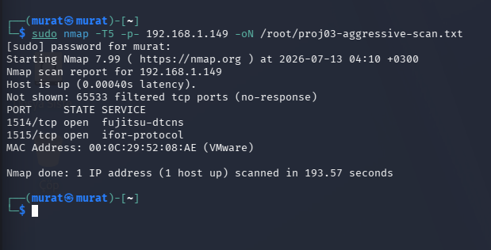
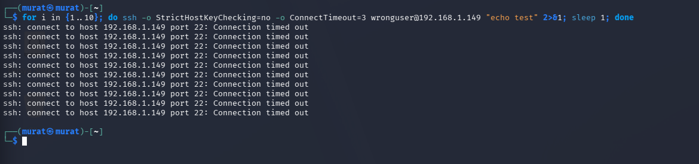
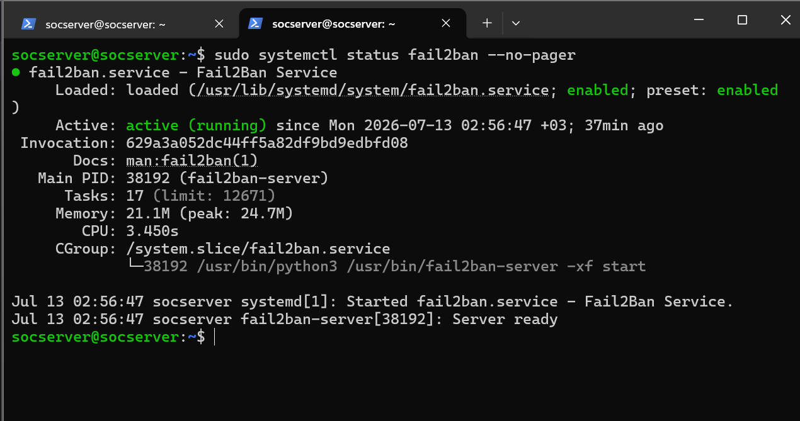
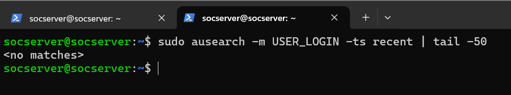
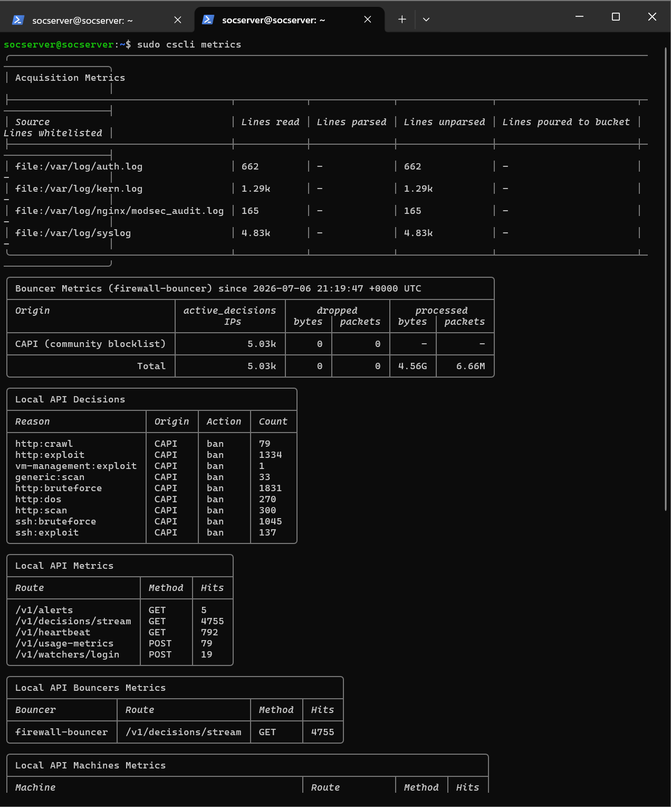
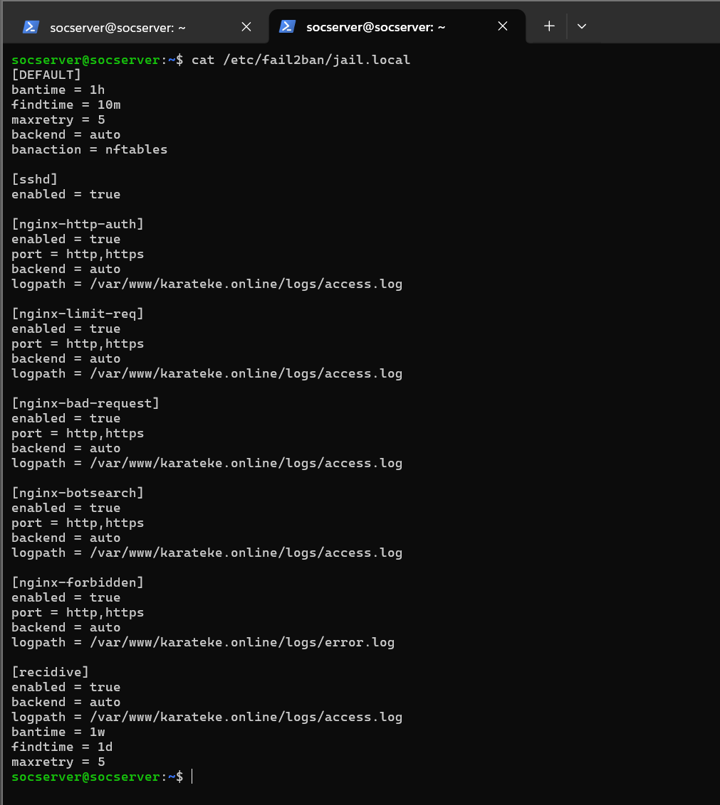
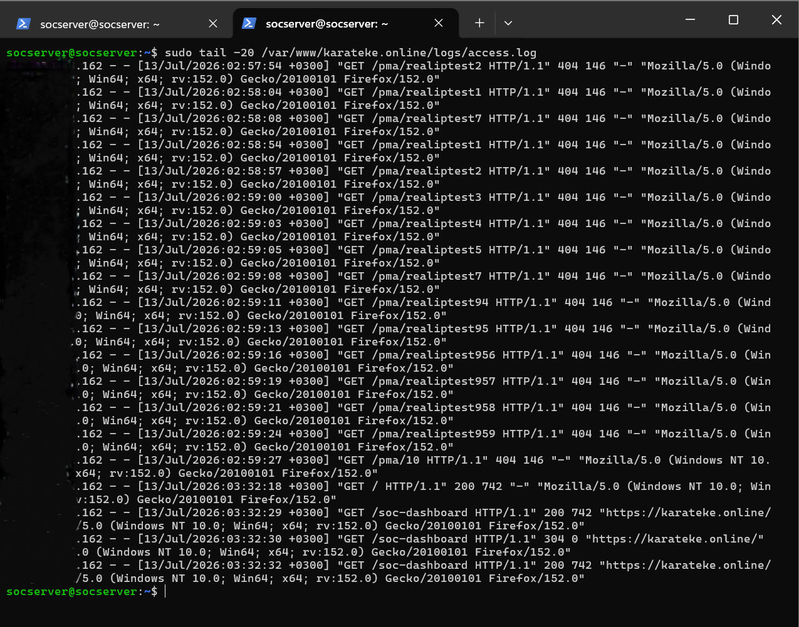
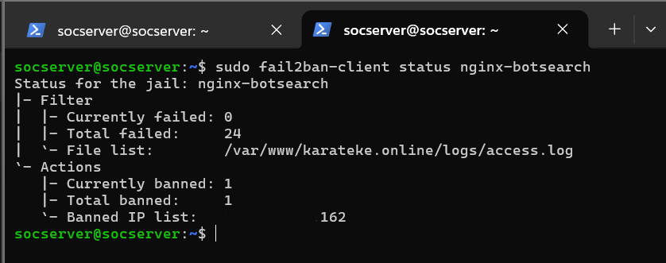
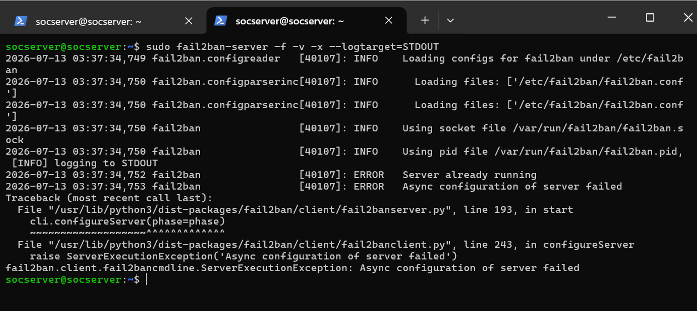

# Proje 03: Host-Based Tehdit Tespiti (Falco + Auditd + CrowdSec + Fail2Ban)

## Amaç

Bu proje, `karateke.online` üzerinde çalışan bir Linux sunucusunda **host tabanlı** tehdit tespiti ve otomatik engelleme katmanı kurmayı, ardından bu katmanı gerçek saldırı denemeleriyle test etmeyi amaçlar. Ağ perimeter savunmasının (Proje 01) ve ağ trafiği tespitinin (Proje 02) ötesinde, bu proje **host üzerinde ne olduğunu görebilme** ve **şüpheli davranışa otomatik tepki verebilme** yeteneğine odaklanır.

Kullanılan bileşenler:

| Araç | Rol |
|---|---|
| **Falco** | Çekirdek seviyesinde runtime davranış tespiti (syscall izleme) |
| **Auditd** | Linux audit alt sistemi — kullanıcı girişi/kimlik doğrulama olayları |
| **CrowdSec** | Topluluk tabanlı tehdit istihbaratı + otomatik IP engelleme (bouncer) |
| **Fail2Ban** | Log tabanlı davranışsal engelleme (brute-force, bot tarama vb.) |

Saldırı simülasyonları için ayrı bir **Kali Linux** makinesi (192.168.1.188) kullanılmıştır; hedef sunucu 192.168.1.149 üzerindedir (bu sunucuya SSH ile yalnızca Windows yönetici makinesi 192.168.1.151 üzerinden erişilebilir).

---

## 1. Saldırı Yüzeyi Analizi (Nmap)

Saldırı denemelerinden önce, sunucunun dışa açık yüzeyi tam port taraması ile doğrulandı:

```
sudo nmap -T5 -p- 192.168.1.149 -oN /root/proj03-aggressive-scan.txt
```

**Sonuç:** 65.533 port filtrelenmiş durumda; yalnızca 2 port açık görünüyor (1514/1515 — Wazuh agent/manager iletişim portları, nmap tarafından fujitsu-dtcns/ifor-protocol olarak yanlış sınıflandırılmış). Bu, sunucunun saldırı yüzeyinin minimuma indirildiğinin doğrudan kanıtıdır.

*Kanıt: `17-nmap-aggressive-scan-attack-surface.png`*



---

## 2. Saldırı Denemeleri (Kali Tarafı)

Saldırı simülasyonları, ağ üzerinde 192.168.1.188 adresine sahip ayrı bir Kali Linux makinesinden yürütülmüştür.

- **Hydra ile SSH brute-force** denemesi yapıldı, ancak wordlist dosyasında biçim hatası nedeniyle araç hata verdi ve tamamlanmadı.
- **Hydra ile HTTP form brute-force** denemesi de aynı wordlist hatasıyla sonuçlandı.
- **Manuel SSH bağlantı denemeleri** (10 kez ardışık) yapıldı; hepsi `Connection timed out` hatasıyla sonuçlandı. Bunun nedeni, hedef sunucudaki (`192.168.1.149`) ağ segmentasyon kuralının SSH erişimini yalnızca yönetici makinesi `192.168.1.151`'e izin vermesidir — Kali makinesi `.188` olduğu için bu kural tarafından engellenmiştir. **Bu, ağ seviyesinde çalışan bir savunma katmanının doğrudan kanıtıdır.**

*Kanıtlar: `01-hydra-ssh-bruteforce-attempt-fail.png`, `02-hydra-http-bruteforce-attempt-fail.png`, `03-manual-ssh-connection-attempts-timeout.png`*




> **Not:** Kali makinesinin IP yapılandırmasını gösteren ayrı bir ekran görüntüsü (ör. `ip a` çıktısı) bu sette bulunmamaktadır; IP adresi bağlam notlarından alınmıştır. Gerekirse tek bir ek görüntüyle tamamlanabilir.

---

## 3. Servis Sağlığı Doğrulaması

Tüm tespit/engelleme servislerinin çalışır durumda olduğu doğrulandı:

- Falco → `active (running)`
- Auditd → `active (running)`
- CrowdSec + firewall-bouncer → ikisi de `active (running)`
- Fail2Ban → `active (running)`

*Kanıtlar: `04-falco-service-status-active.png`, `05-auditd-service-status-active.png`, `06-crowdsec-bouncer-service-status-active.png`, `07-fail2ban-service-status-active.png`*




---

## 4. Gerçek Tespit Kanıtları

**Falco — Hassas Dosya Erişimi Tespiti:**
Falco, `wazuh-syscheckd` sürecinin `/etc/pam.d/passwd`, `chfn`, `sudo`, `chpasswd` gibi kimlik doğrulama ile ilgili hassas dosyaları okuduğunu tespit etti ve `"Sensitive file opened for reading... Read sensitive file untrusted"` uyarısını üretti. Bu davranış **MITRE ATT&CK T1555 (Credential Access)** tekniğiyle eşleşir.

*Kanıt: `08-falco-alert-sensitive-file-read.png`*


**Auditd — Giriş/Kimlik Doğrulama Sorguları:**
`USER_LOGIN` ve `USER_AUTH` olayları için yapılan sorgular bu aşamada `<no matches>` döndürdü — henüz gerçek bir giriş denemesi kaydedilmemişti. Bu, audit alt sisteminin doğru çalıştığının (log üretmeye hazır olduğunun) temiz bir başlangıç noktası kanıtıdır.

*Kanıtlar: `09-auditd-user-login-query-no-matches.png`, `10-auditd-user-auth-query-no-matches.png`*




**CrowdSec — Topluluk Tehdit İstihbaratı:**
`cscli decisions list` bu noktada henüz aktif bir engelleme kararı olmadığını gösterdi. Ancak `cscli metrics` çıktısı çok daha değerli bir bulgu ortaya koydu: CrowdSec Community API (CAPI) blocklist'i üzerinden **5.030 IP proaktif olarak engellenmiş** durumda; kategori dağılımı şöyle:

| Kategori | Engellenen IP Sayısı |
|---|---|
| http:bruteforce | 1.831 |
| http:exploit | 1.334 |
| ssh:bruteforce | 1.045 |
| ssh:exploit | 137 |

Bu, sunucunun **hiçbir saldırı denemesi olmadan bile** küresel bir tehdit istihbaratı ağından faydalanarak koruma altında olduğunu gösterir.

*Kanıtlar: `11-crowdsec-decisions-list-empty.png`, `12-crowdsec-metrics-community-blocklist.png`*




---

## 5. Fail2Ban Sorun Giderme Süreci — Projenin En Değerli Bölümü

Bu proje sırasında Fail2Ban'ın `nginx-botsearch` jail'inin gerçek saldırı denemelerini banlamadığı fark edildi. Kök neden analizi üç ayrı, birbirinden bağımsız sorunu ortaya çıkardı:

### Kök Neden A — Yanlış Backend Yapılandırması
Fail2Ban jail'leri `backend=systemd` kullanacak şekilde yapılandırılmıştı, ancak nginx logları journald'a değil, doğrudan dosyaya (`/var/www/karateke.online/logs/access.log`) yazıyordu. Bu uyumsuzluk nedeniyle Fail2Ban ilgili logları hiç görmüyordu.

**Çözüm:** `jail.local` içinde `backend=auto` olarak düzeltildi ve tüm nginx jail'lerinin `logpath` değerleri doğru dosya yoluna işaret edecek şekilde güncellendi.

*Kanıt: `13-fail2ban-jail-local-config-fixed.png`*



### Kök Neden B — Nginx SPA Fallback'i Gerçek 404 Üretmiyordu
Uygulama bir React SPA olduğu için nginx, bilinmeyen tüm path'leri `index.html`'e yönlendiriyor ve HTTP 200 döndürüyordu — şüpheli path taramaları (`/pma/`, `/wp-admin/` vb.) dahil. Bu durumda Fail2Ban'ın 404 tabanlı filtreleri hiçbir zaman tetiklenmiyordu.

**Çözüm:** Şüpheli/bilinmeyen path'ler için özel bir nginx `location` bloğu eklendi ve bu path'lerin gerçekten `return 404` döndürmesi sağlandı.

*Kanıt: `14-nginx-access-log-real-ip-404-probes.png` — düzeltme sonrası `/pma/realiptest*` isteklerinin gerçekten 404 döndüğü görülüyor*



### Kök Neden C (En Kritik) — Cloudflare Tüneli Gerçek IP'yi Gizliyordu
Sunucu Cloudflare Tunnel üzerinden yayın yaptığı için tüm istekler nginx'e `127.0.0.1` olarak ulaşıyordu. Fail2Ban'ın `ignoreself` kuralı varsayılan olarak kendi loopback IP'sini yok saydığından, **hiçbir saldırgan IP'si asla banlanamıyordu** — çünkü sistem her isteği kendisinden geliyormuş gibi görüyordu.

**Çözüm:** `/etc/nginx/conf.d/cloudflare-realip.conf` dosyası oluşturuldu; tüm resmi Cloudflare IP aralıkları `set_real_ip_from` direktifleriyle tanımlandı ve `real_ip_header CF-Connecting-IP;` ayarıyla gerçek istemci IP'si nginx'e açığa çıkarıldı.

*Kanıt: `18-nginx-cloudflare-realip-config.png`*


**Sonuç doğrulaması:** Düzeltme sonrası access.log'da artık `127.0.0.1` değil, gerçek istemci IP'si (`X.X.X.X`) görünmeye başladı.

*Kanıt: `19-nginx-access-log-real-ip-dashboard-requests.png`*


### Doğrulama ve Final Kanıt

`fail2ban-regex` aracıyla filtre mantığı test edildi ve access.log üzerinde **51 eşleşme** bulundu — filtrenin doğru çalıştığının kanıtı.

*Kanıt: `15-fail2ban-regex-filter-match-analysis.png`*


Üç kök neden düzeltildikten sonra, `nginx-botsearch` jail'i gerçek zamanlı olarak çalışır duruma geldi ve saldırgan IP'yi tespit edip banladı:

```
Currently failed: 0
Total failed:     24
Currently banned: 1
Total banned:     1
Banned IP list:   X.X.X.X
```

Bu, saldırgan IP'sinin **gerçekten tespit edilip banlandığının** nihai kanıtıdır.

*Kanıt: `20-fail2ban-nginx-botsearch-status-final.png`*



(Süreç boyunca ayrıca `fail2ban-server` foreground debug modunda çalıştırılmaya çalışılmış, servis zaten çalıştığı için `"Server already running"` hatası alınmıştır — bu beklenen bir davranıştır, bir hata değildir.)

*Kanıt: `16-fail2ban-server-foreground-debug-error.png`*



---

## Öne Çıkan Yetkinlikler

- Çok katmanlı host tabanlı tespit mimarisi kurulumu ve doğrulanması (Falco, Auditd, CrowdSec, Fail2Ban)
- Gerçek saldırı simülasyonu ve ağ segmentasyonu savunmasının pratikte doğrulanması
- **Karmaşık, çok bileşenli bir üretim sorununun kök neden analizi**: reverse proxy (Cloudflare Tunnel), web sunucusu (nginx SPA routing) ve IPS (Fail2Ban) katmanları arasındaki etkileşimin doğru şekilde teşhis edilip düzeltilmesi
- MITRE ATT&CK çerçevesiyle log/alarm eşleştirmesi (T1555 — Credential Access)
- CrowdSec topluluk tehdit istihbaratının değerlendirilmesi ve yorumlanması

---

## Ekran Görüntüsü Envanteri

| # | Dosya Adı | İçerik |
|---|---|---|
| 01 | 01-hydra-ssh-bruteforce-attempt-fail.png | Hydra SSH brute-force (wordlist hatası) |
| 02 | 02-hydra-http-bruteforce-attempt-fail.png | Hydra HTTP brute-force (wordlist hatası) |
| 03 | 03-manual-ssh-connection-attempts-timeout.png | Manuel SSH denemeleri, timeout |
| 04 | 04-falco-service-status-active.png | Falco servis durumu |
| 05 | 05-auditd-service-status-active.png | Auditd servis durumu |
| 06 | 06-crowdsec-bouncer-service-status-active.png | CrowdSec + bouncer servis durumu |
| 07 | 07-fail2ban-service-status-active.png | Fail2Ban servis durumu |
| 08 | 08-falco-alert-sensitive-file-read.png | Falco hassas dosya erişim uyarısı |
| 09 | 09-auditd-user-login-query-no-matches.png | Auditd USER_LOGIN sorgusu |
| 10 | 10-auditd-user-auth-query-no-matches.png | Auditd USER_AUTH sorgusu |
| 11 | 11-crowdsec-decisions-list-empty.png | CrowdSec aktif karar listesi |
| 12 | 12-crowdsec-metrics-community-blocklist.png | CrowdSec CAPI metrikleri |
| 13 | 13-fail2ban-jail-local-config-fixed.png | jail.local düzeltilmiş yapılandırma |
| 14 | 14-nginx-access-log-real-ip-404-probes.png | 404 döndüren şüpheli path denemeleri |
| 15 | 15-fail2ban-regex-filter-match-analysis.png | fail2ban-regex analiz çıktısı |
| 16 | 16-fail2ban-server-foreground-debug-error.png | Foreground debug modu çıktısı |
| 17 | 17-nmap-aggressive-scan-attack-surface.png | Nmap tam port taraması |
| 18 | 18-nginx-cloudflare-realip-config.png | Cloudflare real-IP yapılandırması |
| 19 | 19-nginx-access-log-real-ip-dashboard-requests.png | Gerçek IP ile erişim logu |
| 20 | 20-fail2ban-nginx-botsearch-status-final.png | Fail2Ban final ban kanıtı |

**Toplam: 20 doğrulanmış ekran görüntüsü.** (Kali IP yapılandırma görüntüsü bu sette mevcut değildir; istenirse tek bir ek görüntüyle tamamlanabilir.)
