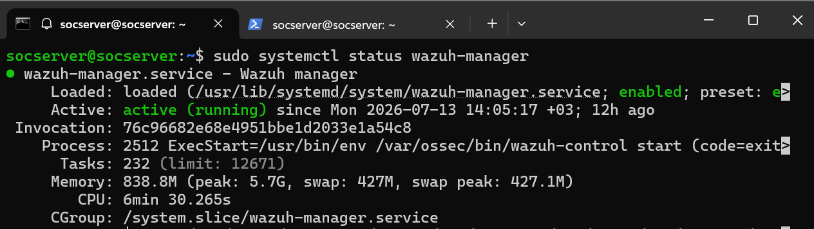
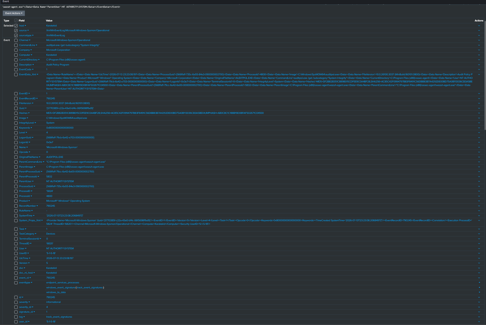
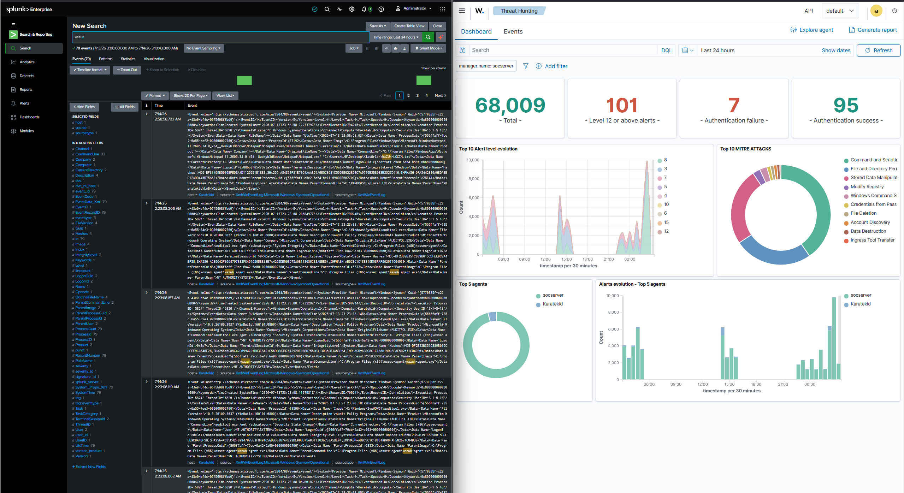

# Proje 04: SIEM Log Korelasyon Platformu (Wazuh + Splunk)

## Amaç

Proje 01-03'te üretilen dağınık loglar (ModSecurity audit log, Suricata eve.json, Zeek conn.log, Falco/Auditd/CrowdSec/Fail2Ban kayıtları) tek başına anlamlıdır ama aralarındaki ilişkiyi görmek zordur. Bu proje, tüm bu kaynakları merkezi bir SIEM platformunda (Wazuh) toplayıp korelasyon kurallarına ve önem derecelerine göre alarm üretmeyi, ayrıca ayrı bir Windows 11 makinesindeki Splunk Enterprise ile ikinci, bağımsız bir analiz/görünürlük katmanı kurmayı amaçlar. (Splunk tarafında tam log korelasyonunun henüz kurulmadığı, test sırasında ortaya çıkan dürüst bir bulgudur — bkz. Bulgular bölümü.)

| Araç | Rol |
|---|---|
| Wazuh Manager | Ajanlardan ve log kaynaklarından gelen verileri toplar, kural motoruyla korelasyon yapar, alarm üretir |
| Wazuh Indexer | Üretilen olayları indeksler, arama ve saklama sağlar |
| Wazuh Dashboard | Alarmların ve olayların görselleştirildiği web arayüzü |
| Splunk Enterprise | Ayrı bir Windows 11 makinesinde çalışan, bağımsız ikincil log analiz platformu |

## Metodoloji

### 1. Servis Doğrulama

Wazuh bileşenlerinin (Manager, Indexer, Dashboard) ve Splunk'ın çalışır durumda olduğu doğrulandı. Dashboard genel görünümünde son 24 saatte **Critical: 81, High: 21, Medium: 42.736, Low: 23.284** seviyesinde alarm olduğu görüldü — bu sayılar, sistemde Proje 01-03'ün güvenlik yığınından beslenen yoğun ve gerçek bir alarm akışının zaten çalıştığını gösteriyor.

```bash
sudo systemctl status wazuh-manager
sudo systemctl status wazuh-indexer
sudo systemctl status wazuh-dashboard
```

*Kanıt: `01-wazuh-manager-service-status.png`*



*Kanıt: `02-wazuh-indexer-service-status.png`*


*Kanıt: `03-wazuh-dashboard-overview.png`*


```powershell
Get-Service splunkd
```

*Kanıt: `07-splunk-service-status.png`*


### 2. Gerçek Yüksek Öncelikli Alarmın Seçilmesi

Sunucuda SSH parola tabanlı kimlik doğrulaması kasıtlı olarak **kapalıdır** (yalnızca key-based auth) — bu bir güvenlik güçlü noktasıdır, bu yüzden bu projede onu zayıflatan/atlatan yapay bir test senaryosu kurulmadı. Bunun yerine, sistemde zaten akan gerçek alarm verisinden yüksek/kritik seviyeli bir örnek seçildi: Wazuh Threat Hunting > Events'te `rule.level >= 12` filtresi uygulandığında **101 sonuç** döndü; bunlar arasından **level 15**, `rule.id 92213` — *"Executable file dropped in folder commonly used by malware"* — alarmı örnek olay olarak seçildi.

*Kanıt: `04-wazuh-real-alert-selection.png`*


### 3. Wazuh Tespiti ve MITRE Eşleştirmesi

Seçilen alarmlardan birinin Document Details görünümü incelendi: `rule.mitre.id: T1222`, `rule.mitre.tactic: Defense Evasion`, `rule.mitre.technique: File and Directory Permissions Modification`, `rule.description: "Auditd - Permission modified"`, `rule.id: 100105`, `rule.level: 8`, `data.audit.key: perm_mod`. Kaynak süreç (`data.audit.exe`) **`/usr/bin/clamscan`** — yani Proje 06'nın ClamAV bileşeni.

*Kanıt: `05-wazuh-alert-detail-mitre-attck.png`*


Ayrıca farklı bir tespit türü örneği olarak, dosya bütünlüğü izleme (syscheck) kaynaklı bir kural tetiklenme kaydı incelendi (`rule.description: "Integrity checksum changed."`, `rule.level: 7`).

*Kanıt: `06-wazuh-rule-triggered-log.png`*


**Bulgu:** Wazuh, kendi güvenlik araçlarımızın (ClamAV) rutin operasyonlarını bile audit seviyesinde izleyip bir MITRE ATT&CK tekniğiyle (T1222) etiketleyebiliyor — bu, savunma araçlarının kendi davranışının bile gözlemlenebilir ve sınıflandırılabilir olduğunu gösteren ilginç bir yan bulgudur.

### 4. Splunk'ta Bağımsız Görünürlük

Splunk'ta `wazuh-agent.exe` araması yapıldı; son 24 saatte **78 event** döndü.

*Kanıt: `08-splunk-index-search-spl-query.png`*


Genişletilmiş bir event'in alan listesi incelendiğinde, `ParentImage` ve `ParentCommandLine` alanlarında `C:\Program Files (x86)\ossec-agent\wazuh-agent.exe` açıkça görülüyor.

*Kanıt: `09-splunk-wazuh-agent-telemetry-detail.png`*



### 5. Wazuh-Splunk Yan Yana İzleme

Split-screen bir görüntüyle iki platform aynı anda izlendi: solda Splunk'ta `wazuh` araması (**79 event**), sağda Wazuh Threat Hunting dashboard'u (**68.009 Total, 101 Level 12+ alerts, 7 Authentication failure, 95 Authentication success**).

*Kanıt: `10-wazuh-splunk-side-by-side-visibility.png`*



Bu görüntü iki platformun **aynı anda, yan yana** izlenebildiğini gösterir — ancak bir sonraki bölümde açıklandığı gibi bu, veri seviyesinde bir korelasyon/entegrasyon değil, operasyonel bir yan yana izleme kolaylığıdır.

## Bulgular

### Bulgu A — Wazuh-Splunk Entegrasyonu Henüz Kurulmamış

Splunk'ta `| eventcount summarize=false index=*` sorgusu çalıştırıldığında, yalnızca `history`, `main`, `summary` index'lerinin var olduğu görüldü — ayrı bir `wazuh`/`wazuh-alerts` index'i **yok**. Bu, Wazuh alarmlarının Splunk'a forward edilmediğini, iki platformun şu an veri seviyesinde bağımsız çalıştığını gösterir. Tam log korelasyonu için ortak bir index/forwarder entegrasyonu (ör. Wazuh'un Splunk App'i veya HTTP Event Collector ile alarm forwarding'i) gelecek bir iyileştirme olarak planlanmıştır.

### Bulgu B — Tamamlayıcı (Ama Bağımsız) Görünürlük

Bulgu A'ya rağmen, Splunk'ın kendi bağımsız Sysmon/Windows telemetrisi dolaylı ama gerçek bir doğrulama sağladı: `ParentImage`/`ParentCommandLine` alanlarında `wazuh-agent.exe`'nin açıkça görünmesi, Wazuh agent'ının endpoint üzerinde gerçekten çalıştığını Splunk'ın kendi, bağımsız açısından doğruluyor. Yani şu an **tam korelasyon yok, ama tamamlayıcı görünürlük var** — iki platform aynı veriyi paylaşmıyor ama birbirinin varlığını dolaylı olarak teyit edebiliyor.

## Öne Çıkan Yetkinlikler

- Gerçek zamanlı, yüksek öncelikli (`rule.level >= 12`) alarmların filtrelenip triyaj edilmesi
- MITRE ATT&CK eşleştirmesinin pratikte yorumlanması (T1222/Defense Evasion'ın audit-seviyeli bir olayla ilişkilendirilmesi)
- Güvenlik araçlarının (ClamAV, Auditd) birbirinin davranışını nasıl izleyip etiketleyebildiğinin fark edilmesi
- SIEM entegrasyon eksikliklerinin (Splunk'ta ayrı bir Wazuh index'i olmaması) tespit edilip dürüstçe raporlanması
- Farklı telemetri kaynaklarının (Wazuh audit + Splunk Sysmon) birbirini bağımsız şekilde doğrulayabildiğinin gösterilmesi

## Ekran Görüntüsü Envanteri

| # | Dosya Adı | İçerik |
|---|---|---|
| 01 | 01-wazuh-manager-service-status.png | Wazuh Manager servis durumu |
| 02 | 02-wazuh-indexer-service-status.png | Wazuh Indexer servis durumu |
| 03 | 03-wazuh-dashboard-overview.png | Dashboard genel görünüm (Critical 81/High 21/Medium 42.736/Low 23.284) |
| 04 | 04-wazuh-real-alert-selection.png | rule.level >= 12 filtresi, 101 hit, level 15 malware alarmı |
| 05 | 05-wazuh-alert-detail-mitre-attck.png | T1222/Defense Evasion MITRE eşleşmesi (clamscan kaynaklı) |
| 06 | 06-wazuh-rule-triggered-log.png | Tetiklenen kuralın tam JSON kaydı (syscheck detayı) |
| 07 | 07-splunk-service-status.png | Splunk servis durumu (Windows, splunkd Running) |
| 08 | 08-splunk-index-search-spl-query.png | Splunk'ta "wazuh-agent.exe" araması, 78 event |
| 09 | 09-splunk-wazuh-agent-telemetry-detail.png | Genişletilmiş event, ParentImage=wazuh-agent.exe |
| 10 | 10-wazuh-splunk-side-by-side-visibility.png | Split-screen: Splunk arama + Wazuh dashboard yan yana |

**Toplam: 10 doğrulanmış ekran görüntüsü.**
