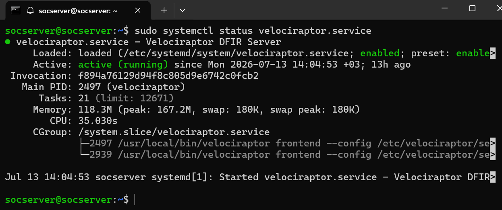
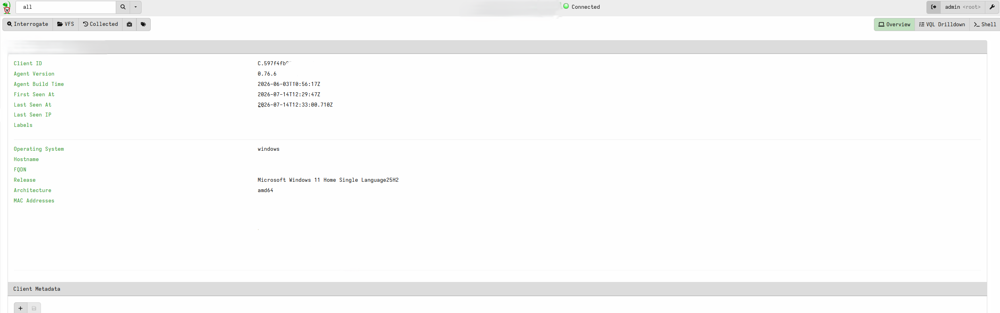

# Proje 05: DFIR Dijital Adli Analiz Laboratuvarı (Velociraptor)

## Amaç

Bu proje, Velociraptor DFIR platformu kullanılarak bir uç nokta (endpoint) üzerinde temel bir dijital adli analiz ve olay müdahale iş akışının uçtan uca doğrulanmasını amaçlamaktadır. Kapsam: sunucu altyapısının doğrulanması, bir Windows istemcisinin ajan (agent) olarak bağlanması, kontrollü bir test senaryosu üzerinden artifact toplama, sonuçların (zaman damgaları ve kriptografik hash) incelenmesi ve raporlama.

## Metodoloji

### 1. Sunucu Durumunun Doğrulanması
Ubuntu sunucuda (`socserver`, 192.168.1.149) Velociraptor servisinin durumu kontrol edildi:
```bash
sudo systemctl status velociraptor.service
```
Servis `active (running)` durumda, 13 saatten uzun süredir kesintisiz çalıştığı doğrulandı.



### 2. İstemci (Client) Bağlantısının Sağlanması
Windows 11 istemcisi (`Karatekid`) için Velociraptor GUI üzerinden bir client MSI paketi üretildi ve kuruldu. İlk kurulum denemelerinde MSI hatası (error 1603, `ProcessComponents` adımında başarısızlık) ile karşılaşıldı; kök neden imzasız/indirilen dosya kaynaklı bir Windows Installer sorunuydu. Çözüm olarak Velociraptor'ın kendi exe + client config yöntemiyle servis doğrudan kuruldu:
```powershell
.\velociraptor.exe --config client.config.yaml service install
Start-Service -Name "Velociraptor"
```
İstemci sunucuya başarıyla bağlandı ve "Connected" durumuna geçti.



### 3. Kontrollü Test Senaryosu
Falco logları (`/var/log/falco.log`) önceden incelendi; tespit edilen "Read sensitive file untrusted" uyarılarının tamamının `wazuh-modulesd` sürecinin rutin FIM (File Integrity Monitoring) taraması sırasında `/etc/sudoers` ve `/etc/shadow` dosyalarını okumasından kaynaklandığı görüldü — bu gerçek bir tehdit değil, beklenen ve meşru bir davranıştır (bkz. Bulgular). Bu nedenle gerçek bir olay yerine, kontrollü ve zararsız bir test senaryosu tercih edildi. İstemcide zararsız bir işaretleyici (marker) dosya oluşturuldu:
```powershell
whoami
New-Item -Path "$env:TEMP\suspicious_test_payload.ps1" -ItemType File -Value "# DFIR simulation test payload - benign marker file"
Get-Item "$env:TEMP\suspicious_test_payload.ps1"
```


### 4. Artifact Toplama İsteği
Velociraptor GUI üzerinden `Windows.Search.FileFinder` artifact'ı ile hedef dosya arandı. İlk denemede varsayılan `auto` accessor ile 0 sonuç alındı (bkz. Bulgular, kök neden analizi); `ntfs` accessor'a geçilerek sorun çözüldü:

### 5. Sonuçların İncelenmesi
Toplama işlemi 1 satır sonuç, 51/51 byte upload ile başarıyla tamamlandı. Sonuç tablosu; dosya yolu, dört MFT zaman damgası (MTime, ATime, CTime, BTime — hepsi 2026-07-14T19:45:48.403Z), ve üç hash algoritmasını (MD5, SHA1, SHA256) tek satırda sunmaktadır. Bu tablo aynı zamanda zaman çizelgesi (timeline) analizini ve hash çıkarımını da karşılamaktadır.


### 6. Raporlama ve Export
Toplama sonucu JSON formatında export edildi ve doğrulandı (`F.D9B961SS72FNU.json`), içerik VS Code üzerinden incelendi.


## Bulgular / Kök Neden Analizi

**Bulgu A — Falco uyarıları false-positive:** Falco'nun "Read sensitive file untrusted" kuralı, `wazuh-modulesd` sürecinin `/etc/sudoers` ve `/etc/shadow` dosyalarını okumasını tetikliyordu. İnceleme sonucunda bunun Wazuh'un kendi meşru FIM/rootcheck aktivitesi olduğu, gerçek bir tehdit göstermediği doğrulandı. Bu, Falco'nun "trusted process" listesine Wazuh'un eklenmediğini gösteren bir yapılandırma iyileştirme fırsatıdır; gerçek bir olay simülasyonu yerine kontrollü test senaryosu tercih edilmesinin gerekçesidir.


**Bulgu B — SYSTEM hesabı erişim kısıtı:** Velociraptor Windows istemcisi `LocalSystem` hesabı altında çalışmaktadır. Varsayılan `auto` accessor ile kullanıcıya özel `AppData\Local\Temp` klasörüne erişim denemesi 0 sonuç döndürdü (izin kısıtlaması). `ntfs` accessor'a (düşük seviye, ham disk okuma) geçilerek bu kısıtlama aşıldı ve dosya başarıyla bulundu. Bu, DFIR araçlarının canlı dosya sistemi API'sine güvenmek yerine ham disk erişimini tercih etmesinin pratik bir gerekçesidir.

## Öne Çıkan Yetkinlikler

- Velociraptor DFIR platformunun uçtan uca kurulumu ve yapılandırılması
- Windows Installer (MSI) hata ayıklama ve alternatif servis kurulum yöntemleri
- VQL tabanlı artifact toplama (Windows.Search.FileFinder)
- Dosya sistemi accessor kavramlarının (auto vs ntfs) pratik uygulaması ve izin kısıtlarının aşılması
- Falco log analizi ve false-positive / gerçek tehdit ayrımı yapılması
- MFT tabanlı zaman damgası analizi (MTime/ATime/CTime/BTime) ve kriptografik hash doğrulama
- JSON formatında adli analiz raporu export edilmesi

## Ekran Görüntüsü Envanteri

| # | Dosya | Açıklama |
|---|---|---|
| 1 | 01-velociraptor-server-status.png | Sunucu servis durumu (active/running) |
| 2 | 02-velociraptor-client-connected.png | İstemci bağlantı durumu (Connected) |
| 3 | 03-simulated-incident-command.png | Kontrollü test dosyası oluşturma komutu |
| 4 | 04-velociraptor-artifact-collection-request.png | Artifact toplama isteği ve parametreler |
| 5 | 05-velociraptor-collection-results.png | Toplama sonuçları (zaman damgaları + hash) |
| 6 | 06-velociraptor-report-export.png | JSON rapor export |
| 7 | 07-falco-log-review.png | Falco log incelemesi (false-positive tespiti) |

## Sonraki Aşamalar

Bu proje kapsamında Velociraptor altyapısının kurulumu, bir endpoint'in bağlanması ve temel bir artifact toplama/analiz akışı uçtan uca doğrulandı. Daha ileri bir DFIR senaryosu olarak, Kali Linux (`192.168.1.188`) üzerinden Windows istemcisine yönelik kontrollü bir saldırı simülasyonu (Impacket ile WMI/SMB üzerinden uzaktan komut çalıştırma, MITRE T1047/T1021.002) planlanmış ancak Windows Firewall'un SMB portlarını (139/445) filtrelemesi nedeniyle bu oturumda tamamlanamamıştır. Bu senaryo gelecek bir iterasyonda:

1. Windows Firewall'da SMB kurallarının açılması,
2. Kali'den `wmiexec.py` ile uzaktan komut çalıştırılması,
3. Velociraptor'ın `Windows.EventLogs.EvtxHunter` veya `Windows.Network.Netstat` artifact'larıyla bu erişimin tespit edilmesi,
4. MITRE ATT&CK eşleştirmesi ve olay zaman çizelgesi çıkarımı

adımlarıyla tamamlanacaktır.
