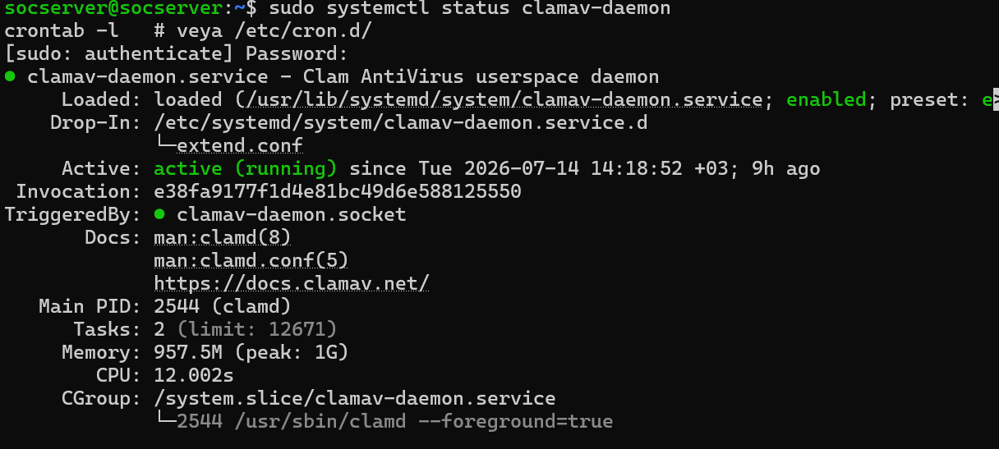
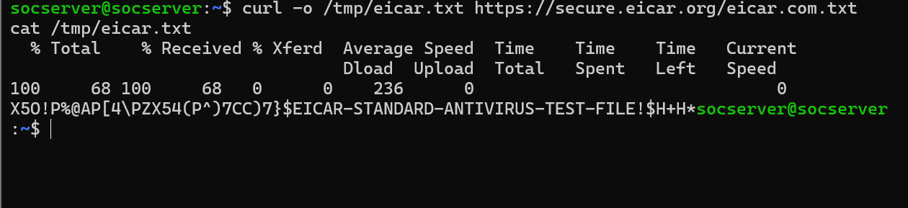
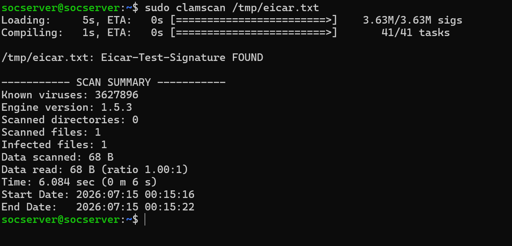
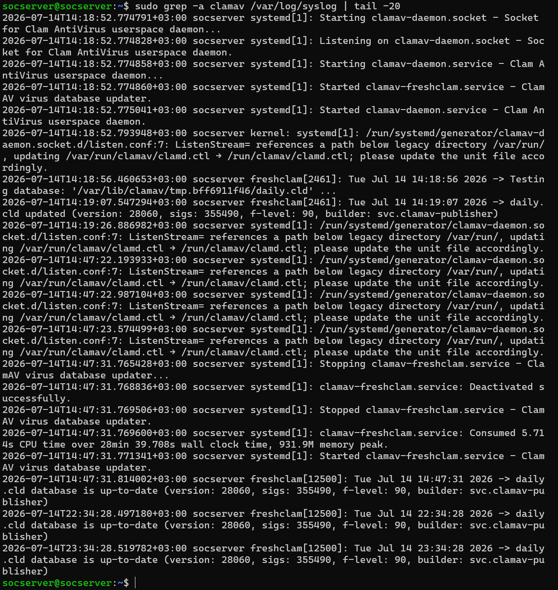

# Proje 06: Zararlı Yazılım Tespiti Otomasyonu (ClamAV + cron)

## Amaç

Bu proje, sunucudaki dosya sistemini düzenli ve otomatik olarak zararlı yazılımlara karşı tarayan bir antivirüs altyapısı kurar. ClamAV imza tabanlı bir antivirüs motoru olarak çalışırken, cron ile zamanlanmış bir betik günlük tam sistem taramasını otomatikleştirir.

| Araç | Rol |
|---|---|
| ClamAV (clamav-daemon) | Dosya sistemini imza tabanlı olarak tarayan antivirüs motoru |
| cron | Günlük tarama betiğini zamanlanmış saatte otomatik tetikler |

## Metodoloji

### 1. Servis Durumu Doğrulama

ClamAV daemon'un durumu kontrol edildi:
```bash
sudo systemctl status clamav-daemon
```
Servis `active (running)` durumda, 2026-07-14 14:18:52 +03'ten bu yana kesintisiz çalışıyor (Main PID 2544, Memory 957.5M).



### 2. Zamanlama Mekanizmasının Doğrulanması

İlk planda zamanlamanın `/etc/cron.d/` altında bir sistem dosyası olarak tanımlanması bekleniyordu; gerçekte görevin root kullanıcısının kişisel crontab'ında tanımlı olduğu doğrulandı:
```bash
sudo crontab -l
```
Çıktıda iki satır bulundu:
```
0 2 * * * /usr/local/bin/clamav-daily-scan.sh
0 3 * * * /usr/local/bin/backup-automation.sh
```
İlk satır bu projenin (ClamAV günlük tarama, 02:00) zamanlamasını, ikinci satır ise Proje 07'nin (Automated Backup Recovery System, 03:00) zamanlamasını gösteriyor — aynı ekran görüntüsü her iki proje için de geçerli bir kanıt niteliğinde.


### 3. EICAR Test Dosyası ile Tespit Testi

Standart, zararsız EICAR test dosyası indirilip içeriği doğrulandı:
```bash
curl -o /tmp/eicar.txt https://secure.eicar.org/eicar.com.txt
cat /tmp/eicar.txt
```
Dosya içeriğinde `EICAR-STANDARD-ANTIVIRUS-TEST-FILE` imza dizesi doğrulandı.



### 4. Manuel Tarama ile Tespit Doğrulama

```bash
sudo clamscan /tmp/eicar.txt
```
Sonuç: `Eicar-Test-Signature FOUND`. Scan Summary: Known viruses: 3.627.896, Engine version: 1.5.3, Scanned files: 1, Infected files: 1, Data scanned: 68 B, Time: 6.084 sec.



### 5. Tam Sistem Tarama Logu ve Sürekli Sağlık Kontrolü

```bash
sudo tail -50 /var/log/clamav/clamav.log
```
Log kaydı; servisin başlatılması, veritabanının (3.627.896 imza) yüklenmesi ve saat başı tekrarlanan `SelfCheck: Database status OK` girdileriyle servisin sürekli ve sağlıklı çalıştığını doğruluyor.


### 6. Otomatik Tarama Geçmişinin Syslog Üzerinden Doğrulanması

```bash
sudo grep -a clamav /var/log/syslog | tail -20
```
Syslog kaydında `clamav-daemon` servisinin başlatılma olayları ve `freshclam` veritabanı güncelleme geçmişi (`daily.cld`, version 28060, 355.490 imza) doğrulandı.



## Bulgular / Kök Neden Analizi

**Bulgu A — Zamanlama root'un kişisel crontab'ında tanımlı:** Denetim planında zamanlamanın `/etc/cron.d/` altında bir sistem dosyası olarak bulunması bekleniyordu; gerçekte görev root kullanıcısının kişisel crontab'ında (`sudo crontab -l`) tanımlanmış durumda. Bu, otomasyon denetimlerinde zamanlanmış görevlerin yalnızca `/etc/cron.d/` değil, kullanıcı crontab'larının da kontrol edilmesi gerektiğini gösteren pratik bir bulgu.

**Bulgu B — ClamAV, Suricata kural dosyalarında false-positive üretiyor (Unix.Tool.13409-1):**
```bash
sudo clamscan -r /var/lib/suricata/
```
taraması, `/var/lib/suricata/cache/sgh/` altındaki bir kural önbellek dosyasında `Unix.Tool.13409-1 FOUND` tespiti üretti (Scanned files: 120, Infected files: 6). Kök neden: Suricata'nın kural setleri (ör. ET/Emerging Threats) bilinen saldırı/exploit imzalarını ve kötü amaçlı kod parçacıklarını, bunları TESPİT ETMEK amacıyla ham haliyle içerir. ClamAV bu imza içeriklerini gerçek bir tehdit sanıp yanlışlıkla işaretliyor. Bu, güvenlik araçlarının birbirinin verisini nasıl yanlış yorumlayabileceğini gösteren gerçek ve öğretici bir false-positive örneğidir — bir yapılandırma hatası değil, dikkatli log analizi ve kaynak doğrulaması gerektiren bir SOC pratiğidir.


## Öne Çıkan Yetkinlikler

- ClamAV + cron ile otomatik, zamanlanmış zararlı yazılım tarama altyapısı kurulumu
- EICAR standart test dosyasıyla antivirüs motorunun gerçek zamanlı tespit yeteneğinin doğrulanması
- Zamanlama mekanizmasının gerçek konumunun (root crontab, `/etc/cron.d/` değil) keşfedilmesi ve doğrulanması
- Güvenlik araçları arasındaki false-positive senaryolarının analiz edilmesi ve kök neden tespiti (Suricata kural dosyaları → ClamAV yanlış tespiti)
- Log tabanlı doğrulama (servis durumu, tarama logu, syslog geçmişi) ile otomasyonun sürekliliğinin ve sağlığının kanıtlanması

## Ekran Görüntüsü Envanteri

| # | Dosya Adı | İçerik |
|---|---|---|
| 01 | 01-clamav-service-status.png | ClamAV servis durumu (active/running) |
| 02 | 02-cron-daily-scan-job-definition.png | Root crontab, günlük tarama zamanlaması (Proje 06 + 07) |
| 03 | 03-eicar-test-file-creation.png | EICAR test dosyası indirme ve doğrulama |
| 04 | 04-clamav-manual-scan-eicar-detection.png | Manuel tarama - EICAR tespiti |
| 05 | 05-clamav-scan-log-full-system.png | Tam sistem tarama logu, SelfCheck OK |
| 06 | 06-false-positive-analysis-suricata-cache.png | Yanlış pozitif analizi (Suricata kural dosyası, Unix.Tool.13409-1) |
| 07 | 07-clamav-cron-log-history.png | Syslog'da ClamAV/freshclam geçmiş kayıtları |

**7 doğrulanmış ekran görüntüsü ile tamamlandı.**
