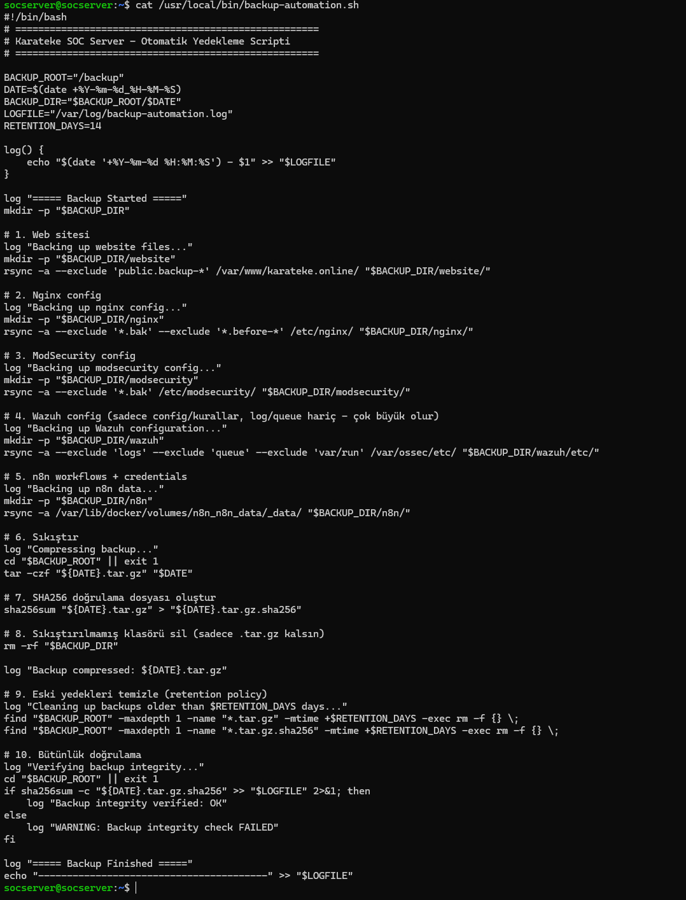
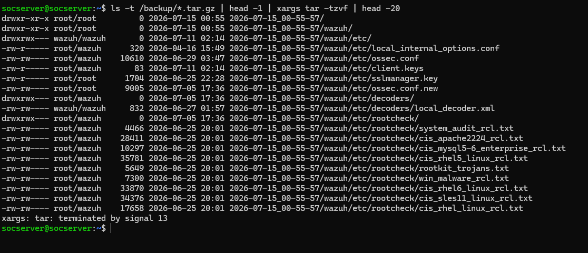

# Proje 07: Otomatik Yedekleme ve Kurtarma Sistemi

## Amaç

Önceki projelerde kurulan güvenlik ve altyapı bileşenlerinin konfigürasyonları ve verileri, bir felaket senaryosunda (disk arızası, fidye yazılımı, yanlış yapılandırma) kurtarılabilir olmalıdır. Bu proje, bütünlük doğrulamalı (SHA256) ve otomatik saklama süresi yönetimli (retention policy) bir yedekleme sistemi kurar.

| Araç | Rol |
|---|---|
| Bash scripting | Yedekleme mantığının tamamını yöneten ana otomasyon betiği |
| cron | Yedekleme betiğini her gece otomatik olarak tetikler |
| tar | Yedeklenen dosyaları tek bir sıkıştırılmış arşivde birleştirir |
| sha256sum | Yedek arşivinin bütünlüğünü doğrulamak için checksum üretir/kontrol eder |

## Metodoloji

### 1. Backup Script İçeriğinin İncelenmesi

```bash
cat /usr/local/bin/backup-automation.sh
```
Script sırasıyla: website (`rsync`, `/var/www/karateke.online/`), nginx config, ModSecurity config, Wazuh config (yalnızca `/var/ossec/etc/` — `logs`/`queue` boyut nedeniyle hariç tutuluyor) ve n8n Docker volume verisini tarih damgalı bir klasöre kopyalıyor; klasörü `tar.gz` olarak sıkıştırıyor; bir SHA256 hash dosyası üretiyor; sıkıştırma sonrası ham (sıkıştırılmamış) klasörü siliyor (yalnızca `.tar.gz` kalıyor); `RETENTION_DAYS=14`'ten eski yedekleri otomatik temizliyor; ve son adımda kendi ürettiği arşivin bütünlüğünü `sha256sum -c` ile doğrulayıp sonucu logluyor.



### 2. Zamanlama Doğrulaması (Cron)

```bash
sudo crontab -l
```
Root'un crontab'ında `0 3 * * * /usr/local/bin/backup-automation.sh` satırı tanımlı — Proje 06'daki ClamAV günlük taramasıyla (`0 2 * * *`) aynı crontab dosyasında, farklı saatte çalışıyor. **Bu ekran görüntüsü Proje 06'da da kanıt olarak kullanılmıştır** (aynı `sudo crontab -l` çıktısı, iki proje için de geçerli).


### 3. Manuel Çalıştırma

```bash
tail -30 /var/log/backup-automation.log
```
Log kaydında tam bir çalıştırma döngüsü görülüyor: `===== Backup Started =====` → website/nginx/modsecurity/Wazuh/n8n sırayla yedeklendi → `Compressing backup...` → `Cleaning up backups older than 14 days...` → `Verifying backup integrity...` → `OK` → `Backup integrity verified: OK` → `===== Backup Finished =====`.


### 4. Oluşan Yedek Dosyalarının Doğrulanması

```bash
ls -lh /backup/
```
`/backup/` altında tarih damgalı `.tar.gz` + `.tar.gz.sha256` dosya çiftleri listelendi (6 yedek, toplam 69M) — en eskisi 2026-07-03, en yenisi aynı gün içinde art arda alınmış iki manuel test yedeği (2026-07-15).


### 5. SHA256 Checksum Değerlerinin İncelenmesi

```bash
cat /backup/*.sha256
```
Her arşiv için üretilmiş SHA256 hash değeri ve ilgili dosya yolu tek satırda listelendi.


### 6. Bütünlük Doğrulaması

Aynı log kaydı, script'in kendi kendine yaptığı bütünlük doğrulamasını da içeriyor: `Verifying backup integrity...` ardından `<dosya>.tar.gz: OK` ve `Backup integrity verified: OK` satırları. **Bu görüntü adım 3 ile aynı kaynak ekran görüntüsüdür** — script'in tek log çıktısı hem çalıştırma hem doğrulama bilgisini birlikte içerdiği için aynı kanıt iki alt başlıkta da kullanılmıştır.


### 7. Saklama (Retention) Politikası Testi

```bash
sudo touch -d "20 days ago" /backup/test-eski-yedek.tar.gz
sudo find /backup -maxdepth 1 -name "*.tar.gz" -mtime +14
```
Gerçek 14 günlük bekleme yerine, değiştirme tarihi 20 gün öncesine ayarlanmış sahte bir dosya oluşturularak simüle edildi. `find ... -mtime +14` komutu bu dosyayı doğru şekilde tespit etti — script'in retention mantığının (`find "$BACKUP_ROOT" -maxdepth 1 -name "*.tar.gz" -mtime +$RETENTION_DAYS -exec rm -f {} \;`) çalışacağının kanıtı.


### 8. Geri Yükleme (Restore) Testi

```bash
ls -t /backup/*.tar.gz | head -1 | xargs tar -tzvf | head -20
```
En güncel arşiv açılmadan, içeriği listelenerek incelendi. Çıktıda `wazuh/etc/` altındaki gerçek konfigürasyon ve rootcheck dosyaları (`ossec.conf`, `client.keys`, `local_decoder.xml`, CIS/rootkit kontrol listeleri vb.) görüldü — bu, yedeğin sadece "var olmadığını" değil, içinde gerçek ve kurtarılabilir veri barındırdığını doğruluyor.



## Öne Çıkan Yetkinlikler

- Kritik altyapı bileşenlerinin (web sitesi, nginx, ModSecurity, Wazuh, n8n) tek bir script ile kapsamlı ve tutarlı şekilde yedeklenmesi
- Script'in kendi kendine bütünlük doğrulaması yapacak (self-verifying) şekilde tasarlanması ve sonucun loglanması
- Saklama (retention) politikasının simüle edilmiş bir testle (`touch -d` + `find -mtime`) dürüstçe ve gerçek bekleme süresine ihtiyaç duymadan doğrulanması
- Restore testiyle "yedek var" ile "yedek gerçekten geri yüklenebilir" ayrımının kanıtlanması
- cron tabanlı zamanlamanın gerçek konumunun (root crontab, Proje 06 ile paylaşılan) doğrulanması
- SHA256 tabanlı uçtan uca bütünlük doğrulama zincirinin kurulumu

## Ekran Görüntüsü Envanteri

| # | Dosya Adı | İçerik |
|---|---|---|
| 01 | 01-backup-script-content.png | Backup script içeriği |
| 02 | 02-cron-schedule-definition.png | Cron zamanlama tanımı (Proje 06 ile ortak kanıt) |
| 03 | 03-manual-backup-run-output.png | Manuel backup çalıştırma çıktısı |
| 04 | 04-backup-tar-file-created.png | Oluşan tar dosyaları (6 yedek, 69M) |
| 05 | 05-sha256-checksum-generation.png | SHA256 checksum üretimi |
| 06 | 06-sha256-integrity-verification.png | SHA256 bütünlük doğrulaması (03 ile aynı kaynak görüntü) |
| 07 | 07-retention-policy-14-day-cleanup.png | 14 günlük retention/temizlik kanıtı (simüle test) |
| 08 | 08-recovery-restore-test.png | Geri yükleme (restore) testi |

**8 doğrulanmış ekran görüntüsü ile tamamlandı** (03 ve 06 aynı kaynak log görüntüsünü paylaşır).
