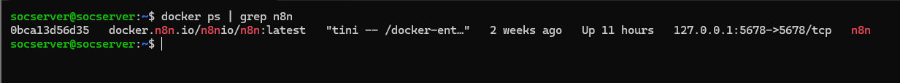
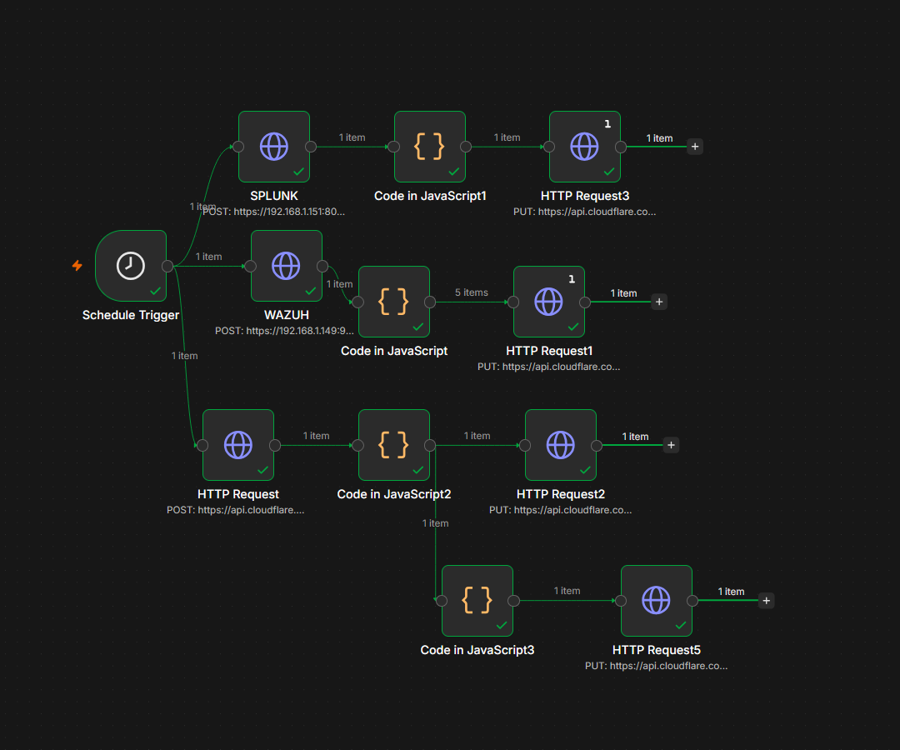
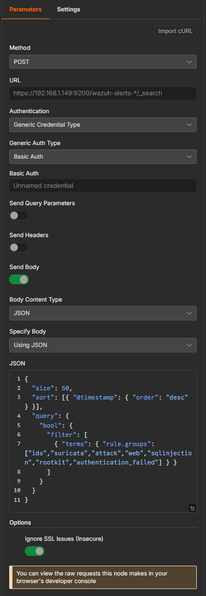
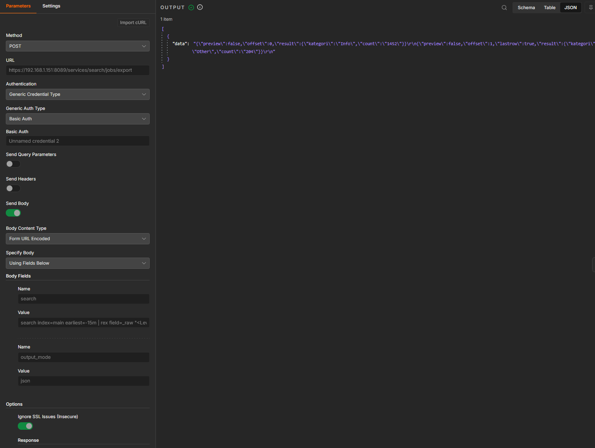
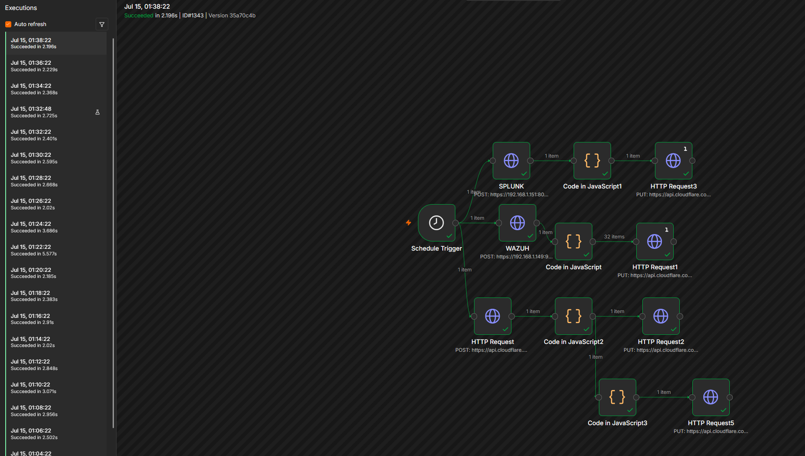

# Proje 08: n8n ile SOC Otomasyonu

## Amaç

Önceki projelerde toplanan SIEM verileri (Wazuh, Splunk) tek başına alarm üretir, ancak bu alarmlara tepki verme genellikle manuel bir analist müdahalesi gerektirir. Bu proje, n8n iş akışı otomasyon aracı kullanılarak bir SOAR (Security Orchestration, Automation & Response) akışı kurar: Wazuh Indexer ve Splunk REST API'lerinden veri çekilir, JavaScript ile işlenir ve Cloudflare KV storage'a otomatik olarak yazılır. **Bu workflow, Proje 04'te (SIEM Log Correlation) incelenen Wazuh/Splunk verilerini tüketip `karateke.online/soc-dashboard` sayfasının canlı panellerini (Threat Live Map, Wazuh Son Alarmlar, Splunk Analiz Özeti) besleyen arka plan motorudur** — yani Proje 04'ün "veri üretimi" ile bu projenin "veri dağıtımı/otomasyonu" aynı zincirin iki parçasıdır.

| Araç | Rol |
|---|---|
| n8n (Docker container) | İş akışı otomasyon motoru; SIEM verilerini çeker, işler, Cloudflare KV'ye yazar |
| Wazuh Indexer (OpenSearch, port 9200) | n8n'in ham `_search` sorgusuyla doğrudan sorguladığı alarm veri kaynağı |
| Splunk REST API (port 8089) | n8n'in SPL sorgusuyla veri çektiği ikincil analiz platformu |
| Cloudflare KV (Workers KV) | n8n'in işlenmiş veriyi yazdığı, soc-dashboard'un okuduğu anahtar-değer deposu |

## Metodoloji

### 1. n8n Docker Servis Durumu

```bash
docker ps | grep n8n
```
n8n container'ı çalışır durumda (`Up 11 hours`), yalnızca `127.0.0.1:5678`'e bağlı — dışarıya kapalı, güvenli bir yapılandırma.



### 2. Workflow Mimarisi Genel Görünümü

n8n canvas'ında tek bir `Schedule Trigger`'dan başlayıp 3 paralel dala ayrılan tam workflow incelendi: WAZUH dalı, SPLUNK dalı ve doğrudan bir Cloudflare/HTTP Request dalı — her biri kendi `Code in JavaScript` ve `HTTP Request` (Cloudflare `PUT`) node çiftleriyle sonlanıyor.



### 3. Zamanlama Yapılandırması (Schedule Trigger)

Workflow bir webhook ile değil, **zamanlanmış** (`Schedule Trigger`) bir tetikleyiciyle çalışıyor: `Trigger Interval: Minutes`, `Minutes Between Triggers: 2` — yani sistem her 2 dakikada bir otomatik olarak tetikleniyor.


### 4. WAZUH Dalı — Ham _search Sorgusu

WAZUH dalındaki `HTTP Request` node'u, Wazuh Indexer'a (OpenSearch, `192.168.1.149:9200`) doğrudan ham bir `_search` sorgusu gönderiyor: `POST /wazuh-alerts-*/_search`, `size: 50`, `@timestamp`'e göre azalan sıralama, ve `rule.groups` filtresiyle yalnızca önem taşıyan kategoriler (`ids`, `suricata`, `attack`, `web`, `sqlinjection`, `rootkit`, `authentication_failed`) seçiliyor.



### 5. JavaScript ile Veri Dönüştürme (Deduplication)

WAZUH dalındaki `Code in JavaScript` node'u, gelen alarmları `src_ip` bazında tekilleştiriyor (`const seen = new Map()`) — veri zaten `@timestamp`'e göre azalan geldiği için her IP'nin ilk görülen kaydı, o IP'nin en güncel kaydı olarak tutuluyor. Çıktıda gerçek örnek IP'ler görüldü: `X.X.X.X`, `X.X.X.X`, `X.X.X.X`.


### 6. Cloudflare KV Güncelleme

İşlenmiş veri, `PUT https://api.cloudflare.com/client/v4/accounts/.../storage/kv/...` ile Cloudflare KV'ye yazılıyor. WAZUH dalındaki bu node'un body'si `{ updated_at: ..., alerts: $input.all().map(...) }` formatında — yani `{updated_at, alerts}` şeklinde bir payload (muhtemelen dashboard'daki "Wazuh Son Alarmlar" panelini besleyen bir KV anahtarı).


### 7. SPLUNK Dalı — SPL Sorgusu (REST API)

SPLUNK dalındaki `HTTP Request` node'u, Splunk REST API'sine (`192.168.1.151:8089`, Basic Auth) bir arama işi gönderiyor: `POST /services/search/jobs/export`, body'de `search index=main earliest=-15m | rex field=_raw ...` şeklinde bir SPL sorgusu — son 15 dakikanın verisi kategori bazlı (Info/Warning/Critical/Other) özetleniyor.



### 8. Prod Execution Geçmişi

n8n'in "Executions" ekranında, workflow'un production'da gerçek zamanlı ve kesintisiz çalıştığı doğrulandı: 2 dakika aralıklarla (01:38:22, 01:36:22, 01:34:22, ...) art arda "Succeeded" durumunda kayıtlar.


### 9. Uçtan Uca Kanıt: SOC Dashboard Canlı Sonucu

`karateke.online/soc-dashboard` sayfası, bu workflow'un ürettiği veriyi canlı olarak gösteriyor: "CANLI VERİ AKIŞI / THREAT LIVE MAP", "WAZUH SON ALARMLAR" ve "SPLUNK ANALİZ ÖZETİ" panelleri — zincirin (Wazuh/Splunk → n8n → Cloudflare KV → dashboard) uçtan uca çalıştığının görsel kanıtı.


### 10. Uçtan Uca Zamanlama

Aynı Executions ekranının detayında (adım 8 ile aynı kaynak görüntü), tek bir execution'ın süresi görüldü: `Succeeded in 2.196s`, `ID#1343` — tetikten Cloudflare KV yazımına kadar geçen toplam süre yaklaşık 2-3.7 saniye aralığında.



## Bulgular

**Bulgu — Workflow, tek değil en az 2 farklı Cloudflare KV anahtarını paralel güncelliyor:** Canvas'taki 3 paralel dal, ortak tek bir veri setini değil, en az iki farklı payload biçimini Cloudflare KV'ye yazıyor. WAZUH dalındaki `HTTP Request1` node'u `{updated_at, alerts}` biçiminde bir payload gönderirken (muhtemelen dashboard'daki "Wazuh Son Alarmlar" panelini besleyen anahtar), incelenen bir başka dal `{windowStart, windowEnd, ...}` biçiminde tamamen farklı bir payload gönderiyor (muhtemelen "Threat Live Map" panelindeki ülke bazlı zaman-pencereli sayaçları besleyen ayrı bir anahtar). Canvas'ta görünen 5 ayrı `HTTP Request` + `PUT` node çifti (`HTTP Request1/2/3/5` ve isimsiz `HTTP Request`) bu paralel, çoklu-anahtar güncelleme mimarisinin kanıtıdır — workflow tek bir "alarm listesi" değil, dashboard'un farklı panellerini besleyen birden fazla bağımsız veri setini eş zamanlı üretiyor.

## Öne Çıkan Yetkinlikler

- Çoklu veri kaynağını (Wazuh Indexer, Splunk REST API, Cloudflare KV) tek bir zamanlanmış (webhook değil, `Schedule Trigger`) workflow'da birleştirme
- OpenSearch/Elasticsearch tarzı ham `_search` sorgularının (filtre, sıralama, boyut) doğrudan HTTP Request node'uyla yazılması
- JavaScript ile özel veri dönüştürme ve deduplication mantığı yazma (`Map` tabanlı en-güncel-kayıt tekilleştirme)
- Birden fazla bağımsız veri setinin (alarm listesi, zaman-pencereli sayaçlar) paralel olarak farklı KV anahtarlarına yazıldığının tespit edilmesi
- Prod ortamda kesintisiz, zamanlanmış execution geçmişiyle otomasyonun güvenilirliğinin kanıtlanması
- SOAR zincirinin (SIEM → n8n → Cloudflare KV → canlı dashboard) uçtan uca, görsel ve gerçek sonuçla doğrulanması

## Ekran Görüntüsü Envanteri

| # | Dosya Adı | İçerik |
|---|---|---|
| 01 | 01-n8n-docker-service-status.png | n8n Docker servis durumu |
| 02 | 02-n8n-workflow-canvas-overview.png | Tam workflow diyagramı |
| 03 | 03-schedule-trigger-configuration.png | 2 dakikalık zamanlama (Schedule Trigger) |
| 04 | 04-wazuh-http-request-config.png | Wazuh Indexer'a ham _search sorgusu |
| 05 | 05-javascript-data-transform.png | src_ip deduplication kodu |
| 06 | 06-cloudflare-kv-put-config.png | Cloudflare KV güncelleme ({updated_at, alerts}) |
| 07 | 07-splunk-http-request-config.png | Splunk SPL sorgusu (REST API) |
| 08 | 08-n8n-execution-log-success.png | Prod execution geçmişi (2 dk aralıklarla) |
| 09 | 09-soc-dashboard-live-data-result.png | Canlı dashboard sonucu (uçtan uca kanıt) |
| 10 | 10-end-to-end-workflow-timing.png | Execution süresi (2.196s, 08 ile aynı kaynak görüntü) |

**10 doğrulanmış ekran görüntüsü ile tamamlandı** (08 ve 10 aynı kaynak ekran görüntüsünü paylaşır).
