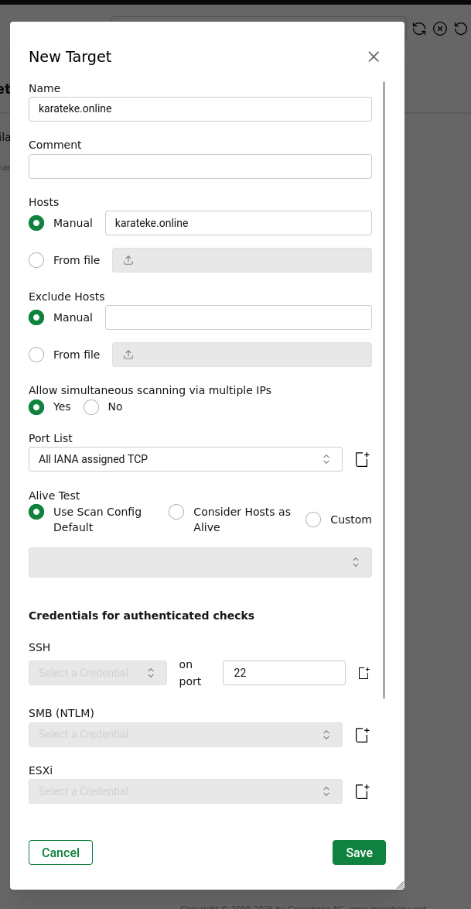
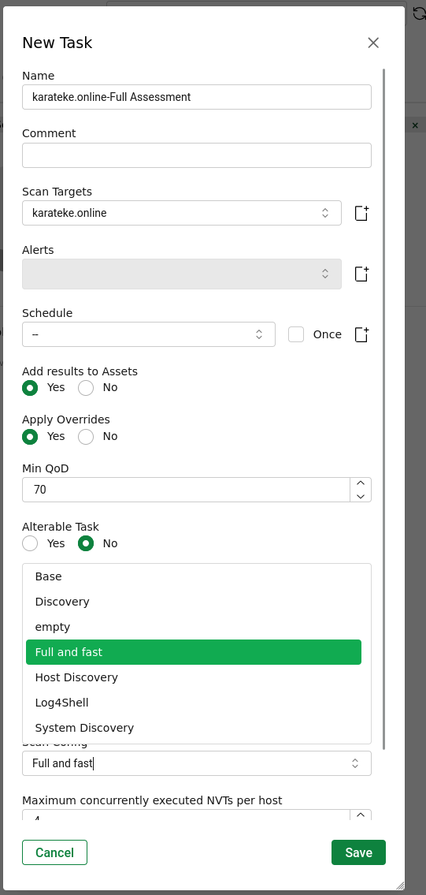
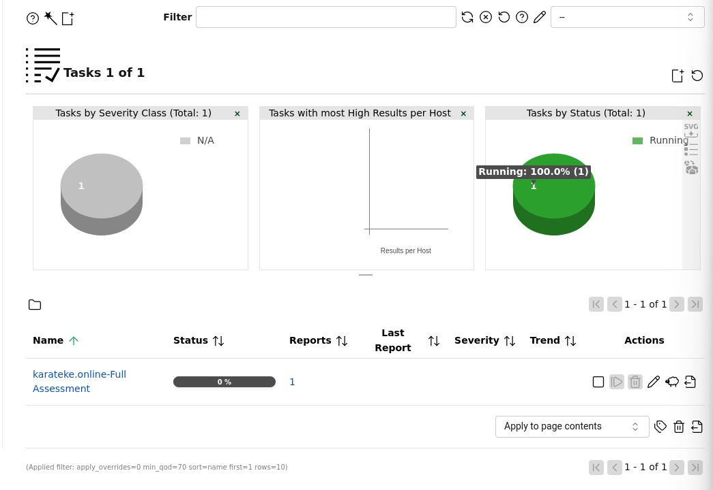

# Proje 09: Zafiyet Değerlendirme Laboratuvarı (GVM/OpenVAS + Nuclei + Nikto + Nmap)

## Amaç

Önceki projeler (01-08) çoğunlukla savunma ve tespit odaklıyken, bu proje `karateke.online`'ın kendisine — yani Proje 01'de kurulan WAF/Cloudflare savunma katmanına — karşı, gerçek bir dış saldırgan perspektifiyle, tam kapasiteli profesyonel araçlarla yapılan bir zafiyet değerlendirmesidir. **İzole bir test hedefi (DVWA/Metasploitable2) bilinçli olarak kullanılmadı** — amaç, Proje 01'in savunmasının gerçek koşullar altında tutup tutmadığını, üretim sistemine karşı doğrudan görmekti.

| Araç | Rol |
|---|---|
| Kali Linux | Zafiyet tarama ve sızma testi araçlarının çalıştırıldığı tarayıcı makine |
| OpenVAS / Greenbone (GVM) | Kapsamlı zafiyet veritabanına dayalı, ağ ve servis seviyesinde otomatik zafiyet taraması |
| Nuclei | Topluluk şablonlu (CVE/exposure/misconfig) hızlı zafiyet tarayıcısı |
| Nikto | Web sunucularına özel, bilinen güvenlik açıkları ve yanlış yapılandırmalar için tarama |
| Nmap | Port taraması, servis/versiyon tespiti ve tam port kapsamı |

*(Acunetix bu projede kullanılmadı — lisans mevcut değildi.)*

## Metodoloji

### 1. Servis Doğrulama (GVM/OpenVAS)

Kali üzerinde GVM/OpenVAS servislerinin çalışır durumda olduğu doğrulandı. Dashboard genel görünümünde **182.312 NVT** yüklü olduğu ve Critical/High/Medium/Low dağılımı görüldü.

```bash
sudo systemctl status gvmd
sudo systemctl status ospd-openvas
```

*Kanıt: `01-gvm-openvas-service-status.png`*


### 2. Hedef Tanımlama

GVM web arayüzünden hedef tanımlandı: `karateke.online` (IP değil, domain), Port List: **All IANA assigned TCP**. Kimlik bilgisi verilmedi — bu, gerçek bir dış saldırganın erişimine eşdeğer, unauthenticated bir dış test senaryosudur.

*Kanıt: `02-gvm-scan-target-configuration.png`*



### 3. Tarama Görevi Oluşturma ve Başlatma

Tarama görevi, bu GVM kurulumunda mevcut en kapsamlı profil olan **"Full and fast"** Scan Config ile oluşturuldu ve başlatıldı.

*Kanıt: `03b-gvm-new-task-config.png` (görev oluşturma), `03-gvm-scan-in-progress.png` (görev çalışıyor)*




### 4. GVM Tarama Sonuçları

Tarama **57 dakika** sürdü. `severity=0` filtresiyle incelendiğinde: **0 Critical, 0 High, 0 Medium, 0 Low** — yalnızca **76 adet "Log"** seviyeli (risksiz, bilgilendirme amaçlı) kayıt bulundu. Bu, Proje 01'in savunma katmanının gerçek bir dış tarama aracına karşı tuttuğunun güçlü bir kanıtıdır.

*Kanıt: `04-gvm-scan-results-cve-list.png`*


### 5. Nuclei Taraması

5971 topluluk şablonu (cve, exposure, misconfig etiketleriyle) kullanılarak Nuclei taraması çalıştırıldı. **2 düşük öncelikli bulgu** elde edildi:

- **`weak-csp-detect:unsafe-script-src`** — araştırıldı. Bulgunun kaynağının sitenin kendi CSP'si değil, Cloudflare'in bot trafiğine sunduğu "Just a moment..." challenge sayfasının kendi CSP'si olduğu tespit edildi (sunucudaki gerçek nginx yapılandırmasında `unsafe-eval` yok; `curl` ile `cf-mitigated: challenge` doğrulandı). Kod değişikliği yapılmadı — gerçek bir sorun olmadığı kanıtlandı.
- **`http-missing-security-headers:x-permitted-cross-domain-policies`** — gerçek bir bulguydu, **düzeltildi**: hem repodaki (`deploy/nginx.conf.example`) hem sunucudaki gerçek nginx yapılandırmasına header eklendi, deploy edilip DevTools ile canlıda doğrulandı (`x-permitted-cross-domain-policies: none` artık dönüyor).

```bash
nuclei -u https://karateke.online -tags cve,exposure,misconfig -rate-limit 3 -timeout 20 -retries 1
```

*Kanıt: `05-nuclei-scan-results.png`*


### 6. Nikto Taraması

Nikto taraması Cloudflare'i tespit etti (`cf-mitigated: challenge` header'ı). Aracın kendisi ilginç bir öneri de verdi: *"Cloudflare detected via cf-ray header, consider proxying via Burp or mitmproxy to avoid TLS fingerprint blocks"* — yani araç, otomatize taramaların TLS/HTTP fingerprint'e dayalı olarak tutarlı şekilde engellendiğini kendisi fark edip belirtti. Ayrıca `Content-Encoding: deflate` kullanımı nedeniyle teorik bir **BREACH** uyarısı üretti; bu araştırıldı ve site statik bir SPA olduğu, sunucu tarafı secret/token üretmediği, sıkıştırılan içerikte hassas veri olmadığı için gerçek istismar riski taşımadığı belirlendi — gerekçeli kabul edilmiş bir risk olarak belgelenip düzeltme yapılmadı.

```bash
nikto -h https://karateke.online -Tuning x -maxtime 600
```

*Kanıt: `06-nikto-scan-command-output.png`*


### 7. Nmap Taraması

Önce hızlı bir doğrulama taraması (`--top-ports 1000`) çalıştırıldı: 41 saniyede tamamlandı, 997 port filtrelenmiş, yalnızca 80/443/8080 açık (hepsi Cloudflare) — bu tarama için ayrı bir ekran görüntüsü alınmadı.

Ardından **tam port taraması** (`-p-`, tüm 65.535 port) çalıştırıldı ve **3295 saniye (~55 dakika)** sürdü. Bu olağandışı uzun süre, Cloudflare/WAF katmanının otomatize tarama trafiğini kasıtlı olarak yavaşlattığının dolaylı bir kanıtıdır. Sonuç: 65.529 port filtrelenmiş, yalnızca Cloudflare'e ait portlar (80, 443, 2082, 2087, 8080) açık, OS fingerprint **başarısız** oldu (`No OS matches for host`), traceroute yalnızca 4 hop'ta Cloudflare edge IP'sine (`104.21.33.164`) ulaştı — gerçek origin sunucu hiçbir şekilde görünmedi/erişilmedi.

```bash
nmap --privileged -p- -sV -sC -A -oN proj09-full-scan-complete.txt karateke.online
```

*Kanıt: `07-nmap-full-port-scan-results.png`*


### 8. Rapor Export

GVM tarama sonucu XML formatında dışa aktarıldı ve hassas veri (iç IP, dosya yolu, kullanıcı adı) için tarandı — **temiz** çıktı, repoya ham kanıt olarak eklendi.

*Kanıt: `08-vulnerability-report-export.xml` (dosya, görsel değil — repoda ham kanıt olarak bulunur)*

## Bulgular

### Bulgu A — Origin Sunucu Tamamen Gizli

Nmap'in OS fingerprinting'i bile başarısız oldu; taramanın gördüğü tek şey Cloudflare edge'idir. Gerçek origin sunucunun IP'si (`192.168.1.149`) hiçbir taramada açığa çıkmadı.

### Bulgu B — Otomatize Araçlar Fingerprint ile Tespit Edilip Engelleniyor

Otomatize CLI araçları (curl, Nuclei, Nikto) TLS/HTTP fingerprint'e dayalı olarak tutarlı şekilde tespit ediliyor — bunu Nikto'nun kendi önerisi (`consider proxying via Burp or mitmproxy`) doğrudan doğruluyor.

### Bulgu C — Tam Port Taramasının Olağandışı Uzun Sürmesi

Tam port taramasının 55 dakika sürmesi (top-1000 taramasının 41 saniyeye karşı), WAF'ın tarama trafiğini kasıtlı olarak yavaşlattığının (tarpitting) dolaylı bir kanıtıdır.

### Bulgu D — Bir Gerçek Bulgu, Bir Yanlış Pozitif

Nuclei'nin bulduğu 2 düşük öncelikli bulgudan biri (eksik `x-permitted-cross-domain-policies` header'ı) gerçekti ve aynı gün canlı ortamda düzeltildi; diğeri (`unsafe-eval` CSP uyarısı) araştırma sonucunda Cloudflare challenge sayfasından kaynaklanan bir yanlış pozitif olduğu kanıtlandı. Bu, ham tarayıcı çıktısına körü körüne güvenmemenin, her bulguyu doğrulamanın önemini gösteriyor.

## Öne Çıkan Yetkinlikler

- Gerçek üretim ortamına karşı, endüstri standardı araçlarla (GVM/OpenVAS, Nuclei, Nikto, Nmap) kapsamlı dış zafiyet taraması gerçekleştirme
- Ham tarayıcı çıktısını körü körüne kabul etmeyip doğrulama yapma (unsafe-eval bulgusunun yanlış pozitif olduğunun kanıtlanması)
- Tespit edilen gerçek bulguyu aynı gün canlı ortamda düzeltip doğrulama
- WAF/CDN katmanının otomatize araçlara karşı davranışını (fingerprint tespiti, tarpitting) analiz etme
- Kendi kurduğu savunma mimarisini bağımsız ve nesnel şekilde test edip sonucu dürüstçe raporlama (0 bulgu = başarı, uydurma bulgu yok)

## Ekran Görüntüsü Envanteri

| # | Dosya Adı | İçerik |
|---|---|---|
| 01 | 01-gvm-openvas-service-status.png | GVM Dashboard genel görünüm (182.312 NVT) |
| 02 | 02-gvm-scan-target-configuration.png | GVM hedef tanımlama - karateke.online |
| 03 | 03-gvm-scan-in-progress.png | GVM görev çalışıyor (Running) |
| 03b | 03b-gvm-new-task-config.png | GVM yeni görev oluşturma - Full and fast profili |
| 04 | 04-gvm-scan-results-cve-list.png | GVM sonuçları - 0 Critical/High/Medium/Low, 76 Log |
| 05 | 05-nuclei-scan-results.png | Nuclei tarama sonuçları - 2 bulgu (araştırılıp ele alındı) |
| 06 | 06-nikto-scan-command-output.png | Nikto çıktısı - Cloudflare tespiti, BREACH uyarısı |
| 07 | 07-nmap-full-port-scan-results.png | Nmap tam port taraması - origin sunucu gizli |
| 08 | 08-vulnerability-report-export.xml | Ham GVM raporu (XML, temiz - hassas veri yok) |

**Toplam: 8 ekran görüntüsü + 1 ham XML raporu (9 doğrulanmış kanıt dosyası).**
