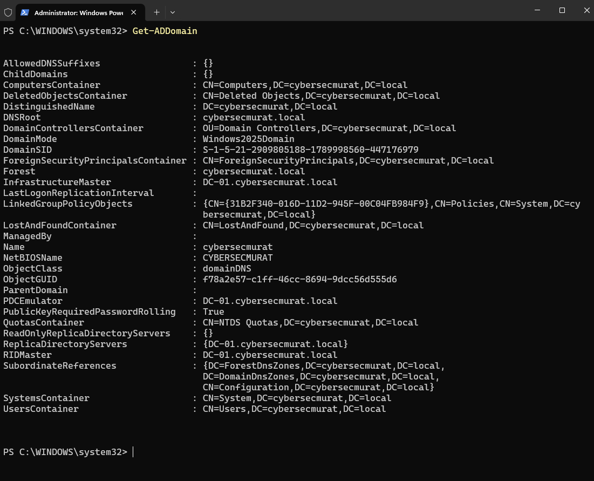
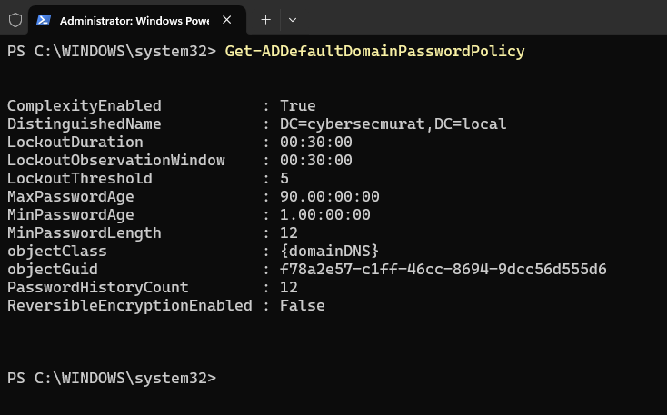
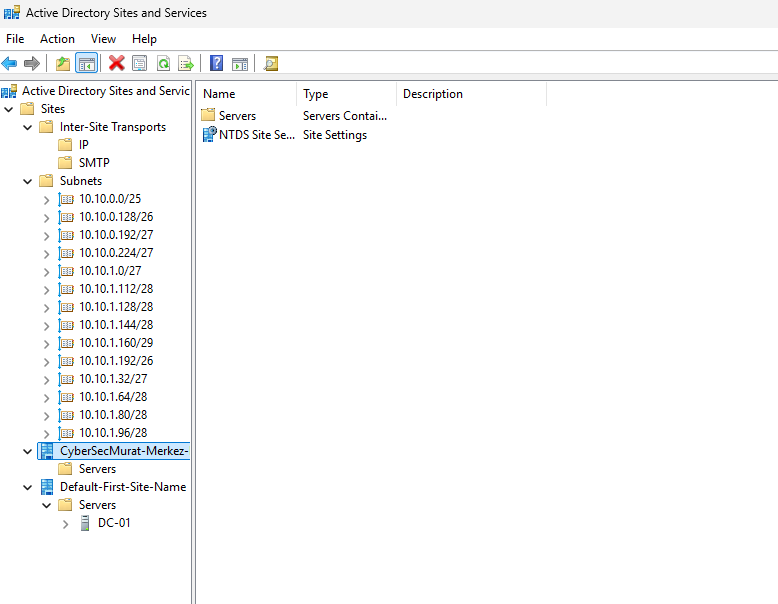

# Proje 10: Active Directory Laboratuvarı ve Ağ Mimarisi (CyberSecMurat A.Ş.)

## Amaç

Bu proje, kurgusal bir üretim şirketi olan **CyberSecMurat A.Ş.** için uçtan uca bir kimlik yönetimi (Active Directory) altyapısı ile Purdue Model mantığına dayalı bir ağ mimarisini bir araya getirir. Windows Server 2025 üzerinde kurulan AD DS ortamı 12 departmanı, 48 kullanıcıyı ve departman bazlı güvenlik/erişim kurallarını modellerken; Packet Tracer'da tasarlanan ağ topolojisi OT/Üretim ve Kurumsal tarafları fiziksel olarak ayıran, OSPF ile kendi kendine öğrenen, HSRP ile yedekli bir omurga sunar. Amaç, tek bir aracı değil; kimlik yönetimi, ağ mimarisi ve güvenlik mühendisliğinin bir sistemin farklı katmanları olarak nasıl bir araya geldiğini göstermektir.

## Metodoloji

### 1. Domain'in Doğuşu

`Get-ADDomain` çıktısı, `cybersecmurat.local` domain'inin sağlıklı şekilde ayağa kalktığını doğruluyor: NetBIOS adı **CYBERSECMURAT**, domain modu **Windows2025Domain**, tek domain controller **DC-01.cybersecmurat.local**.

```powershell
Get-ADDomain
```



### 2. Organizasyon Şeması

Active Directory Users and Computers konsolunda, `Departments` OU'su altında 12 departmanın (AgYonetimi, ArGe, BakimMuhendislik, BilgiIslem, FinansMuhasebe, GuvenlikCCTV, InsanKaynaklari, KaliteKontrol, LojistikDepo, Sunucular, Uretim, Yonetim) her birinin kendi `Computers` / `Groups` / `Users` alt-OU yapısına sahip olduğu görülüyor. Ayrıca ayrı bir **Admins** (Tier 0) ve **ServiceAccounts** konteyneri bulunuyor — bu, Tiered Administration modelinin bir yansıması.

Tüm departmanların genişletilmiş hali sayıldığında toplam OU sayısı: `CyberSecMurat` (1) + `Admins` (1) + `Departments` (1) + 12 departman OU'su + 12 × 3 alt-OU (Computers/Groups/Users) + `ServiceAccounts` (1) = **52 OU**.


### 3. Şirketin Çalışanları

PowerShell ile **48 gerçekçi kullanıcı** (12 departman × 4 kullanıcı) toplu olarak oluşturuldu — her biri kendi departmanına uygun Türkçe isim ve unvanla (örn. "Mehmet Aydın - Üretim Müdürü", "Gizem Sarı - Sistem Yöneticisi"). `Get-ADUser` sorgusu tüm kullanıcıları departman ve unvan bilgisiyle listeliyor.

```powershell
$DomainDN = (Get-ADDomain).DistinguishedName
$DeptOU = "OU=Departments,OU=CyberSecMurat,$DomainDN"
Get-ADUser -Filter * -SearchBase $DeptOU -Properties Title,Department |
  Select-Object Name, SamAccountName, Title, Department | Format-Table -AutoSize
```


### 4. Kimlerin Birlikte Çalıştığı

Kullanıcılar departman bazlı güvenlik gruplarına toplandı: her departman için bir `-Users` grubu, artı iki özel grup — **IT-Admins** ve **Uretim-USB-Kisitli**. Toplam **14 grup**.

```powershell
Get-ADGroup -Filter * -SearchBase "OU=CyberSecMurat,$DomainDN" |
  Select-Object Name, GroupCategory, GroupScope | Format-Table -AutoSize
```


### 5. Kuralların Konması

`Get-ADDefaultDomainPasswordPolicy` çıktısı domain genelindeki parola kurallarını gösteriyor: minimum **12 karakter**, **12** şifre geçmişi, **90 günlük** yenileme süresi, **5 hatalı denemede** **30 dakikalık** hesap kilidi.

```powershell
Get-ADDefaultDomainPasswordPolicy
```



### 6. OT Güvenliğinin İmzası

Üretim departmanına özel bir GPO (`Uretim-USB-Kisitlama`) oluşturuldu: **Removable Storage Devices → Deny Write**. Stuxnet benzeri saldırılara karşı gerçekçi bir savunma katmanı. GPO raporunda `SOFTWARE\Policies\Microsoft\Windows\RemovableStorageDevices\Deny_Write` ayarının hem **Computer Configuration** hem **User Configuration** altında `State: 1` olarak aktif olduğu ve GPO durumunun **Enabled** olduğu görülüyor.


### 7. İki Dünyanın Buluşma Noktası

Active Directory Sites and Services konsolunda, Packet Tracer'da tasarlanan **14 subnet'in tamamı** (12 departman + omurga + Misafir WiFi) tek bir Site (**CyberSecMurat-Merkez-Fabrika**) altında tanımlandı — AD topolojisi ile fiziksel ağ topolojisi arasındaki bağlantı noktası.



### 8. Büyük Resim

Tüm ağ topolojisi: **3 ana router** (R-CORE, R-OT, R-CORP), **2 yedek router** (YEDEK-OT, YEDEK-CORP), **5 switch**, **22 uç cihaz** ve bir Misafir WiFi erişim noktası. Purdue Model mantığıyla OT/Üretim (R-OT) ve Kurumsal (R-CORP) fiziksel olarak farklı router'larda, aralarındaki trafik merkez router (R-CORE) üzerinden geçiyor.


### 9. Ağın Kendi Kendine Öğrenmesi

OSPF (Open Shortest Path First) protokolü ile R-CORE tüm departman ağlarını otomatik öğreniyor (`show ip route ospf` çıktısında `O` ile işaretli rotalar). `%OSPF-5-ADJCHG` log satırı, bir yedek router'ın ağa yeni komşu olarak katıldığını (LOADING → FULL) gösteriyor.

```
R-CORE#show ip route ospf
```


### 10. Departmanların Sanal Duvarları

Kurumsal tarafın switch'inde (SW-CORP) **7 VLAN** tanımlandı: Yönetim (10), İnsan Kaynakları (11), Finans/Muhasebe (12), Bilgi İşlem (13), Ar-Ge (14), Sunucular (90), Ağ Yönetimi (91).

```
SW-CORP#show vlan brief
```


### 11. Tek Nokta Arızasına Karşı Sigorta

HSRP (Hot Standby Router Protocol) ile her departman VLAN'ının gateway'i, R-OT (Active) çökerse YEDEK-OT (Standby) tarafından otomatik devralınacak şekilde yapılandırıldı. `show standby brief` çıktısı, **5 VLAN'ın** tamamında R-OT'un Active rolünü doğru şekilde üstlendiğini gösteriyor.

```
R-OT#show standby brief
```


### 12. Son Kanıt: Sistem Gerçekten Çalışıyor

Üretim departmanındaki bir bilgisayardan gateway'ine (**10.10.0.1**) atılan ping, **4/4 başarılı, %0 paket kaybıyla** dönüyor — kimlik yönetimi, VLAN, OSPF ve HSRP katmanlarının uçtan uca birlikte çalıştığının somut kanıtı.

```
C:\>ping 10.10.0.1
```


---

Bu proje, tek bir teknolojiyi değil, bir sistemler bütününü göstermeyi hedefledi: kimlik yönetimi (AD), ağ mimarisi (VLAN/OSPF/HSRP) ve güvenlik mühendisliği (Purdue Model ayrımı, USB kısıtlama GPO'su) aynı kurgusal şirketin farklı katmanları olarak bir araya getirildi. İki katman arasındaki bağlantı gerçek bir sistem entegrasyonu değil, bilinçli bir tasarım tutarlılığı kararıdır — ve bu sınırın açıkça belirtilmesi, projenin iddiasını abartmadan, gerçek mühendislik disiplinini yansıtır.

## Öne Çıkan Yetkinlikler

- PowerShell ile toplu kullanıcı/grup oluşturma ve Active Directory'yi script'lenebilir şekilde yönetme
- Tiered Administration mantığıyla OU hiyerarşisi tasarlama (Tier 0 Admin ve Service Accounts ayrımı)
- Domain genelinde parola politikası ve GPO tabanlı cihaz kısıtlaması (USB Deny Write) uygulama
- AD Sites and Services ile mantıksal dizin yapısını fiziksel ağ topolojisiyle hizalama
- Purdue Model mantığıyla OT/Kurumsal ağ ayrımı tasarlayıp uygulama
- OSPF ile dinamik yönlendirme, VLAN ile departman segmentasyonu, HSRP ile gateway yedekliliği kurma
- Uçtan uca bağlantıyı (ping testi) doğrulayarak tasarımın kağıt üzerinde kalmadığını kanıtlama
- İki farklı katman (AD ve ağ mimarisi) arasındaki ilişkinin sınırlarını dürüstçe belirtme

## Ekran Görüntüsü Envanteri

| # | Dosya Adı | İçerik |
|---|---|---|
| 01 | 01-ad-domain-overview.png | Get-ADDomain çıktısı - cybersecmurat.local domain özeti |
| 02 | 02-ou-structure.png | OU yapısı - Departments altında 12 departman |
| 02b | 02b-ou-structure-full.png | OU yapısı - tüm departmanlar genişletilmiş, 52 OU doğrulaması |
| 03 | 03-users-list.png | Get-ADUser çıktısı - 48 kullanıcı, departman ve unvan bilgisiyle |
| 04 | 04-security-groups.png | Get-ADGroup çıktısı - 14 güvenlik grubu |
| 05 | 05-password-policy.png | Get-ADDefaultDomainPasswordPolicy çıktısı - şifre politikası |
| 06 | 06-gpo-usb-restriction.png | GPO raporu - Uretim-USB-Kisitlama, Deny_Write aktif |
| 07 | 07-ad-sites-services.png | AD Sites and Services - 14 subnet, tek Site altında |
| 08 | 08-network-topology-overview.png | Ağ topolojisi genel görünüm - Purdue Model ayrımı |
| 09 | 09-ospf-routing-table.png | OSPF routing table - otomatik öğrenilen departman ağları |
| 10 | 10-vlan-configuration.png | VLAN yapılandırması - 7 departman VLAN'ı |
| 11 | 11-hsrp-active-standby.png | HSRP durumu - 5 VLAN, Active/Standby rolleri |
| 12 | 12-ping-test-success.png | Ping testi - 10.10.0.1 gateway'ine 4/4 başarılı |

**Toplam: 13 ekran görüntüsü (13 doğrulanmış kanıt dosyası).**
